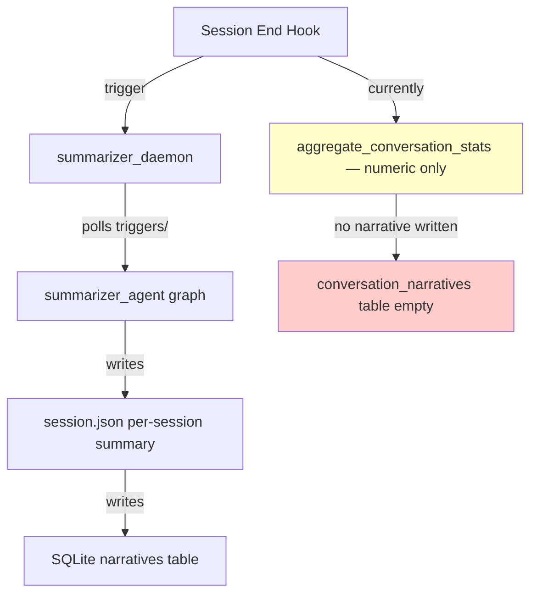
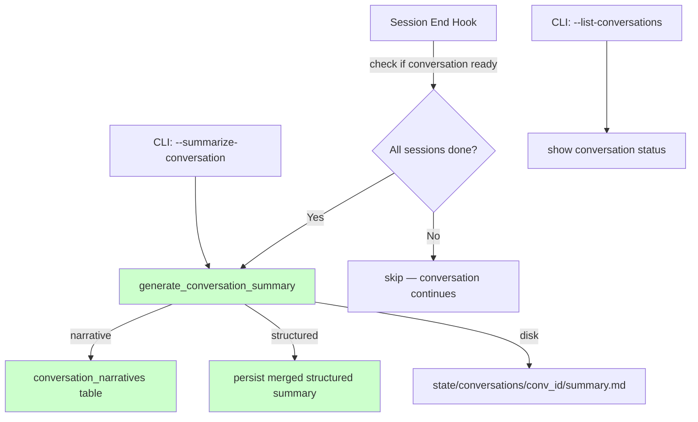
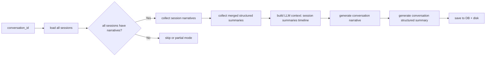

# Conversation-Level Summarization

## Current Architecture

The system has three layers of summarization, all scoped to individual **sessions**:

1. **`session_end.py`** — generates numeric stats at session close
2. **`summarizer_agent.py`** — LangGraph agent that generates LLM narrative + structured summaries per session
3. **`summarizer_daemon.py`** — background polling process that processes per-session triggers

The **conversation** layer exists in SQLite (`conversations` table, `conversation_narratives` table) but is never written to. `conversation_narratives` (Migration 5) has columns `conversation_id`, `narrative`, `generated_at`, `session_count`, `word_count` — but no `upsert_conversation_narrative()` method exists. Similarly, `merge_structured_summaries()` exists but only returns in-memory merged data, never persisting it.

## Data Flow Overview



### Target Data Flow



## Implementation Plan

### Phase 1: Add `upsert_conversation_narrative` to NarrativesDB

**File:** `narratives_db.py`

Add a new method after `delete_conversation()` (~line 1059):

```python
def upsert_conversation_narrative(
    self,
    conversation_id: str,
    narrative: str,
    generated_at: str | None = None,
    session_count: int = 0,
) -> bool:
```

- Strip NULL bytes and encode UTF-8 (same pattern as `upsert_narrative()`)
- Soft cap at 100K chars with debug warning
- Compute `word_count` from the narrative text
- Ensure parent `conversations` row exists (create minimal row if missing)
- INSERT OR UPDATE on `conversation_narratives`
- Add `get_conversation_narrative(conversation_id)` method for retrieval
- Add `delete_conversation_narrative(conversation_id)` for cleanup

### Phase 2: Create `conversation_summarizer_agent.py`

This is a new LangGraph agent that generates conversation-level summaries from all sessions in a conversation.

**Core approach:** Rather than re-summarizing from raw events (which could be thousands of events across many sessions), use existing **session summaries** as building blocks:



**StateGraph Definition:**

```python
class ConversationSummarizerState(TypedDict, total=False):
    conversation_id: str
    sessions: list           # session metadata from DB
    session_narratives: dict # {session_id: narrative_text}
    merged_structured: dict  # from merge_structured_summaries
    conversation_narrative: str
    conversation_structured: dict
    strategy: str            # "full" | "incremental" | "skip"
    error: str
    force: bool
```

**Nodes:**

1. **`load_conversation`** — Get all sessions via `get_sessions_by_conversation()`, load each session's narrative, check which sessions have summaries. Determine strategy:
   - `full` — all sessions completed, all have narratives
   - `incremental` — conversation has an existing conversation narrative, at least one new session added since last conversation summary
   - `skip` — no sessions with narratives, or conversation still active with incomplete sessions (unless `force=True`)

2. **`build_context`** — Build LLM context from session-level artifacts:
   - Concatenate session narratives in chronological order
   - Include aggregated stats (`aggregate_conversation_stats`)
   - Include merged structured summary data
   - For incremental: include previous conversation narrative as base

3. **`generate_narrative`** — LLM call with system prompt that produces conversation-level narrative. The prompt instructs the LLM to synthesize across sessions, identify overarching themes, track progress across sessions, and highlight cross-session patterns.

4. **`generate_structured`** — Generate conversation-level structured summary by synthesizing the merged session-level structured data. This produces: unified objectives, all files touched, consolidated decisions with context, recurring errors and patterns, aggregated tool usage, and final outcome.

5. **`save_summary`** — Persist to:
   - `conversation_narratives` table via new `upsert_conversation_narrative()`
   - Disk: `state/conversations/<conversation_id>/conversation_summary.md`
   - Disk: `state/conversations/<conversation_id>/conversation_structured.json`
   - SQLite: new `upsert_conversation_structured()` method (see Phase 3)
   - Update `conversations.completed_at` and `conversations.status` to `"summarized"`

**Edge case handling in `load_conversation`:**

| Scenario | Strategy |
|----------|----------|
| All sessions have narratives | `full` — generate from all |
| Conversation has prior narrative + new sessions | `incremental` — update with delta |
| Some sessions lack narratives | `skip` (log warning, user can use `--force`) |
| Conversation has only 1 session | `skip` (conversation summary == session summary, no value add) |
| `force=True` from CLI | `full` — generate even if incomplete |
| Session narratives exist but no structured summaries | `full` narrative, structured from merged data with caveats |

### Phase 3: Add conversation structured summary persistence to NarrativesDB

**File:** `narratives_db.py`

Add migration v7 for `conversation_structured_summaries` table:

```sql
CREATE TABLE IF NOT EXISTS conversation_structured_summaries (
    conversation_id TEXT PRIMARY KEY,
    structured_json TEXT NOT NULL,
    generated_at TEXT NOT NULL,
    session_count INTEGER DEFAULT 0,
    schema_version INTEGER DEFAULT 1,
    objectives TEXT DEFAULT '[]',
    files_modified TEXT DEFAULT '[]',
    files_created TEXT DEFAULT '[]',
    files_deleted TEXT DEFAULT '[]',
    decisions_count INTEGER DEFAULT 0,
    errors_count INTEGER DEFAULT 0,
    FOREIGN KEY (conversation_id) REFERENCES conversations(conversation_id) ON DELETE CASCADE
)
```

Add methods:
- `upsert_conversation_structured(conversation_id, structured_json, generated_at, session_count)`
- `get_conversation_structured(conversation_id)`

Update `CURRENT_SCHEMA_VERSION` from 6 to 7.

### Phase 4: Integrate into `session_end.py`

**File:** `session_end.py`

After the existing session summarization logic (after line 344, after `aggregate_conversation_stats`), add:

```python
# Trigger conversation-level summary generation
_try_generate_conversation_summary(conversation_id)
```

**`_try_generate_conversation_summary(conversation_id)`:**
1. Query all sessions in the conversation via `get_sessions_by_conversation()`
2. Check if all sessions have `completed_at` set (all sessions finished)
3. Count sessions with narratives vs total — if any are missing, skip (they will be summarized by daemon later)
4. Check if the conversation already has a recent summary (within 30s debounce)
5. If all checks pass, call `conversation_summarizer_agent.py` via subprocess or direct graph invocation
6. Run asynchronously via `Popen` to avoid blocking the 30s session_end hook timeout

Key edge cases:
- **Timeout guard:** Wrap in try/except with 25s timeout so hook doesn't expire
- **Daemon vs subprocess:** Launch as detached subprocess (`Popen`) so it runs independently
- **Idempotency:** If conversation summary already exists and is recent (within 60s), skip
- **Subagent sessions:** Include subagent sessions in the count but flag them in the structured output
- **Conversation still active:** If fingerprint matching would create a new session soon, wait for that session to end before summarizing

### Phase 5: Extend CLI in `summarize_sessions.py`

**File:** `summarize_sessions.py`

Add new CLI commands:

```
--summarize-conversation <conversation_id>    # Generate conversation-level summary
--summarize-all-conversations                 # Summarize all conversations lacking a summary
--show-conversation <conversation_id>         # Display conversation narrative + structured summary
--list-conversations-with-stats               # List conversations with session counts, summary status
```

**`summarize_conversation(conversation_id, force=False)`:**
1. Import and run `conversation_summarizer_agent.graph.invoke()`
2. Acquire conversation-level lock (`.conversation_summarizer_lock` file)
3. Report strategy, session count, and success/failure

**`summarize_all_conversations()`:**
1. Use `list_conversations()` from NarrativesDB
2. Filter for conversations without existing `conversation_narrative`
3. For each, check if all sessions have narratives (ready to summarize)
4. Process sequentially with progress output

### Phase 6: Add `--summarize-conversation` to `narratives_db.py` CLI

**File:** `narratives_db.py` (CLI section, ~line 1599)

Add argparse argument and handler that calls `conversation_summarizer_agent` directly.

## Edge Cases Matrix

| Edge Case | Handling |
|-----------|----------|
| **Conversation with 1 session** | Skip — session summary is sufficient. CLI `--force` can override. |
| **Session summary missing for one session in conversation** | Skip entire conversation summary. Log which session is missing. User can `--force`. |
| **DB corruption during save** | File-based summary still written (dual-write). SQLite write wrapped in try/except. |
| **Concurrent summarization (session_end + CLI)** | Per-conversation lock file (`conversation_summarizer_lock`). Same atomic `O_CREAT | O_EXCL` pattern as session locks. |
| **Conversation spans days/weeks** | Narrative includes date range and "this conversation spanned X sessions over Y days" |
| **Very large conversations (50+ sessions)** | LLM context cap: summarize in chunks of 10 sessions, then meta-summarize the chunks. Add `MAX_SESSIONS_FOR_CONTEXT = 10` constant. |
| **Conversation with only subagent sessions** | Still summarize but flag as "subagent-only conversation" |
| **Session added after conversation summary (new session continues conversation)** | Regeneration: CLI `--regenerate-conversation` or daemon detects new session and triggers incremental update |
| **JSON file lock conflict** | Fallback to write without lock with debug log (same pattern as `conversation_recorder.py`) |
| **LLM returns empty response** | Retry with explicit prompt (same pattern as `summarizer_agent.py`) |
| **LLM response truncated** | Soft cap at 100K chars, warning in debug log |
| **Conversation has completed_at but no summarization** | CLI `--summarize-all-conversations` catches these as a backfill path |
| **Migration v7 applied but old code runs** | Version guard: `_current_version()` check prevents writes with wrong schema |

## File Change Summary

| File | Change |
|------|--------|
| `narratives_db.py` | Add `upsert_conversation_narrative()`, `get_conversation_narrative()`, `delete_conversation_narrative()`, `upsert_conversation_structured()`, `get_conversation_structured()`, migration v7 |
| `conversation_summarizer_agent.py` | **New file** — LangGraph agent for conversation-level summarization |
| `session_end.py` | Add `_try_generate_conversation_summary()` call after existing aggregation |
| `summarize_sessions.py` | Add conversation-level CLI commands |
| `narratives_db.py` (CLI) | Add `--summarize-conversation` argument |
