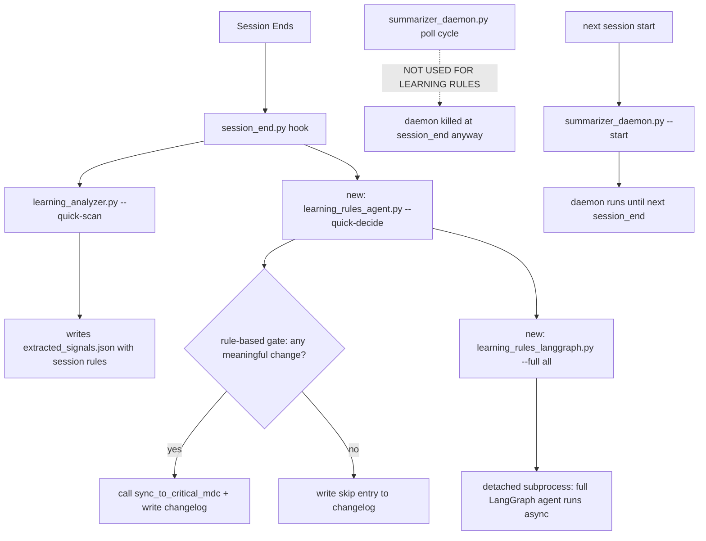
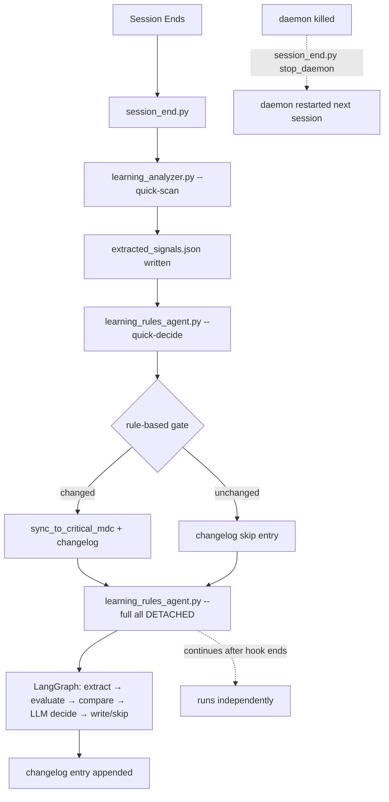

# LangGraph Learning Rules Agent

## Problem

The `learning-critical.mdc` file is never auto-updated. It has 5 hand-curated rules while the system has telemetry from many sessions. The `learning_analyzer.py` CLI can generate signals (`--quick-scan`, `--bootstrap`) and sync them (`--sync`), but nothing calls `--sync` automatically.

## Architecture Overview




### Critical Correction: Daemon Lifecycle

The daemon is started at `sessionStart` and killed at `sessionEnd`. There is no daemon running between sessions. Adding a poll-cycle trigger would only execute during a new session's lifetime, creating redundant work with the session_end path. Instead, the full LangGraph agent is launched as a **detached subprocess** from `session_end.py` (after the sync `quick-decide`), running async in the background with no hook timeout constraint.

## Key Files

- **New**: `learning_rules_langgraph.py` — full LangGraph agent (StateGraph with nodes: extract, evaluate, compare, decide, write)
- **New**: `learning_rules_agent.py` — CLI wrapper with `--quick-decide` (sync, rule-based) and `--full` (async, LangGraph) modes
- **New**: `state/learning_rules_changelog.jsonl` — append-only JSONL changelog of every write decision
- **Modified**: `session_end.py` — add quick-decide call + detached full agent launch after `_try_quick_scan_learning`
- **Modified**: `learning-critical.mdc` — update frontmatter to reflect auto-updated status

## Implementation Details

### Corrected Flow (Aligned with Existing Architecture)

The existing session_end flow already runs `learning_analyzer.py --quick-scan` synchronously, which writes signals to `extracted_signals.json`. The new system adds two steps after this:

1. **Quick-decide** (sync, within session_end hook's 30s budget): Rule-based check of whether extracted_signals.json changed enough to warrant a rewrite. If yes, calls `sync_to_critical_mdc()` and writes changelog. This is fast (DB-only, no LLM).
2. **Full LangGraph agent** (async, detached subprocess): Launched as a background process that runs the full StateGraph with LLM reasoning. It re-extracts signals fresh (since quick-scan just wrote them), evaluates with both sentiment + recurrence effectiveness, compares against current `learning-critical.mdc`, uses an LLM to decide if a rewrite is warranted, and writes if so. This runs independently of the hook timeout.

The daemon is NOT used for learning rules because it is killed at every session end. The full agent is launched as a detached subprocess from session_end.py, allowing it to continue running after the hook completes and after the daemon is killed.




### Step 1: New File — `learning_rules_langgraph.py`

Location: `d:\test_agent\learning_agent\.cursor\hooks\learning_rules_langgraph.py`

**State definition** (TypedDict):

```python
class LearningRulesState(TypedDict, total=False):
    session_id: str              # "all" for full re-evaluation
    new_signals: list[dict]      # extracted signals from LearningAnalyzer.extract_all()
    existing_signals: list[dict] # loaded from extracted_signals.json
    current_mdc_rules: list[dict]# parsed from current learning-critical.mdc
    change_diff: str             # human-readable diff/summary of changes
    should_write: bool           # final decision
    decision_reason: str         # why the LLM decided this way
    write_result: str            # success/failure message
    mode: str                    # "full" — identifies this as LangGraph-run
```

**Graph nodes** (5 nodes total, each with try/except fail-open):

1. `**extract_signals`** — Calls `LearningAnalyzer().extract_all(session_id=None)` to get fresh signals from all sessions. Loads `extracted_signals.json` for the existing signals baseline. Both from the same `LearningAnalyzer.extract_all()` method that `--quick-scan` already called — so this will find the same data plus any sessions the quick-scan didn't cover.
2. `**evaluate_rules`** — Runs both effectiveness systems:
  - `compute_rule_effectiveness(rules, sentiment_map)` — sentiment-based scoring (adds `effectiveness_score` to each rule)
  - `compute_recurrence_effectiveness()` — recurrence-based scoring (returns `rule_hash -> "effective" | "ineffective" | "unknown"`)
  - Both are already implemented in `learning_analyzer.py` — just call them here
3. `**compare_with_existing**` — Loads `learning-critical.mdc` (parse the markdown sections) and compares:
  - New rules in extracted_signals that aren't represented in current `learning-critical.mdc`
  - Rules in current `learning-critical.mdc` whose recurrence effectiveness is now `"ineffective"`
  - Changes in ranking (e.g., a rule that was #3 is now #1 due to count changes)
  - Produces `change_diff` string with counts: "X new rules, Y rules now ineffective, Z ranking changes"
4. `**llm_decide**` (THE LLM NODE) — Constructs a concise prompt:
  ```
   You are evaluating whether to rewrite the learning rules file (.cursor/rules/learning-critical.mdc).

   CURRENT RULES (10 max, alwaysApply):
   [list current rules from learning-critical.mdc, max 10]

   PROPOSED CHANGES:
   [change_diff from compare_with_existing]

   EFFECTIVENESS DATA:
   [top 20 signals with sentiment + recurrence scores]

   DECIDE: Should learning-critical.mdc be rewritten?
   Answer "yes" only if:
   - There are 2+ genuinely new patterns not in current rules, OR
   - 2+ current rules are proven ineffective (recurrence), OR
   - The top-10 ranking would meaningfully change

   Otherwise answer "no".

   Respond in JSON: {"decision": "yes"|"no", "reason": "..."}
  ```
   LLM setup: reuses `get_llm()` from `summarizer_agent.py` (reads `API_KEY`, `BASE_URL`, `REASONING_MODEL` from `llm.env`).
   **Fallback**: If LLM call fails/timeout (60s), defaults to `{"decision": "no", "reason": "LLM unavailable, conservative skip"}`.
5. `**write_or_skip`** — Conditional node:
  - If `should_write == True`: calls `LearningAnalyzer().sync_to_critical_mdc()`, then appends write entry to changelog
  - If `should_write == False`: appends skip entry to changelog
  - This is a single node that handles both branches (simpler graph than separate write/skip nodes)

**Graph structure**:

```
START → extract_signals → evaluate_rules → compare_with_existing → llm_decide → write_or_skip → END
```

**Lock mechanism**: Uses `.learning_rules_lock` file in `state/` directory, same atomic `os.O_CREAT | os.O_EXCL` pattern as `summarizer_agent.py`'s lock. This prevents the detached full agent from conflicting with a subsequent session's quick-decide.

### Step 2: New File — `learning_rules_agent.py` (CLI wrapper)

Location: `d:\test_agent\learning_agent\.cursor\hooks\learning_rules_agent.py`

Two modes:

**Mode 1: `--quick-decide <session_id>`** (sync, rule-based, no LLM):

- Loads `extracted_signals.json` (just written by `--quick-scan` in session_end)
- Loads the previous version from `state/.last_extracted_signals.json` (a copy kept for comparison)
- Computes:
  - New unique rule hashes not in the previous version
  - Changed effectiveness scores for existing rules
- Decision rule: if `new_rules >= 2` OR `ineffective_rules >= 2` → call `sync_to_critical_mdc()` and write changelog entry; otherwise write skip entry
- Updates `state/.last_extracted_signals.json` with current signals for next comparison
- Target: <10s execution time (pure Python, no LLM)

**Mode 2: `--full`** (async, LangGraph):

- Imports and invokes `learning_rules_langgraph.py`'s compiled graph
- Runs `graph.invoke({"session_id": "all"})`
- No subprocess spawning — direct Python call
- Used when launched as a detached subprocess from session_end.py

### Step 3: Modify `session_end.py`

After the existing `_try_quick_scan_learning(session_id)` call (line 396), add:

```python
# Quick rule-based learning rules decision (sync, within hook timeout)
_try_quick_learning_rules_decision(session_id)

# Full LangGraph agent for learning rules (async, detached)
_try_full_learning_rules_agent()
```

New functions:

`_try_quick_learning_rules_decision(session_id)`:

- Calls `learning_rules_agent.py --quick-decide <session_id>` via `subprocess.run()` (synchronous)
- 15s timeout (well within the remaining hook budget after quick-scan)
- stdout/stderr to DEVNULL
- Fail-open: logs to `debug_log()` on failure

`_try_full_learning_rules_agent()`:

- Launches `learning_rules_agent.py --full` as a **detached subprocess** using `subprocess.Popen()` with `stdout=subprocess.DEVNULL`, `stderr=subprocess.DEVNULL`
- On Windows: `creationflags=subprocess.CREATE_NO_WINDOW | subprocess.CREATE_NEW_PROCESS_GROUP`
- No timeout set — runs independently after the hook returns
- The daemon will be killed by `stop_daemon()` at the end of session_end.py, but this detached process continues because it's a separate process group

**Timing consideration**: The sessionEnd hook has a 30s timeout. The current flow is:

- quick-scan: up to 30s timeout of its own
- quick-decide: up to 15s timeout
- full agent: Popen, returns immediately (no blocking)
- stop_daemon(): fast PID kill

If quick-scan takes its full 30s, quick-decide would exceed the hook budget. To handle this: `_try_quick_learning_rules_decision` uses a 10s timeout (reduced from 15s), and if quick-scan already consumed >20s, it skips quick-decide and relies on the full agent instead.

### Step 4: Changelog File

Location: `d:\test_agent\learning_agent\.cursor\hooks\state\learning_rules_changelog.jsonl`

Append-only, one JSON object per line. Schema:

```json
{
  "ts": "2026-05-05T15:30:00",
  "mode": "quick",
  "decision": "write",
  "reason": "2 new unique patterns detected, 0 rules now ineffective",
  "signals_before": 12,
  "signals_after": 15,
  "rules_written": 8,
  "session_id": "abc-123"
}
```

For skips:

```json
{
  "ts": "2026-05-05T15:30:00",
  "mode": "quick",
  "decision": "skip",
  "reason": "no meaningful change (0 new patterns, 0 ineffective rules)",
  "signals_count": 12,
  "session_id": "abc-123"
}
```

For full LangGraph runs:

```json
{
  "ts": "2026-05-05T15:31:00",
  "mode": "full",
  "decision": "write",
  "reason": "LLM confirmed: 3 new patterns + 2 ineffective rules warrant rewrite",
  "llm_reasoning": "The current rules focus on Grep scoping, but new patterns show Read file-not-found is now more frequent...",
  "rules_written": 9,
  "session_id": "all"
}
```

### Step 5: Update `learning-critical.mdc` Frontmatter

Change from:

```yaml
description: Hand-curated critical learning rules from session data. Updated manually when clear patterns emerge.
```

To:

```yaml
description: Auto-updated critical learning rules from session telemetry. Managed by learning_rules_langgraph.py LangGraph agent. Changelog at state/learning_rules_changelog.jsonl.
```

## Security & Safety Requirements

### LLM Prompt Sanitization

The `llm_decide` node constructs a prompt from session-derived data (`change_diff`, signal patterns, lesson text). This data originates from user sessions and could contain injection payloads. Before sending to the LLM:

- Strip all content matching API key, token, or secret patterns (reuse `_scrub_secrets()` from `summarizer_agent.py` line 201)
- Truncate each signal's `lesson` field to `LLM_PROMPT_MAX_LESSING_LENGTH` (200 chars)
- Truncate `change_diff` to `LLM_PROMPT_MAX_DIFF_LENGTH` (500 chars)
- Never pass raw user prompt text directly -- only processed patterns and summaries

### Atomic Writes

- `sync_to_critical_mdc()` already uses atomic write (tempfile + rename) -- no change needed
- Changelog append: use file-level lock (same `os.O_CREAT | os.O_EXCL` pattern as `summarizer_agent.py` lock) to prevent interleaved writes when quick-decide and full agent run concurrently
- `.last_extracted_signals.json` update: write to `.tmp` file then rename, same atomic pattern

### Idempotency

The full agent must check if `learning-critical.mdc` has been modified since the quick-decide step ran. In `compare_with_existing`:

- If the file content would produce identical output to what quick-decide already wrote, skip the write and log "identical to quick-decide result"

### Error Recovery & Transactional Behavior

Quick-decide's three operations (call `sync_to_critical_mdc`, append changelog, update `.last_extracted_signals.json`) must be ordered for safety:

1. First: call `sync_to_critical_mdc()` (the critical side effect)
2. Second: append changelog entry (audit trail)
3. Third: update `.last_extracted_signals.json` (the comparison baseline)

If step 1 fails, skip steps 2 and 3. If step 2 fails, still do step 3 (data consistency is more important than audit completeness). If step 3 fails, log a warning -- the next run will detect a larger-than-expected change (acceptable one-time anomaly).

### Changelog Rotation

The JSONL file grows unbounded. Implement rotation:

- After each append, check if file exceeds `CHANGELOG_MAX_SIZE_BYTES` (1MB)
- If so, rename to `learning_rules_changelog.jsonl.1` (keeping only the last rotation)
- New file starts fresh at `learning_rules_changelog.jsonl`
- Maximum 1 rotation; older history is available via git

### Lock Stale Cleanup

The `.learning_rules_lock` file could be left behind if the full agent crashes:

- When acquiring the lock, check if the file's `st_mtime` is older than `LOCK_STALE_SECONDS` (300s / 5 min)
- If stale, delete it and retry acquisition
- Matches the pattern used in `summarizer_daemon.py`'s PID file staleness check

### LLM Response Parsing

The LLM is instructed to respond in JSON, but may return markdown code fences or extra text. Parse with:

1. Try `json.loads()` directly first
2. If that fails, extract JSON from code blocks using regex
3. If that fails, scan for `"decision": "yes"` or `"decision": "no"` with regex
4. If all parsing fails, default to `{"decision": "no", "reason": "could not parse LLM response"}`

### Changelog Schema Validation

Each changelog entry must be validated before writing:

```python
_REQUIRED_FIELDS = {"ts", "mode", "decision", "reason"}
_VALID_MODES = {"quick", "full"}
_VALID_DECISIONS = {"write", "skip"}
```

If an entry fails validation, log to `debug_log()` and skip the write (fail-open for audit, never for data).

### Process Cleanup (Detached Full Agent)

The detached full agent should self-terminate if it detects its parent process is gone:

- At the start of `--full`, record the parent PID from `os.getppid()`
- Every `FULL_AGENT_PARENT_CHECK_INTERVAL` (30s), check if the parent is still alive (`is_process_alive`)
- If parent is dead and more than 10 minutes have elapsed, exit cleanly (orphan process guard)
- Always exit within `FULL_AGENT_TIMEOUT_SECONDS` (600s / 10 min) hard ceiling

### Memory Limits

`extract_all()` queries the entire DB for signals. On large datasets this could consume significant memory:

- Limit `extract_all` to the most recent `MAX_EXTRACT_SESSIONS` (100) sessions (ordered by `completed_at DESC`)
- Limit signal list to `MAX_EXTRACT_RULES` (50) rules max (sorted by count DESC)
- The LLM prompt receives only the top `LLM_PROMPT_MAX_SIGNALS` (20) signals (sorted by effectiveness priority then count)

### Constants as Named Variables

All thresholds must be defined as module-level constants at the top of each file, not inline magic numbers:

```python
QUICK_DECIDE_NEW_RULES_THRESHOLD = 2
QUICK_DECIDE_INEFFECTIVE_THRESHOLD = 2
QUICK_DECIDE_TIMEOUT_SECONDS = 10
FULL_AGENT_TIMEOUT_SECONDS = 600  # 10 min hard ceiling
FULL_AGENT_PARENT_CHECK_INTERVAL = 30
CHANGELOG_MAX_SIZE_BYTES = 1_000_000  # 1MB
LOCK_STALE_SECONDS = 300  # 5 minutes
LLM_PROMPT_MAX_SIGNALS = 20
LLM_PROMPT_MAX_RULES = 10
LLM_PROMPT_MAX_LESSING_LENGTH = 200
LLM_PROMPT_MAX_DIFF_LENGTH = 500
MAX_EXTRACT_SESSIONS = 100
MAX_EXTRACT_RULES = 50
```

### Encoding Consistency

All file operations in new code must specify `encoding="utf-8"` explicitly (Windows default may be cp1252).

### Type Hints and Docstrings

- All functions must have type hints for parameters and return types
- All public functions must have docstrings
- Follow the same style as existing hooks (e.g., `summarizer_agent.py` line 258)

### Rollback Backup

Before `sync_to_critical_mdc()` writes, copy the current `learning-critical.mdc` to `learning-critical.mdc.bak`:

- Only one backup is kept, overwritten each write
- The changelog records the previous rule count, so manual reconstruction is possible
- The `.bak` file is created before the atomic write, so it reflects the previous stable state

## Edge Cases Covered


| Edge Case                                          | Handling                                                                                                                                                                                |
| -------------------------------------------------- | --------------------------------------------------------------------------------------------------------------------------------------------------------------------------------------- |
| **No sessions in DB yet**                          | `extract_signals` returns empty, quick-decide sees no signals, skips. Full agent same.                                                                                                  |
| **DB locked/unavailable**                          | All DB calls are try/except fail-open. Quick-decide uses `if rules:` check. Full agent defaults to skip.                                                                                |
| **LLM API down or timeout**                        | `llm_decide` catches exception, defaults to `should_write = False`. Changelog records "LLM unavailable".                                                                                |
| **Concurrent writes** (quick + full running)       | Full agent acquires `.learning_rules_lock` before writing. If quick-decide already wrote, full agent sees up-to-date file in `compare_with_existing` and may decide "no change needed". |
| **learning-critical.mdc deleted**                  | `sync_to_critical_mdc` creates from scratch. `compare_with_existing` treats missing file as "all rules are new".                                                                        |
| **extracted_signals.json missing**                 | Quick-scan writes it first in session_end flow. Quick-decide reads it after quick-scan. Full agent calls `extract_all()` which creates it.                                              |
| **Too-frequent writes**                            | Quick-decide compares against `.last_extracted_signals.json` -- only writes if meaningful change. Full agent uses LLM as additional gate. Double-gate prevents churn.                   |
| **Rule explosion** (too many signals)              | `MAX_CRITICAL_RULES = 10` cap in `sync_to_critical_mdc`. No change needed.                                                                                                              |
| **Quick-decide eats hook timeout**                 | Quick-decide timeout reduced to 10s. If quick-scan took >20s, quick-decide is skipped entirely. Full agent runs detached regardless.                                                    |
| **Detached process killed when daemon stops**      | Full agent is in its own process group (`CREATE_NEW_PROCESS_GROUP`). `stop_daemon()` kills only the daemon PID and its children, not the full agent process group.                      |
| **Stale `.last_extracted_signals.json`**           | Quick-decide always updates it after running. If stale/missing, treats as "all signals are new" (one-time bootstrap).                                                                   |
| **Token limit in LLM prompt**                      | Only top 20 signals + current 10 rules sent. Prompt is structured to be concise (~2K tokens total).                                                                                     |
| **Stale signals from deleted sessions**            | `extract_all` queries DB directly. Deleted sessions don't appear. `compute_recurrence_effectiveness` naturally filters by session timestamps.                                           |
| **Session with zero events**                       | Quick-scan returns empty rules. Quick-decide skips. Full agent skips. No wasted work.                                                                                                   |
| **Windows process group isolation**                | `CREATE_NEW_PROCESS_GROUP` ensures the detached full agent is not a child of the daemon or session_end process.                                                                         |
| **Orphaned full agent process**                    | Parent PID check every 30s. Auto-exits if parent dead + 10 min elapsed. Hard 10-min ceiling.                                                                                            |
| **Lock file left behind by crash**                 | Stale lock cleanup: if `.learning_rules_lock` is older than 5 min, delete and retry.                                                                                                    |
| **LLM returns malformed response**                 | 4-level fallback parser (direct JSON → code block regex → decision scan → conservative default).                                                                                        |
| **Changelog write fails mid-operation**            | Transactional ordering: sync_to_critical_mdc first, then changelog, then baseline update. Partial failure doesn't corrupt data.                                                         |
| **Changelog grows too large**                      | Rotation at 1MB: rename to `.1` (one backup), start fresh. Max 2 files total.                                                                                                           |
| **Quick-decide and full agent race on same write** | Full agent checks idempotency before writing. If quick-decide already produced identical output, skips.                                                                                 |
| `**.bak` file corruption**                         | `.bak` is a copy, not the primary. If corrupted, git history provides recovery path.                                                                                                    |


## Execution Order

1. Create `learning_rules_langgraph.py` (LangGraph StateGraph with 5 nodes)
2. Create `learning_rules_agent.py` (CLI wrapper with `--quick-decide` and `--full` modes)
3. Create initial empty `state/learning_rules_changelog.jsonl` and `state/.last_extracted_signals.json`
4. Modify `session_end.py` -- add `_try_quick_learning_rules_decision` and `_try_full_learning_rules_agent` after `_try_quick_scan_learning`
5. Update `learning-critical.mdc` frontmatter
6. Test `--quick-decide` manually with a recent session ID
7. Test `--full` manually to verify the LangGraph runs end-to-end
8. Test full session end flow to verify quick-decide stays within timeout and full agent launches detached
9. Verify no existing hooks are broken (run existing session start/end flow)

