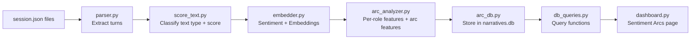

# Sentiment Arc Pipeline — Accuracy Improvements (Phased)

## Architecture Overview



## Current File Map

| File | Path |
|------|------|
| Config | [.cursor/hooks/sentiment_arc/config.py](.cursor/hooks/sentiment_arc/config.py) |
| Parser | [.cursor/hooks/sentiment_arc/parser.py](.cursor/hooks/sentiment_arc/parser.py) |
| Embedder | [.cursor/hooks/sentiment_arc/embedder.py](.cursor/hooks/sentiment_arc/embedder.py) |
| Arc Analyzer | [.cursor/hooks/sentiment_arc/arc_analyzer.py](.cursor/hooks/sentiment_arc/arc_analyzer.py) |
| Batch Runner | [.cursor/hooks/sentiment_arc/batch_runner.py](.cursor/hooks/sentiment_arc/batch_runner.py) |
| Arc DB | [.cursor/hooks/sentiment_arc/arc_db.py](.cursor/hooks/sentiment_arc/arc_db.py) |
| DB Queries | [.cursor/hooks/dashboard/db_queries.py](.cursor/hooks/dashboard/db_queries.py) |
| Dashboard | [.cursor/hooks/dashboard/dashboard.py](.cursor/hooks/dashboard/dashboard.py) |

---

# PHASE 1 — Tier 1: High Impact

## 1.1 Expand Parser to Include Tool Events

**Problem**: [parser.py](.cursor/hooks/sentiment_arc/parser.py) only extracts `user_prompt` and `response` events. All `tool_use` events (with error messages, tool outputs, debugging context) are discarded — losing the majority of signal during long debugging sessions.

**Changes in [parser.py](.cursor/hooks/sentiment_arc/parser.py)**:

Add `_TOOL_USE_EVENTS = {"tool_use"}` to the recognized event types. When extracting, for tool_use events:

- Build text from `tool_name` + truncated `tool_output` (first 500 chars, focusing on error messages)
- Use `event.get("tool_name", "")` and `event.get("tool_output", "")` fields
- Mark role as `"assistant"` (tools are called by the assistant)
- Include the tool name in `tools_called` list

New turn dict structure for tool events:
```python
{
    "turn_index": int,
    "role": "assistant",
    "text": "Tool: Read — Error: File not found: ...",  # concatenated name + output
    "tools_called": [tool_name],
    "original_line": event.get("sequence"),
    "event_type": "tool_use",  # new field
}
```

Update `discover_transcripts` to look in both `state/sessions/<uuid>/session.json` (current) and check for any future format changes.

## 1.2 Add Per-Role Sentiment Separation

**Problem**: User prompts and assistant responses are scored on a single timeline. A frustrated user prompt and confident assistant response average out to neutral, masking the actual interaction dynamic.

**Changes in [arc_analyzer.py](.cursor/hooks/sentiment_arc/arc_analyzer.py)**:

- In `compute_arc_features`, split scores by role into `user_scores` and `assistant_scores`
- Compute `user_sentiment_trend` = linear regression slope of user-only scores
- Compute `assistant_sentiment_trend` = linear regression slope of assistant-only scores
- Compute `sentiment_gap` = mean(assistant_scores) - mean(user_scores) — positive gap means assistant is more optimistic than user
- Add `avg_user_sentiment` and `avg_assistant_sentiment` to the feature dict
- Add `max_sentiment_gap` = max over sliding window of |assistant - user| at matching turns

Add new features to the return dict:
```python
"user_sentiment_trend": float | None,
"assistant_sentiment_trend": float | None,
"sentiment_gap": float | None,
"avg_user_sentiment": float | None,
"avg_assistant_sentiment": float | None,
```

**Changes in [arc_db.py](.cursor/hooks/sentiment_arc/arc_db.py)**:

Add columns to `session_arc_features`:
```sql
ALTER TABLE session_arc_features ADD COLUMN user_sentiment_trend REAL;
ALTER TABLE session_arc_features ADD COLUMN assistant_sentiment_trend REAL;
ALTER TABLE session_arc_features ADD COLUMN sentiment_gap REAL;
ALTER TABLE session_arc_features ADD COLUMN avg_user_sentiment REAL;
ALTER TABLE avg_assistant_sentiment REAL;
```

Use `PRAGMA writable_schema` or migration approach: check column existence before ALTER (SQLite 3.35+ supports ADD COLUMN).

**Changes in [db_queries.py](.cursor/hooks/dashboard/db_queries.py)**:

- Update `get_arc_kpi_stats` to include `avg_sentiment_gap`
- Add `get_sessions_with_high_gap(limit)` — sessions where sentiment_gap > 0.3 (assistant overly optimistic vs frustrated user)

## 1.3 Add Archetype Confidence Score

**Problem**: The classifier returns a single string with no indication of certainty. The original plan had `classify_archetype(features) -> str, confidence` but the implementation dropped it.

**Changes in [arc_analyzer.py](.cursor/hooks/sentiment_arc/arc_analyzer.py)**:

Modify `classify_archetype` to return `tuple[str, float]` (archetype, confidence). Confidence is computed as:

- For each rule, count how many conditions are met vs how many are required
- Confidence = conditions_met / conditions_required (0.0 to 1.0)
- Example: `escalating_frustration` requires `arc_slope < negative` (met?) AND `late_volatility > low` (met?) → if both met, confidence = 1.0; if only one, confidence = 0.5

For `inconclusive`, confidence is always 0.0. For `too_short`, confidence is 0.0.

Update `batch_runner.py` to store `archetype_confidence` in DB.

**Changes in [arc_db.py](.cursor/hooks/sentiment_arc/arc_db.py)**:

Add column:
```sql
ALTER TABLE session_arc_features ADD COLUMN archetype_confidence REAL;
```

Update `store_arc_features` to accept and write `archetype_confidence`.

## 1.4 Phase 1 Tests

Create [.cursor/hooks/sentiment_arc/tests/](.cursor/hooks/sentiment_arc/tests/) directory:

- `test_parser.py`: Test tool_use event extraction, edge cases (missing fields, empty output), combined prompt+response+tool turn sequences
- `test_arc_analyzer.py`: Test per-role features with mock scores, test confidence computation for each archetype, test that confidence is 0.0 for inconclusive
- `test_arc_db.py`: Test column existence checks, UPSERT behavior with new columns

Use `pytest`. No model loading in tests — use mock scores.

---

# PHASE 2 — Tier 2: Medium Impact

## 2.1 Fix Recovery Event Counting Logic

**Problem**: In [arc_analyzer.py](.cursor/hooks/sentiment_arc/arc_analyzer.py) lines 140-149, the recovery counter triggers on any dip > `recovery_threshold` and any subsequent rebound above the trough. Tiny oscillations around neutral produce false positives.

**Current logic**:
```python
if smoothed[i] < smoothed[i - 1] - recovery_threshold:
    for j in range(i + 1, len(smoothed)):
        if smoothed[j] > smoothed[i] + recovery_threshold:
            recovery_events += 1
            break
```

**New logic**:
```python
MIN_DIP_DEPTH = 0.1  # Config constant
# A recovery requires:
# 1. Dip depth >= MIN_DIP_DEPTH from pre-dip level
# 2. Rebound reaches ABOVE the pre-dip level (not just above trough)
# 3. Track the last recovery end index to avoid double-counting
if smoothed[i] < smoothed[i - 1] - recovery_threshold:
    pre_dip = smoothed[i - 1]
    dip_depth = pre_dip - smoothed[i]
    if dip_depth >= MIN_DIP_DEPTH:
        for j in range(i + 1, len(smoothed)):
            if smoothed[j] > pre_dip:  # Must reach above pre-dip, not just trough
                recovery_events += 1
                break  # Move past this recovery
```

Add `MIN_DIP_DEPTH = 0.1` to [config.py](.cursor/hooks/sentiment_arc/config.py).

## 2.2 Switch to Technical-Domain Sentiment Model

**Problem**: `cardiffnlp/twitter-roberta-base-sentiment-latest` is trained on tweets. Agent sessions are code-heavy with technical prose, stack traces, and file paths — very different from tweet distribution.

**Changes in [config.py](.cursor/hooks/sentiment_arc/config.py)**:

Replace default model from `cardiffnlp/twitter-roberta-base-sentiment-latest` to `cardiffnlp/twitter-roberta-base-sentiment-long` (handles longer text, trained on general sentiment corpora).

If `cardiffnlp/twitter-roberta-base-sentiment-long` is not available on HuggingFace, fall back to `distilbert-base-uncased-finetuned-sst-2-english` (general domain, not tweet-specific).

**Changes in [embedder.py](.cursor/hooks/sentiment_arc/embedder.py)**:

Update `compute_sentiment_scores` to handle the new model's label mapping. Add a `_get_label_map(model_name)` helper:

- For cardiffnlp models: `label2id = {"LABEL_0": "negative", "LABEL_1": "neutral", "LABEL_2": "positive"}` → `score = P(positive) - P(negative)`
- For distilbert SST-2: 2-class model → `score = P(positive) - P(negative)` (no neutral)

Keep the same scoring formula but adapt to the model's output structure.

## 2.3 Upgrade Embedding Model

**Problem**: `sentence-transformers/all-MiniLM-L6-v2` (22M params) is weak at code semantics and instruction-following nuances. `user_self_distance` and `model_relevance_trend` features suffer.

**Changes in [config.py](.cursor/hooks/sentiment_arc/config.py)**:

Replace `EMBEDDING_MODEL` default from `sentence-transformers/all-MiniLM-L6-v2` to `sentence-transformers/all-mpnet-base-v2` (110M params, significantly better semantic similarity).

Add fallback: if mpnet fails to load (memory constraints), fall back to `BAAI/bge-small-en-v1.5` (33M params, better than MiniLM on technical text).

**No code changes needed in [embedder.py](.cursor/hooks/sentiment_arc/embedder.py)** — it uses `SentenceTransformer(name)` generically. Just the config change.

## 2.4 Phase 2 Tests

Add to [tests/](.cursor/hooks/sentiment_arc/tests/):

- `test_recovery_logic.py`: Verify that small oscillations (< 0.1 dip depth) don't count as recoveries, verify that rebound must exceed pre-dip level, verify no double-counting
- `test_embedder.py`: Test label map resolution for different model names, test batch scoring with mock model, test fallback behavior
- `test_config.py`: Test env var overrides for all configurable constants

---

# PHASE 3 — Tier 3: Lower Impact

## 3.1 Uniform analyze_session Return Values

**Problem**: `analyze_session()` in [arc_analyzer.py](.cursor/hooks/sentiment_arc/arc_analyzer.py) returns `None` for sessions under `MIN_TURNS_FOR_ANALYSIS`, but `batch_runner.py` handles this case by storing a `too_short` record itself. This means calling `analyze_session` as an API function vs running CLI produces different results.

**Changes in [arc_analyzer.py](.cursor/hooks/sentiment_arc/arc_analyzer.py)**:

```python
def analyze_session(turns: list[dict], embeddings: list[np.ndarray | None] | None = None) -> dict:
    """Always returns a dict. For short sessions, returns {"archetype": "too_short", "turn_count": N}."""
    if len(turns) < config.MIN_TURNS_FOR_ANALYSIS:
        return {
            "archetype": "too_short",
            "turn_count": len(turns),
            "arc_slope": None,
            "archetype_confidence": 0.0,
        }
    # ... rest unchanged
```

Update `batch_runner.py` to check `result["archetype"] == "too_short"` instead of `len(turns) < MIN_TURNS_FOR_ANALYSIS`.

## 3.2 Consecutive Turn Deduplication

**Problem**: If a user sends near-identical prompts consecutively (e.g., re-running the same command), each gets scored independently, inflating turn count and creating artificial oscillations.

**New file**: [.cursor/hooks/sentiment_arc/dedup.py](.cursor/hooks/sentiment_arc/dedup.py)

```python
def deduplicate_turns(turns: list[dict], similarity_threshold: float = 0.95) -> list[dict]:
    """Merge consecutive same-role turns with near-identical text.
    
    Uses simple character Jaccard similarity (fast, no model needed).
    Merged turn keeps the last text but notes the repeat count.
    """
```

Jaccard similarity: `len(set(chars_a) & set(chars_b)) / len(set(chars_a) | set(chars_b))`

**Changes in [batch_runner.py](.cursor/hooks/sentiment_arc/batch_runner.py)**:

Call `deduplicate_turns` after parsing, before scoring. Add `--no-dedup` CLI flag to disable.

## 3.3 Text-Type-Aware Scoring Pipeline

**Problem**: Stack traces, code blocks, and natural language are all scored by the same RoBERTa model. A stack trace gets a sentiment score but it's reporting a fact, not expressing sentiment.

**New file**: [.cursor/hooks/sentiment_arc/score_text.py](.cursor/hooks/sentiment_arc/score_text.py)

```python
def classify_text_type(text: str) -> str:
    """Classify text as 'natural_language', 'code', 'error_trace', or 'mixed'."""
    # Heuristics:
    # - Contains ``` or indentation patterns > 70% → code
    # - Contains "Traceback", "Error:", "Exception", "at line" → error_trace
    # - Mix of both → mixed
    # - Otherwise → natural_language

def score_text(text: str, sentiment_model, error_keywords: set[str] | None = None) -> float:
    """Route to appropriate scoring method based on text type."""
    text_type = classify_text_type(text)
    if text_type == "code":
        return 0.0  # Neutral — code has no sentiment
    elif text_type == "error_trace":
        return -0.5  # Default negative (adjustable)
    else:
        return sentiment_model_scoring(text, sentiment_model)
```

**Changes in [embedder.py](.cursor/hooks/sentiment_arc/embedder.py)**:

Update `compute_sentiment_scores` to call `score_text` per-item before batch inference, filtering out code-only texts.

## 3.4 Turn Length Weighting

**Problem**: A 3-word reply and a 2000-word debugging explanation get equal weight in the arc.

**Changes in [arc_analyzer.py](.cursor/hooks/sentiment_arc/arc_analyzer.py)**:

Update `smooth_arc` to accept optional weights:
```python
def smooth_arc(scores: list[float], weights: list[float] | None = None, alpha: float = config.SMOOTHING_ALPHA) -> list[float]:
```

Weight formula: `w = min(log2(text_length + 1), 3.0)` — caps at 3x weight for very long turns.

In `compute_arc_features`, compute weights from turn text lengths and pass to `smooth_arc`.

## 3.5 Phase 3 Tests

Add to [tests/](.cursor/hooks/sentiment_arc/tests/):

- `test_dedup.py`: Test Jaccard similarity for identical, near-identical, and different texts. Test that merging preserves correct turn count and text.
- `test_score_text.py`: Test classification of code blocks, error traces, mixed text, and natural language. Test scoring routes correctly.
- `test_analyze_session_uniform.py`: Test that short sessions return `too_short` dict, not None.
- `test_smooth_arc_weighted.py`: Test that weighted smoothing produces different results from unweighted, test weight capping.
- `test_integration.py`: End-to-end test: parse a mock session.json → dedup → score → features → classify → verify archetype

---

# DB Migration Strategy

All Phase changes add columns to `session_arc_features`. Implement a migration helper in [arc_db.py](.cursor/hooks/sentiment_arc/arc_db.py):

```python
_MIGRATIONS = [
    "ALTER TABLE session_arc_features ADD COLUMN archetype_confidence REAL",
    "ALTER TABLE session_arc_features ADD COLUMN user_sentiment_trend REAL",
    "ALTER TABLE session_arc_features ADD COLUMN assistant_sentiment_trend REAL",
    "ALTER TABLE session_arc_features ADD COLUMN sentiment_gap REAL",
    "ALTER TABLE session_arc_features ADD COLUMN avg_user_sentiment REAL",
    "ALTER TABLE session_arc_features ADD COLUMN avg_assistant_sentiment REAL",
]

def migrate_arc_tables(conn):
    for migration in _MIGRATIONS:
        try:
            conn.execute(migration)
        except sqlite3.OperationalError:
            pass  # Column already exists
    conn.commit()
```

Call `migrate_arc_tables` from `init_arc_tables` and from `batch_runner.py` before analysis.

---

# Execution Order

**Phase 1**: 1.1 → 1.2 → 1.3 → 1.4 (tests)
**Phase 2**: 2.1 → 2.2 → 2.3 → 2.4 (tests)
**Phase 3**: 3.1 → 3.2 → 3.3 → 3.4 → 3.5 (tests)

Each phase can be validated by running:
```
python .cursor/hooks/sentiment_arc/batch_runner.py --limit 5 --force
pytest .cursor/hooks/sentiment_arc/tests/
```

Then re-run full analysis:
```
python .cursor/hooks/sentiment_arc/batch_runner.py --force
```
