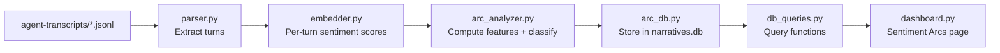

# Sentiment Arc Analysis Integration into Dashboard

## File Scoping Constraint

ALL new code and all modifications to existing code MUST be within `.cursor/hooks/`:


| File                            | Action            | Location                            |
| ------------------------------- | ----------------- | ----------------------------------- |
| `sentiment_arc/__init__.py`     | **New**           | `.cursor/hooks/sentiment_arc/`      |
| `sentiment_arc/config.py`       | **New**           | `.cursor/hooks/sentiment_arc/`      |
| `sentiment_arc/parser.py`       | **New**           | `.cursor/hooks/sentiment_arc/`      |
| `sentiment_arc/embedder.py`     | **New**           | `.cursor/hooks/sentiment_arc/`      |
| `sentiment_arc/arc_analyzer.py` | **New**           | `.cursor/hooks/sentiment_arc/`      |
| `sentiment_arc/batch_runner.py` | **New**           | `.cursor/hooks/sentiment_arc/`      |
| `sentiment_arc/arc_db.py`       | **New**           | `.cursor/hooks/sentiment_arc/`      |
| `dashboard/db_queries.py`       | **Extend**        | `.cursor/hooks/dashboard/`          |
| `dashboard/dashboard.py`        | **Extend**        | `.cursor/hooks/dashboard/`          |
| `requirements.txt`              | **Extend**        | `.cursor/hooks/`                    |
| `state/narratives.db`           | **Schema extend** | `.cursor/hooks/state/`              |
| `DOCS.md`                       | **Extend**        | Workspace root (project convention) |


Nothing is created outside `.cursor/hooks/` except the `DOCS.md` update, which follows the existing project convention. The `agent-transcripts/` directory is read-only data at an external path — no code or files are written there.

## Architecture Overview

```
agent-transcripts/ (external path)
  └── *.jsonl files
        │
        ▼
[.cursor/hooks/sentiment_arc/]  (new module)
  ├── config.py           — Transcript root path, model name, thresholds
  ├── parser.py           — Parse JSONL → turn sequences
  ├── embedder.py         — Lightweight sentiment scoring via Harrier-0.6B
  ├── arc_analyzer.py     — Compute arc features + archetype classification
  ├── batch_runner.py     — CLI to analyze all transcripts
  └── arc_db.py           — Store arc results in narratives.db (new tables)
        │
        ▼
[.cursor/hooks/dashboard/db_queries.py]  (extended)
  └── + query functions for arc data
        │
        ▼
[.cursor/hooks/dashboard/dashboard.py]  (extended)
  └── + "Sentiment Arcs" page
```

## Data Flow




## Implementation Steps

### Step 1: Create `sentiment_arc/config.py` — Central Configuration

All configurable constants in one place. No hardcoded paths in other modules.

```python
# Transcript root path — overridable via SENTIMENT_ARC_TRANSCRIPT_ROOT env var
TRANSCRIPT_ROOT = Path(
    os.environ.get(
        "SENTIMENT_ARC_TRANSCRIPT_ROOT",
        r"C:\Users\kanis\.cursor\projects\d-test-agent-learning-agent\agent-transcripts"
    )
)

# Embedding model — overridable via SENTIMENT_ARC_MODEL env var
# Default: Harrier (best quality in <1B tier, MIT license)
# Alternatives: "google/embeddinggemma-300m", "microsoft/Harrier-oss-v1-0.6b"
DEFAULT_MODEL = os.environ.get("SENTIMENT_ARC_MODEL", "microsoft/Harrier-oss-v1-0.6b")

# Smoothing
SMOOTHING_ALPHA = 0.3  # First-order EMA smoothing factor

# Archetype classification thresholds
ARCHETYPE_THRESHOLDS = {
    "slope_positive": 0.005,
    "slope_negative": -0.005,
    "volatility_low": 0.02,
    "volatility_high": 0.05,
    "end_sentiment_high": 0.3,
    "end_sentiment_low": -0.3,
    "user_self_distance_low": 0.15,  # User repeating themselves
    "model_relevance_trend_negative": -0.003,
    "recovery_threshold": 0.15,  # Minimum sentiment rebound to count as recovery
}

# Minimum turns to produce a valid arc
MIN_TURNS_FOR_ANALYSIS = 4

# Batch processing
BATCH_SIZE = 32  # Turns per embedding batch
DB_BUSY_TIMEOUT_MS = 10000  # SQLite busy timeout
```

### Step 2: Create the `sentiment_arc/` module

Create `.cursor/hooks/sentiment_arc/__init__.py` and the following modules:

#### `parser.py` — JSONL Transcript Parser

**Functions:**

`load_session_transcript(path: Path) -> tuple[list[dict], str | None]`

- Reads a JSONL file line-by-line with UTF-8 encoding
- For each line, parses JSON with error handling:
  - On `json.JSONDecodeError`: log warning, skip line, continue parsing remaining lines
  - On empty lines: skip silently
- Extracts from each valid line: `role`, `text` (concatenated from all `type: "text"` content blocks), `tools_called` (list of tool names from `type: "tool_use"` blocks)
- For user turns: strips `<timestamp>` and `<user_query>` XML tags using regex to get clean text
- Validates required keys exist (`role`, `message`, `message.content`); skips lines with missing keys and logs warning
- Returns: `(turns: list[dict], error: str | None)` where each turn is:
  ```python
  {"turn_index": int, "role": str, "text": str, "tools_called": list[str], "original_line": int}
  ```
- Returns error string if the file is completely unreadable (not found, permission denied, not valid JSONL at all)

`discover_transcripts(root: Path, include_subagents: bool = False) -> list[Path]`

- Recursively walks root directory for `*.jsonl` files
- **Edge case**: If `include_subagents=False` (default), skip files inside `subagents/` subdirectories
- **Edge case**: Returns only files where the directory name matches the filename stem (parent transcripts), e.g. `abc123/abc123.jsonl` — this filters out subagent transcripts even without the `include_subagents` flag
- **Edge case**: Handles symlinks by resolving them first; skips broken symlinks
- Returns sorted list (by file mtime, newest first) for deterministic ordering

`extract_user_text(content_list: list[dict]) -> str`

- Helper: concatenates all `type: "text"` blocks, strips XML tags
- Returns empty string if no text blocks exist

`extract_assistant_text(content_list: list[dict]) -> str`

- Helper: concatenates all `type: "text"` blocks (ignores tool_use blocks for sentiment)
- Returns empty string if no text blocks exist

**Edge cases handled:**

- Empty JSONL files → returns `([], None)` — caller skips with log message
- Corrupted lines mid-file → skipped with warning, rest of file still parsed
- Non-UTF-8 files → caught, returns error string
- Mixed content types in single turn → text and tool_use coexist, only text used for sentiment
- Very large files (>10MB) → streamed line-by-line, never loaded entirely into memory

#### `embedder.py` — Sentiment Scoring via Lightweight Embedding

**Default model: `microsoft/Harrier-oss-v1-0.6b`** (MIT license, 600M params, best in <1B tier)

**Functions:**

`get_model(model_name: str | None = None) -> SentenceTransformer`

- Lazily loads the embedding model with `sentence-transformers`
- Caches the loaded model in a module-level variable to avoid reload on subsequent calls
- **Edge case**: On first load, attempts to download from HuggingFace Hub. If download fails (network error), raises `ModelError` with clear message including fallback instructions
- **Edge case**: If no GPU available, falls back to CPU with a logged warning. On Windows, checks `torch.cuda.is_available()` first
- **Edge case**: If model name is not recognized by `sentence-transformers`, raises `ModelError` with list of known alternatives
- **Edge case**: Handles `torch.backends.mkldnn` fallback on Intel CPUs for better CPU performance

`compute_sentiment_scores(texts: list[str], model: SentenceTransformer | None = None) -> list[float]`

- Zero-shot approach using anchor text cosine similarity:
  - Positive anchor: `"This is working well. The solution is correct and helpful."`
  - Negative anchor: `"This is wrong. The approach is confusing and unsatisfactory."`
  - For each text: embed → compute `cosine(embedding, positive) - cosine(embedding, negative)` → normalize to [-1, +1] via `(score + 2) / 2 - 1` clamped to [-1, +1]
- Processes texts in batches of `config.BATCH_SIZE` to limit memory usage
- **Edge case**: Empty text strings → returns score 0.0 (neutral) rather than embedding empty string
- **Edge case**: Very long texts (> model max length) → truncates to model's max_seq_length with logged warning
- **Edge case**: Single-character texts → still embeds but logs debug-level warning
- **Edge case**: NaN or Inf in embedding vectors (model corruption) → returns 0.0 for that turn and logs error
- Returns list of floats in [-1, +1], one per input text

`compute_turn_embeddings(texts: list[str], model: SentenceTransformer | None = None) -> list[np.ndarray]`

- Returns raw embedding vectors for downstream analysis (user self-distance, model relevance)
- Same batching and edge case handling as `compute_sentiment_scores`
- Used by `arc_analyzer.py` for geometric features

**Model size note:** Harrier-0.6B is ~~1.2GB on first download, cached by `sentence-transformers` at `~~/.cache/torch/sentence_transformers/`. Subsequent runs use the cached copy.

#### `arc_analyzer.py` — Arc Feature Engineering + Archetype Classification

**Functions:**

`smooth_arc(scores: list[float], alpha: float = config.SMOOTHING_ALPHA) -> list[float]`

- Exponential moving average: `smoothed[t] = alpha * scores[t] + (1 - alpha) * smoothed[t-1]`
- **Edge case**: If scores list is empty → returns `[]`
- **Edge case**: Single score → returns `[score]` (no smoothing needed)
- **Edge case**: 2 scores → still applies smoothing

`compute_arc_features(turns: list[dict], scores: list[float], embeddings: list[np.ndarray] | None = None) -> dict`

- Computes all TRACE-inspired features:


| Feature                    | Computation                                                        | Edge case handling               |
| -------------------------- | ------------------------------------------------------------------ | -------------------------------- |
| `arc_slope`                | Linear regression slope of smoothed arc                            | If < 2 data points: `None`       |
| `arc_intercept`            | First smoothed score                                               | If empty: `None`                 |
| `late_volatility`          | Variance of last 25% of smoothed scores                            | If < 2 turns in last 25%: `None` |
| `user_self_distance`       | Mean cosine distance between consecutive user-turn embeddings      | If < 2 user turns: `None`        |
| `model_relevance_trend`    | Slope of user-request ↔ agent-response cosine similarity over time | If no user-agent pairs: `None`   |
| `recovery_events`          | Count of dips > threshold followed by rebounds > threshold         | If < 4 turns: 0                  |
| `turn_count`               | `len(turns)`                                                       | Always valid                     |
| `avg_sentiment`            | Mean of raw scores                                                 | If empty: `None`                 |
| `sentiment_range`          | max(scores) - min(scores)                                          | If < 2 scores: 0                 |
| `arc_etv`                  | Variance of full smoothed arc                                      | If < 2 scores: 0                 |
| `arc_ecp`                  | Weighted mean index of smoothed arc (center of gravity)            | If empty: `None`                 |
| `mismatched_effort_signal` | `user_self_distance < threshold AND model_relevance_trend < 0`     | If either is None: False         |


`classify_archetype(features: dict) -> str`

- Rule-based classification with priority order (first match wins):

```
1. looping:
   IF recovery_events >= 3 AND arc_etv > volatility_high
   → "looping"

2. abandoned:
   IF late_volatility is not None
   AND last 25% avg sentiment < end_sentiment_low
   AND arc_slope < slope_negative
   AND (last smoothed score - max smoothed score before last 25%) < -recovery_threshold
   → "abandoned"

3. escalating_frustration:
   IF arc_slope < slope_negative AND late_volatility > volatility_low
   → "escalating_frustration"

4. mismatched_effort:
   IF mismatched_effort_signal is True
   → "mismatched_effort"

5. smooth_convergence:
   IF arc_slope > slope_positive AND late_volatility < volatility_low AND last_score > end_sentiment_high
   → "smooth_convergence"

6. rapid_resolution:
   IF sentiment_range > 0.4 AND max(score) - min(score before max) > recovery_threshold AND last_score > 0
   → "rapid_resolution"

7. steady_friction:
   IF abs(arc_slope) < 0.003 AND avg_sentiment < -0.05 AND arc_etv < volatility_low
   → "steady_friction"

8. inconclusive (default):
   → "inconclusive"
```

- **Edge case**: If `arc_slope` is `None` (too few turns) → returns `"inconclusive"`
- **Edge case**: If all features are `None` → returns `"too_short"` (special archetype meaning "not enough data")

**Archetype values:** `smooth_convergence`, `rapid_resolution`, `steady_friction`, `escalating_frustration`, `mismatched_effort`, `looping`, `abandoned`, `inconclusive`, `too_short`

`analyze_session(turns: list[dict]) -> dict | None`

- Top-level function: orchestrates embed + score + features + classify
- Returns `None` if turns list is empty or has fewer than `MIN_TURNS_FOR_ANALYSIS` (4) turns
- Otherwise returns full analysis dict with all features + archetype

#### `arc_db.py` — Database Storage

**Schema:** Two new tables in `narratives.db`:

```sql
CREATE TABLE IF NOT EXISTS session_arc_features (
    session_id TEXT PRIMARY KEY,
    analyzed_at TEXT NOT NULL,
    archetype TEXT NOT NULL DEFAULT 'inconclusive',
    turn_count INTEGER NOT NULL DEFAULT 0,
    arc_slope REAL,
    arc_intercept REAL,
    late_volatility REAL,
    user_self_distance REAL,
    model_relevance_trend REAL,
    recovery_events INTEGER DEFAULT 0,
    avg_sentiment REAL,
    sentiment_range REAL,
    arc_etv REAL,
    arc_ecp REAL,
    mismatched_effort_signal INTEGER DEFAULT 0,
    smoothed_arc_json TEXT,
    per_turn_sentiments_json TEXT,
    model_used TEXT,
    error_message TEXT
);

CREATE TABLE IF NOT EXISTS arc_analysis_stats (
    id INTEGER PRIMARY KEY AUTOINCREMENT,
    total_sessions_analyzed INTEGER DEFAULT 0,
    last_analyzed_at TEXT,
    model_used TEXT,
    avg_arc_slope REAL,
    archetype_distribution TEXT
);
```

**Key differences from original plan:**

- Added `error_message TEXT` column — stores parse/embed errors so failed sessions are visible in dashboard
- Added `model_used TEXT` column — tracks which model generated each analysis (enables re-analysis tracking after model swaps)
- Added `DEFAULT` values on all nullable columns for safer queries

**Functions:**

`init_arc_tables(db_path: Path) -> sqlite3.Connection`

- Opens connection with `PRAGMA journal_mode=WAL` and `PRAGMA busy_timeout=10000`
- Creates tables if not exists
- Returns the open connection

`store_arc_features(conn, session_id: str, analysis: dict, smoothed_arc: list[float], raw_scores: list[float], model_name: str, error: str | None = None) -> None`

- UPSERT: `INSERT OR REPLACE` to handle re-analysis with `--force`
- **Edge case**: If `error` is not None, stores error_message and sets archetype to `"error"` with null features
- **Edge case**: JSON serialization of `smoothed_arc` and `raw_scores` — handles NaN/Inf by converting to `null` in JSON

`update_analysis_stats(conn, total_analyzed: int, model_name: str, avg_slope: float, archetype_dist: dict) -> None`

- Inserts a new row into `arc_analysis_stats` (append-only history)

`get_arc_features_for_session(conn, session_id: str) -> dict | None`

- Returns a single row as dict, or `None` if not found

`list_analyzed_session_ids(conn) -> set[str]`

- Returns set of session IDs that already have arc features — used by batch_runner to skip analyzed sessions

#### `batch_runner.py` — CLI Entry Point

```
Usage: python .cursor/hooks/sentiment_arc/batch_runner.py [options]

Options:
  --root <path>         Transcript root directory (default: from config)
  --limit N             Only analyze first N sessions (for testing)
  --session-id <id>     Analyze a single session by UUID
  --force               Re-analyze sessions that already have results
  --include-subagents   Include subagent transcripts
  --model <name>        Override embedding model (default: from config)
  --no-progress         Disable tqdm progress bar (for CI/pipe usage)
  --dry-run             Discover sessions and print count without analyzing
```

**Execution flow:**

1. Parse args, resolve transcript root path
  - **Edge case**: If path doesn't exist → exit with clear error message
  - **Edge case**: If path is a file, not a directory → exit with error
2. Initialize arc tables in `narratives.db`
  - **Edge case**: If `narratives.db` doesn't exist → run backfill first, or exit with instructions
3. Discover transcripts
  - **Edge case**: No transcripts found → print info message and exit cleanly
  - **Edge case**: If `--session-id` provided but not found → error and exit
4. Filter already-analyzed sessions (unless `--force`)
5. Apply `--limit` if set
6. Load embedding model (with progress indicator)
  - **Edge case**: Model download fails → exit with error and retry instructions
7. For each transcript:
  - Parse turns (handle errors gracefully — per-file, not fatal)
  - If parse error → log, store error record, continue to next
  - If turns < MIN_TURNS_FOR_ANALYSIS → log skip, store `"too_short"` record
  - Compute sentiment scores + embeddings
  - Compute arc features + classify archetype
  - Store in database
  - **Edge case**: If embedding fails mid-session → log, store partial results with error, continue
  - **Edge case**: If DB write fails (locked by dashboard) → retry up to 3 times with 1s backoff, then log and skip
8. Print summary: total found, analyzed, skipped, errors
9. Update `arc_analysis_stats`

**Edge cases handled:**

- KeyboardInterrupt → saves progress so far, prints partial summary
- Out of memory → catches, prints guidance to use `--limit`, exits
- Concurrent DB access → uses WAL mode + busy_timeout, retries on locked
- Model cache corruption → detects, clears cache path, re-downloads

### Step 3: Extend `db_queries.py` with arc query functions

Add to `.cursor/hooks/dashboard/db_queries.py` (after existing functions, following the same `_connect()` / `_rows_to_dicts()` pattern):

```python
def get_arc_kpi_stats() -> dict:
    """Sessions analyzed, smooth %, frustrating %, avg slope, top archetype, mismatched effort count."""
    # Query session_arc_features for aggregates
    # Edge case: returns all zeros/empty if table is empty

def get_archetype_distribution() -> list[dict]:
    """SELECT archetype, COUNT(*) as count FROM session_arc_features GROUP BY archetype ORDER BY count DESC"""

def get_arc_time_series(date_from: str, date_to: str) -> list[dict]:
    """Daily archetype counts, joined with sessions.created_at for dates.
    Edge case: date filtering uses sessions table join; skip sessions not in sessions table."""

def get_arc_session_list(search, archetype_filter, sort_col, sort_dir, page, page_size) -> tuple[list[dict], int]:
    """Paginated session list from session_arc_features + sessions join.
    sort_col validated against whitelist: archetype, arc_slope, avg_sentiment, turn_count, analyzed_at, session_id
    Edge case: if sort_col not in whitelist, default to analyzed_at."""

def get_arc_session_detail(session_id: str) -> dict:
    """Full arc analysis for one session including smoothed_arc_json parsed to list.
    Edge case: returns None if session not found."""

def get_top_frustrating_sessions(limit: int) -> list[dict]:
    """Sessions where archetype in (escalating_frustration, mismatched_effort, looping, abandoned),
    ordered by severity (most negative arc_slope first).
    Edge case: returns empty list if no frustrating sessions."""

def get_arc_archetype_examples(archetype: str, limit: int) -> list[dict]:
    """Sample sessions of a given archetype for inspection."""

def get_arc_error_sessions(limit: int) -> list[dict]:
    """Sessions where error_message IS NOT NULL, ordered by analyzed_at DESC.
    Edge case: returns empty list if no errors."""
```

All functions follow the existing pattern: `_connect()`, execute SQL, `finally: conn.close()`, return list-of-dicts.

### Step 4: Add "Sentiment Arcs" page to dashboard

Add `"Sentiment Arcs"` to the sidebar navigation radio in `dashboard.py` (line 260):

```python
page = st.sidebar.radio(
    "Select page",
    ["Overview", "Session Explorer", "Narrative Viewer", "Conversation Summaries", "Tool Analytics", "File Activity", "Model Comparison", "Error Tracking", "Sentiment Arcs"],
    label_visibility="collapsed",
    key="selected_page",
)
```

Add cached query wrappers (following existing pattern at lines 93-219):

```python
@st.cache_data(ttl=60)
def _cached_arc_kpi_stats():
    return db_queries.get_arc_kpi_stats()

@st.cache_data(ttl=60)
def _cached_archetype_distribution():
    return db_queries.get_archetype_distribution()

# ... etc for all arc query functions
```

**Page layout:**

1. **DB availability check** — reuse `check_db_accessible()` pattern; if DB has no arc data yet, show friendly message:
  ```
   No sentiment arc data yet. Run the analysis first:
   python .cursor/hooks/sentiment_arc/batch_runner.py
  ```
2. **KPI Row** (6 columns):
  - Sessions Analyzed
  - Smooth Sessions (% where archetype in smooth_convergence, rapid_resolution)
  - Frustrating Sessions (% where archetype in escalating_frustration, mismatched_effort, looping, abandoned)
  - Avg Arc Slope (formatted to 4 decimal places)
  - Top Archetype (most common archetype name)
  - Mismatched Effort Count
3. **Archetype Distribution** — horizontal bar chart (Plotly), one bar per archetype, color-coded:
  - Green: smooth_convergence, rapid_resolution
  - Yellow: steady_friction, inconclusive
  - Red: escalating_frustration, mismatched_effort, looping, abandoned
  - Gray: too_short, error
4. **Arc Timeline** — stacked area chart: daily session count broken down by archetype. X-axis = date, Y-axis = count, color = archetype.
5. **Session Arc Explorer Table** — paginated `st.dataframe` with:
  - Columns: Session ID (truncated to 20 chars), Created, Archetype, Arc Slope, Avg Sentiment, Turns, Mismatched Effort
  - Filter: archetype dropdown (All + each archetype)
  - Filter: search text box (matches session_id)
  - Sortable by: analyzed_at (default DESC), arc_slope (ASC), avg_sentiment (ASC), turn_count (DESC)
  - Row click → expand detail section
6. **Individual Session Arc Viewer** (expanded on row click):
  - Plotly line chart: two traces — raw sentiment scores (scatter dots) + smoothed arc (line)
  - X-axis = turn number, Y-axis = sentiment [-1, +1]
  - Horizontal reference line at y=0
  - Feature summary as metrics row: slope, volatility, recovery events, archetype
  - If `error_message` exists: display in `st.warning()`
  - If archetype is `too_short`: show `st.info("Session too short for meaningful analysis")`
7. **Top Frustrating Sessions** — collapsible section at bottom:
  - Table of sessions with frustration archetypes, ranked by arc_slope (most negative first)
  - Columns: Session ID, Archetype, Arc Slope, Avg Sentiment, Created, Duration (joined from sessions)
  - CSV download button
8. **Analysis Errors** — collapsible section:
  - Table of sessions where `error_message IS NOT NULL`
  - Shows session ID, error message, analyzed_at
  - Helps users identify parse failures or model issues

**Edge cases in dashboard:**

- Zero analyzed sessions → show info message with CLI command to run analysis
- Query returns empty → `empty_state()` helper (reuse existing pattern from line 61)
- DB locked by batch_runner → show `st.warning("Analysis may be in progress. Refresh in a moment.")`
- `smoothed_arc_json` is `None` → skip chart, show info message
- Very long session IDs → truncate to 20 chars with `...` suffix

### Step 5: Add dependencies

Append to `.cursor/hooks/requirements.txt`:

```
sentence-transformers>=3.0.0
torch>=2.0.0
tqdm>=4.66.0
scikit-learn>=1.4.0
numpy>=1.26.0
```

**Model download:** On first run, Harrier-0.6B (~~1.2GB) downloads from HuggingFace Hub and caches at `~~/.cache/torch/sentence_transformers/`. Subsequent runs use the cached copy. No GPU required — runs on CPU with reasonable latency (~50ms per turn on a modern CPU).

### Step 6: Update DOCS.md

Document the new module:

- What it does and why (detecting frustrating vs smooth sessions)
- How to run `batch_runner.py` with all CLI options
- New database tables and their schema
- Archetype definitions and interpretation guide
- How to change the embedding model via env var
- Edge cases and known limitations

## Key Design Decisions

- **Harrier-oss-v1-0.6b** as default: best quality in <1B tier (0.8911 nDCG@3), MIT license, outranks EmbeddingGemma-300M by 0.074 points, self-hostable with `sentence-transformers`
- **Zero-shot sentiment scoring** via anchor text cosine similarity: no labeled training data needed, fully deterministic, reproducible across runs
- **First-order smoothing** (alpha=0.3): balances responsiveness and noise reduction
- **Rule-based archetype classification**: transparent, tunable, explainable. ML classification can replace later once enough labeled data exists
- **Arc results in SQLite** alongside existing session data: dashboard can join and correlate arcs with tool usage, file edits, errors
- **Subagent transcripts excluded by default**: parent transcript captures the full user-facing conversation
- **All paths configurable via env vars**: `SENTIMENT_ARC_TRANSCRIPT_ROOT` and `SENTIMENT_ARC_MODEL`
- **Graceful degradation**: every failure mode (parse error, model failure, DB locked) is handled without crashing the pipeline

## Edge Cases Summary


| Scenario                            | Handling                                                               |
| ----------------------------------- | ---------------------------------------------------------------------- |
| Empty JSONL file                    | Skipped with log, no error                                             |
| Corrupted JSON lines                | Skipped with warning, rest of file parsed                              |
| File not UTF-8                      | Error returned, stored as error record                                 |
| Single-turn session                 | Classified as `too_short`, stored with minimal features                |
| No text content in turns            | Skipped during scoring, `too_short` if insufficient text-bearing turns |
| Model download fails                | Clear error message with retry instructions                            |
| No GPU available                    | CPU fallback with logged warning                                       |
| NaN/Inf in embeddings               | Score set to 0.0, logged                                               |
| DB locked by concurrent access      | Retry 3x with 1s backoff, then skip with log                           |
| Very long text (> model max length) | Truncated with warning                                                 |
| Empty text strings                  | Score = 0.0 (neutral)                                                  |
| KeyboardInterrupt during batch      | Save progress, print partial summary                                   |
| Out of memory                       | Catch, suggest `--limit`, exit cleanly                                 |
| Already-analyzed sessions           | Skipped unless `--force`                                               |
| Symlinks / broken paths             | Resolved and validated before processing                               |
| Windows backslash paths             | All path handling uses `pathlib.Path`                                  |
| Unicode in transcript text          | UTF-8 with error replacement on decode failure                         |
| Zero sessions analyzed              | Dashboard shows friendly setup message                                 |
| `smoothed_arc_json` is null         | Chart skipped with info message                                        |


