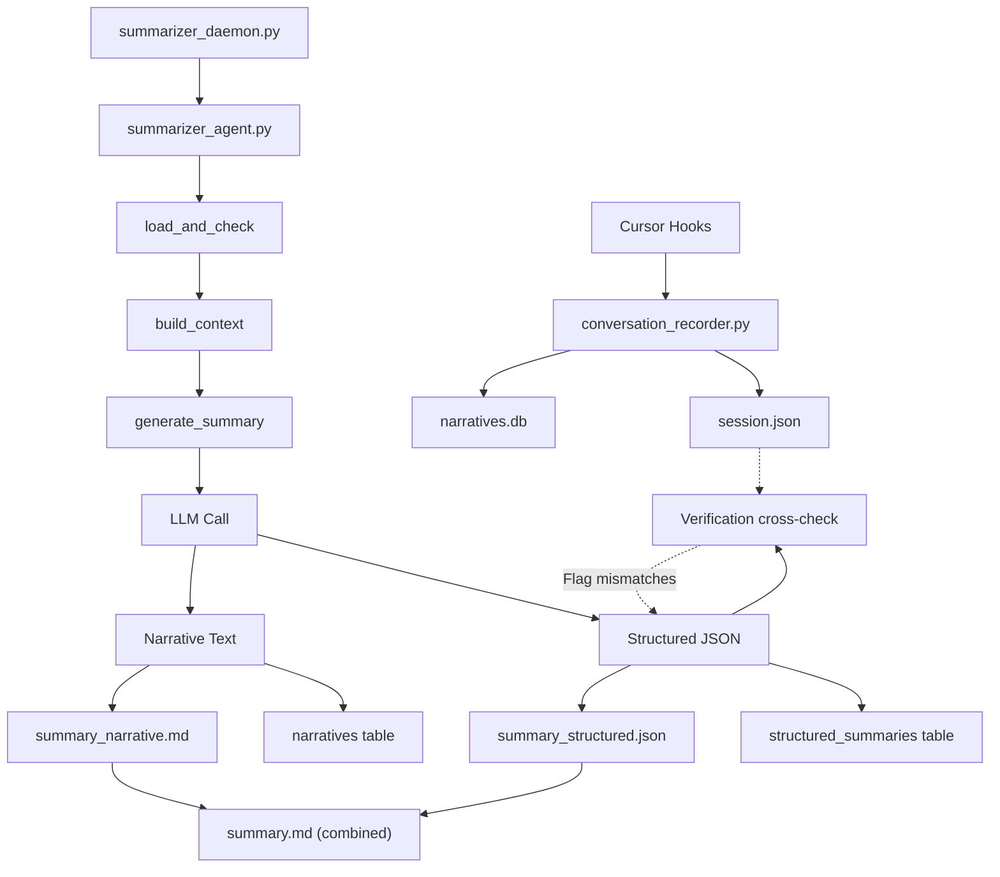

# Structured Data Output for Session Summarization

## Problem Statement

The current summarizer in `summarizer_agent.py` only produces a free-form narrative summary. While `session_end.py` generates structured statistics (counts, breakdowns), these are purely numeric — they don't capture the **semantic** content of what happened: decisions made, problems solved, errors encountered, and reasoning patterns.

This makes it impossible to query, filter, or programmatically reason about past sessions.

## Architecture Overview

Current flow:
```
Hooks (pre_compact, session_end, etc.)
  → conversation_recorder.add_event()
    → session.json (JSON) + narratives.db (SQLite)
    
Summarizer Daemon (polls triggers)
  → summarizer_agent.py (LangGraph graph)
    → generate_summary() → LLM → narrative text only
    → save_summary() → summary_narrative.md + summary.md + SQLite
```

New flow adds structured output as a **parallel product** of the LLM call, stored alongside the narrative.

## Changes

### 1. Define the Structured Summary Schema

Add a `Pydantic`-style TypedDict in `summarizer_agent.py` that defines the structured output format. This will be used to instruct the LLM and validate its output.

```python
class StructuredSummary(TypedDict, total=False):
    objectives: list[str]           # What the user was trying to accomplish
    files_modified: list[str]       # Files that were changed
    files_created: list[str]        # New files created
    files_deleted: list[str]        # Files removed
    decisions: list[dict]           # {decision, reason, alternatives_considered}
    errors_encountered: list[dict]  # {error, context, resolution}
    tool_usage_summary: dict        # {tool_name: {"calls": N, "failures": N, "success_rate": float}}
    subagent_work: list[dict]       # {subagent_type, task, outcome, tool_calls}
    code_patterns: list[str]        # Notable patterns (e.g., "added retry logic", "extracted helper function")
    open_questions: list[str]       # Unresolved items or future work
    outcome: str                    # One-line result
    session_type: str               # "feature", "bugfix", "refactor", "exploration", "documentation", "config"
```

### 2. Modify `summarizer_agent.py` — Add Structured Summary Generation

In the existing `generate_summary()` function (lines 455-521), add structured output generation as a **second LLM call** (or a single call that produces both outputs).

**Approach: Single LLM call with dual output**

Modify the system prompt to request both narrative AND structured JSON in a specific format. Parse the JSON from the response and store it separately.

The prompt will include:
- Existing narrative instructions (unchanged)
- New structured output instructions
- A clear delimiter and format specification

Add a new node to the LangGraph:

```
load_and_check → build_context → generate_summary → extract_structured → save_summary → END
```

Or combine extraction into `save_summary` to minimize graph complexity.

### 3. Add JSON Validation and Repair Logic

The LLM may produce malformed JSON. Add a validation step:

1. Parse JSON from LLM response (extract from code blocks or raw text)
2. Validate against the schema
3. If validation fails, attempt auto-repair:
   - Fix common JSON errors (trailing commas, missing quotes)
   - Fill missing required fields with defaults
4. If repair fails, store a partial structure with a `"parse_error"` field
5. Log the failure for debugging

### 4. Extend `save_summary()` to Store Structured Output

In the existing `save_summary()` function (lines 524-628), add:

1. Write `summary_structured.json` to the session directory (alongside `summary_narrative.md` and `summary.md`)
2. Add the structured data to the `session.json` summary field
3. Add a new SQLite table `structured_summaries` in `narratives_db.py`

### 5. Add SQLite Table in `narratives_db.py` — Migration v6

Add a new schema migration that creates:

```sql
CREATE TABLE IF NOT EXISTS structured_summaries (
    session_id TEXT PRIMARY KEY,
    structured_json TEXT NOT NULL,       -- The full JSON blob
    generated_at TEXT NOT NULL,
    objectives TEXT DEFAULT '[]',        -- JSON array for indexed search
    files_modified TEXT DEFAULT '[]',    -- JSON array for indexed search
    decisions_count INTEGER DEFAULT 0,
    errors_count INTEGER DEFAULT 0,
    session_type TEXT DEFAULT '',
    FOREIGN KEY (session_id) REFERENCES sessions(session_id) ON DELETE CASCADE
)
```

The indexed columns (`objectives`, `files_modified`, `session_type`) enable SQL queries like:
- "Show all sessions that modified `auth.py`"
- "Show all bugfix sessions with errors"
- "Show sessions about rate limiting"

Add corresponding methods:
- `upsert_structured_summary(session_id, structured_json)`
- `search_structured_summaries(query_field, value)` — e.g., find sessions by file, type, or objective keyword
- `get_structured_summary(session_id)`

### 6. Handle Edge Cases

#### Edge Case: Empty or Trivial Sessions
- Sessions with 0-2 events should get a minimal structured summary (no LLM call)
- Default structure: `{"objectives": [], "outcome": "Session had insufficient events for analysis", ...}`
- This avoids wasting LLM tokens on sessions like "user opened chat, then closed"

#### Edge Case: LLM Returns No JSON
- The regex extraction may fail if the LLM produces pure narrative with no JSON block
- Fallback: make a second, targeted LLM call with just the structured prompt
- If that also fails, store a structure with `{"parse_error": true, "raw_response_preview": "..."}`

#### Edge Case: LLM Hallucination
- Cross-reference `files_modified` against actual `file_edits` events
- Cross-reference `tool_usage_summary` counts against `tool_uses` array length
- Flag discrepancies: add `"_verification_warnings": ["listed file X was not found in events"]` field

#### Edge Case: Oversized Structured Output
- Cap each field: max 50 objectives, max 100 files_modified, max 50 decisions
- Cap individual string fields to 500 chars
- Total JSON capped at 10KB
- Excess items get a `"..."` suffix

#### Edge Case: Concurrent Writes (Race with session_end.py)
- `session_end.py` and `summarizer_agent.py` both write to `session.json`
- The existing summarizer lock already handles this
- The new structured output write should follow the same lock pattern

#### Edge Case: Corrupt or Malformed JSON in Output
- Use `json5`-style lenient parsing or regex-based extraction
- Strip control characters, fix encoding issues
- Store raw failed output in debug log

#### Edge Case: Backfilling Existing Sessions
- Add a `--structured` flag to `summarize_sessions.py` for backfilling structured summaries
- Re-run summarization with the new prompt for existing sessions
- Or use a separate "extract structured from narrative" pass that only calls the LLM on existing narratives (cheaper than re-processing full events)

#### Edge Case: Schema Evolution
- Version the structured summary schema (start at version 1)
- Store `schema_version` field in the JSON
- Future migrations can handle version bumps

#### Edge Case: Sensitive Data in Structured Output
- Scrub secrets from `decisions` and `errors_encountered` fields
- Detect patterns like API keys, passwords, tokens
- Store scrubbed version, log if scrubbing occurred

#### Edge Case: Multi-Session Conversations
- The current system summarizes per-session
- Structured summaries should be linkable across sessions within the same conversation
- Add `conversation_id` to the SQLite table
- Provide a `merge_structured_summaries(conversation_id)` method that combines structured outputs across sessions

### 7. Update `summarize_sessions.py` CLI

Add new CLI options:
- `--structured` — Generate structured summaries only (skip narrative)
- `--full` — Generate both narrative and structured (default)
- `--show-structured <session_id>` — Display structured summary for a session
- `--validate-structured` — Run verification on all existing structured summaries

### 8. Update `summary.md` Output

Modify `format_markdown_summary()` in `session_end.py` (or create a new renderer) to include structured data sections in `summary.md`:

```markdown
# Narrative Summary
...existing narrative...

---

## Structured Summary

**Session Type:** bugfix
**Outcome:** Fixed auth middleware timeout issue

### Objectives
- Fix connection timeout in auth middleware

### Files Modified
- `/src/auth.py`
- `/src/middleware.py`

### Decisions
- Use Redis instead of in-memory cache (persistence requirement)

### Errors Encountered
- Connection timeout → Resolved with retry logic

### Open Questions
- Should we add circuit breaker pattern?
```

## Data Flow Diagram



## File Changes Summary

| File | Change |
|------|--------|
| `summarizer_agent.py` | Add `StructuredSummary` TypedDict, modify system prompt, add `extract_structured_summary()` function, add JSON validation/repair, extend `save_summary()` |
| `narratives_db.py` | Add migration v6 with `structured_summaries` table, add `upsert_structured_summary()`, `search_structured_summaries()`, `get_structured_summary()`, `merge_structured_summaries()` |
| `session_end.py` | Update `format_markdown_summary()` to include structured data sections in rendered markdown |
| `summarize_sessions.py` | Add `--structured`, `--full`, `--show-structured`, `--validate-structured` CLI options |

## Implementation Order

1. **Schema definition** — Add `StructuredSummary` TypedDict in `summarizer_agent.py`
2. **Prompt engineering** — Modify `generate_summary()` system prompt to request structured output
3. **JSON extraction & validation** — Add `extract_structured_summary()` with repair logic
4. **Storage — JSON file** — Extend `save_summary()` to write `summary_structured.json`
5. **Storage — SQLite** — Add migration v6 and DB methods in `narratives_db.py`
6. **Verification** — Add cross-reference check against actual events
7. **Markdown rendering** — Update `session_end.py` `format_markdown_summary()` 
8. **CLI** — Update `summarize_sessions.py` with new options
9. **Backfill support** — Add `--structured` backfill mode
10. **Edge case handling** — Empty sessions, sensitive data scrubbing, multi-session merge
