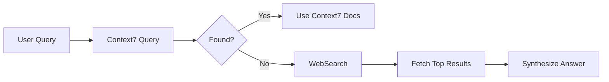

# Context7 Integration

## Quick Start
Check Context7 registry → Query version-specific docs → Apply to codebase → Cite source

## Auto-Invoke Triggers
- Library name + version number (e.g., "React 19", "Vite 6")
- "How to use" + library + API method
- "What's the API for" + feature
- Version migration questions ("migrate from X to Y")

## When to Use
- Need version-specific API documentation
- Library has Context7 support (check registry)
- Want current code examples matching project version
- API syntax or parameters unclear
- Migration between versions needed

## MCP Server Setup

Context7 MCP is configured in `.cursor/mcp.json` with the `user-` prefix convention:

```json
{
  "mcpServers": {
    "user-context7": {
      "command": "npx",
      "args": ["-y", "@upstash/context7-mcp@latest"]
    }
  }
}
```

**Server name**: `user-context7` (matches Cursor's user-level MCP naming convention)

**Tools Available**:
- `resolve-library-id`: Look up library in Context7 registry
- `query-docs`: Fetch version-specific documentation

## Workflow

### 1. Identify Library and Version
From user query or project context:
- Library name (e.g., "react", "nextjs", "vite")
- Version from package.json or user input
- Specific API or feature needed

### 2. Check Context7 Registry
Use `resolve-library-id` tool:
```
CallMcpTool(
  server: "user-context7",
  toolName: "resolve-library-id",
  arguments: { library: "react" }
)
```

**If Found**: Get library ID for queries
**If Not Found**: Fall back to WebSearch/WebFetch

### 3. Query Documentation
Use `query-docs` tool:
```
CallMcpTool(
  server: "user-context7",
  toolName: "query-docs",
  arguments: {
    library_id: "react",
    query: "useEffect hook documentation",
    version: "19.0.0"
  }
)
```

### 4. Extract Relevant Information
From returned docs:
- API signatures
- Parameter types
- Usage examples
- Version-specific notes
- Migration guides

### 5. Apply to Codebase
- Show implementation matching fetched docs
- Ensure version compatibility
- Note any breaking changes
- Cite Context7 as source

## Example Usage

**User**: "How do I use the new React 19 use() hook?"

**Agent Response**:
"I'll fetch the React 19 use() hook documentation from Context7..."

1. **Resolve**: Get React library ID from Context7
2. **Query**: "use() hook documentation version 19"
3. **Extract**: API signature, examples, caveats
4. **Apply**: Show usage in your component
5. **Verify**: Version matches your package.json

**User**: "What's the Vite 6 config for code splitting?"

**Agent Response**:
"Let me check Context7 for Vite 6 documentation..."

1. **Resolve**: Vite library ID
2. **Query**: "code splitting manualChunks configuration"
3. **Extract**: Config options, examples
4. **Apply**: Update your vite.config.ts

## Auto-Invoke Pattern

When user mentions library or API:

```markdown
1. Check if library likely in Context7 (popular libraries)
2. If yes, query Context7 automatically
3. If no results, fall back to WebSearch
4. Inject fetched docs into response
```

**Example Flow**:
```
User: "Add authentication with NextAuth"
Agent:
1. Query Context7: "NextAuth authentication setup"
2. Fetch current API patterns
3. Show implementation with fetched examples
```

## Supported Libraries

Context7 supports thousands of libraries. Common ones:

### Frontend
- React, Vue, Svelte, Angular
- Next.js, Nuxt, SvelteKit
- Vite, Webpack, Rollup
- Tailwind CSS, Material-UI, Chakra UI

### Backend
- Express, Fastify, NestJS
- Django, Flask, FastAPI
- Spring Boot, Quarkus

### Database
- Prisma, Drizzle, TypeORM
- Mongoose, Sequelize
- Redis, PostgreSQL drivers

### Testing
- Vitest, Jest, Playwright
- Cypress, Testing Library

**Check Registry**: Use `resolve-library-id` to verify support

## Fallback Strategy

If Context7 doesn't have the library:



**Fallback Order**:
1. Context7 MCP (version-specific, preferred)
2. WebSearch + WebFetch (general web)
3. User-provided documentation

## Best Practices

### Version Matching
✅ **Good**:
- Check project's package.json for versions
- Query Context7 with specific version
- Note version differences in response

❌ **Avoid**:
- Assuming latest version
- Mixing version-specific APIs
- Not verifying compatibility

### Query Specificity
✅ **Good Queries**:
- "useEffect dependency array cleanup"
- "Next.js 14 App Router data fetching"
- "Vite 6 build.minify options"

❌ **Vague Queries**:
- "React hooks"
- "Next.js routing"
- "Vite config"

### Citation Format
Always include:
- Library name and version
- Context7 as source
- Specific API or section referenced

## Error Handling

### Library Not Found
```
Response: "Library [name] not found in Context7 registry. 
I'll search the web for current documentation instead."
Action: Fall back to WebSearch
```

### Version Not Available
```
Response: "Version [x.y.z] not available, fetching latest docs..."
Action: Query without version constraint
```

### Query Returns No Results
```
Response: "No results for [query]. Trying broader search..."
Action: Simplify query, retry
```

## Performance Tips

### Efficient Queries
- Be specific but not overly narrow
- Include version when relevant
- Use library terminology

### Caching
- Context7 responses are cached in conversation
- Re-use fetched docs for follow-up questions
- Note when re-fetching needed (version changes)

## Security Considerations

### Context Poisoning Awareness
- Context7 had a vulnerability (ContextCrush) in Feb 2026
- Community contributions may not be verified
- Always cross-reference with official docs for critical code

### Verification
For security-critical code:
1. Fetch from Context7
2. Verify against official documentation
3. Check library's GitHub repo
4. Review security advisories

## Success Metrics
✅ Resolved library in Context7 registry
✅ Fetched version-specific documentation matching project
✅ Applied examples to user's codebase correctly
✅ Noted any breaking changes or migrations
❌ Library not found without fallback to WebSearch

## Parallel Execution

### Pattern 1: Library Research
**When**: Library research or version comparison
**Parallel**: Context7 + WebSearch simultaneously
**Example**: "React 19 optimization techniques"
  - Context7: React 19 APIs, hook signatures (version-specific)
  - WebSearch: Latest patterns, performance tips 2025-2026 (current practices)
**Benefit**: Get both authoritative APIs + cutting-edge patterns

### Pattern 2: Plan Mode Research (NEW)
**When**: User requests plan mode
**Parallel**: Context7 + WebSearch + WebFetch (all three)
**Example**: "Plan: Add authentication"
  - Context7: jsonwebtoken v9 API, Electron 41 IPC patterns
  - WebSearch: "Electron authentication 2026", "JWT best practices"
  - WebFetch: electronjs.org/docs/security, jwt.io, OWASP
**Merge**: Synthesize into comprehensive implementation plan

### Pattern 3: Security Verification (NEW)
**When**: Authentication, encryption, user input handling
**Parallel**: Context7 + Official Docs + Security Guides
**Example**: "Implement JWT authentication"
  - Context7: jsonwebtoken v9 sign/verify API
  - Official: jwt.io, node-jsonwebtoken GitHub
  - Security: OWASP JWT guidelines (2025)
**Requirement**: All three must align (ContextCrush awareness)
**Note**: 25.1% of AI code has vulnerabilities, triple-verify critical code

### Pattern 4: Version Migration (NEW)
**When**: Migrating between major versions
**Parallel**: Context7 (old + new versions) + WebSearch
**Example**: "Migrate Vite 5 config to Vite 6"
  - Context7: Vite 5 config API, Vite 6 config API
  - WebSearch: "Vite 6 migration breaking changes 2026"
**Output**: Migration guide with verified changes

## Common Failures & Fixes
**Library not in Context7 registry**: Fall back to WebSearch for official documentation
**Version not available**: Query without version constraint, note potential differences
**Query returns no results**: Simplify query to core terms, retry with broader scope
**ContextCrush vulnerability concern**: Cross-reference critical code with official docs, verify security-sensitive implementations

## See Also
- **web-search-research**: Fallback when library not in Context7
- **web-fetch-docs**: Fetch official docs when Context7 unavailable
- **context7-parallel-research**: Enhanced parallel execution with security awareness

## Related Skills

- **web-search-research**: For libraries not in Context7
- **web-fetch-docs**: For fetching official documentation
- **browser-use-testing**: For testing fetched patterns
