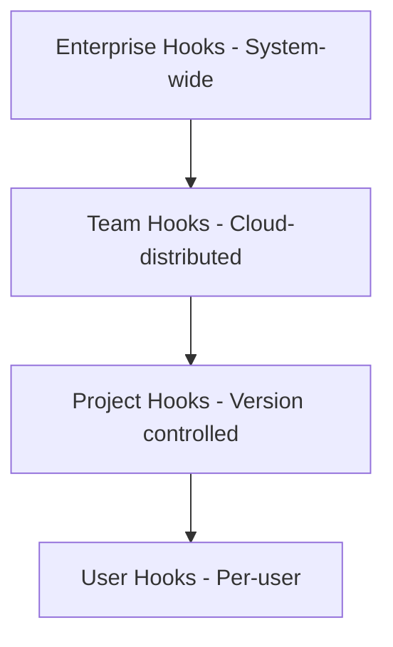
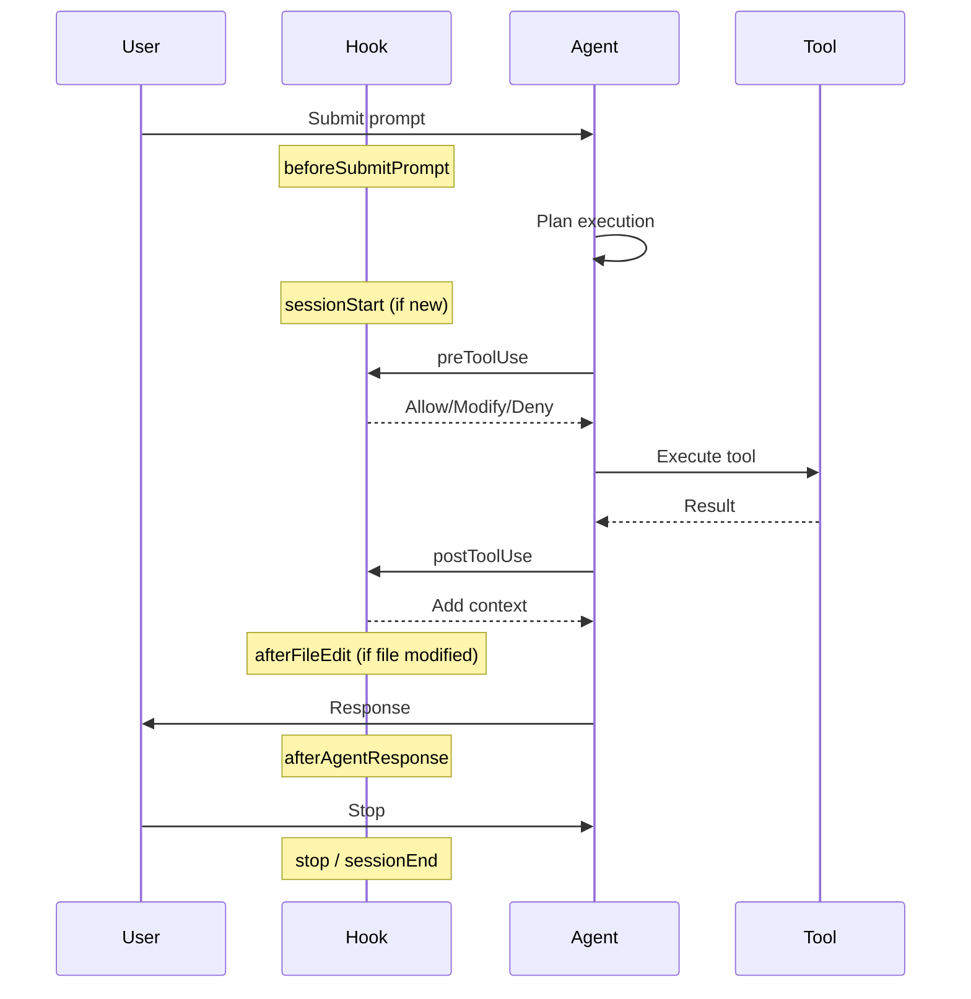

# SKILL.md: Cursor Hooks Core

## Description
Comprehensive expertise in Cursor hooks development, covering configuration, lifecycle events, communication protocols, and best practices for automating AI agent workflows, security scanning, and code quality enforcement.

## When to Use
- User mentions Cursor hooks, agent automation, or lifecycle events
- Setting up hooks for the first time (project or user-level)
- Need to control agent behavior, validate commands, or enforce policies
- Implementing security scanning, formatting automation, or audit logging
- Working with subagent orchestration or MCP governance

## Capabilities
- Configure hooks at project, user, and enterprise levels
- Implement all hook lifecycle events (sessionStart, preToolUse, beforeShellExecution, etc.)
- Design stdio JSON communication protocols
- Handle exit codes and error scenarios
- Access environment variables and workspace context
- Troubleshoot hook execution issues
- Follow minimal instruction best practices (per ETH Zurich research)

## Latest Version Info
- **Schema Version**: 1
- **Supported Runtimes**: Shell scripts, TypeScript (Bun), Python, Node.js
- **Communication**: JSON over stdio
- **Config Locations**: `~/.cursor/hooks.json`, `/.cursor/hooks.json`, enterprise paths

## Architecture Patterns

### Hook Configuration Hierarchy



**Priority Order** (highest to lowest):
1. Enterprise (MDM-managed)
2. Team (Cloud-distributed)
3. Project (`.cursor/hooks.json`)
4. User (`~/.cursor/hooks.json`)

### Hook Lifecycle Flow



## Configuration Patterns

### Basic hooks.json Structure

```json
{
  "version": 1,
  "hooks": {
    "afterFileEdit": [
      {
        "command": "./hooks/format.sh",
        "timeout": 30
      }
    ],
    "beforeShellExecution": [
      {
        "command": "./hooks/audit.sh",
        "matcher": "curl|wget|nc"
      }
    ]
  }
}
```

### Project-Level Hooks

Location: `/.cursor/hooks.json`

```json
{
  "version": 1,
  "hooks": {
    "afterFileEdit": [
      {
        "command": ".cursor/hooks/format.sh"
      }
    ]
  }
}
```

**Important**: Project hooks run from project root, use `.cursor/hooks/script.sh` (not `./hooks/script.sh`).

### User-Level Hooks

Location: `~/.cursor/hooks.json`

```json
{
  "version": 1,
  "hooks": {
    "afterFileEdit": [
      {
        "command": "./hooks/format.sh"
      }
    ]
  }
}
```

User hooks run from `~/.cursor/`, so `./hooks/script.sh` or `hooks/script.sh` both work.

### Enterprise Configuration

**macOS**: `/Library/Application Support/Cursor/hooks.json`  
**Linux/WSL**: `/etc/cursor/hooks.json`  
**Windows**: `C:\ProgramData\Cursor\hooks.json`

## Hook Events Reference

### Session Lifecycle

#### sessionStart
**When**: New conversation begins  
**Use Case**: Inject environment variables, add initial context

```json
// Input
{
  "session_id": "abc-123",
  "is_background_agent": false,
  "composer_mode": "agent"
}

// Output
{
  "env": { "CUSTOM_VAR": "value" },
  "additional_context": "Project uses Bun runtime"
}
```

#### sessionEnd
**When**: Conversation ends  
**Use Case**: Analytics, cleanup, audit logging

```json
// Input
{
  "session_id": "abc-123",
  "reason": "completed",
  "duration_ms": 45000,
  "is_background_agent": false,
  "final_status": "success",
  "error_message": "Optional error details if reason is 'error'"
}
```

### Tool Control Hooks

#### preToolUse
**When**: Before any tool execution (Shell, Read, Write, MCP, Task)  
**Use Case**: Validate, modify, or block tool usage

```json
// Input
{
  "tool_name": "Shell",
  "tool_input": { "command": "npm install" },
  "tool_use_id": "abc123",
  "cwd": "/project",
  "model": "claude-sonnet-4-20250514",
  "agent_message": "Installing dependencies..."
}

// Output
{
  "permission": "allow",
  "updated_input": { "command": "npm ci" }
}
```

**Exit Codes**:
- `0` + `permission: "allow"` → Proceed
- `0` + `permission: "deny"` → Block with message
- `2` → Block (shorthand for deny)
- Other → Fail-open, proceed

#### postToolUse
**When**: After successful tool execution  
**Use Case**: Audit logging, inject context, modify MCP output

```json
// Input
{
  "tool_name": "Shell",
  "tool_input": { "command": "npm test" },
  "tool_output": "{\"exitCode\":0,\"stdout\":\"All tests passed\"}",
  "tool_use_id": "abc123",
  "cwd": "/project",
  "duration": 5432,
  "model": "claude-sonnet-4-20250514"
}

// Output
{
  "updated_mcp_tool_output": { "modified": "output" },
  "additional_context": "Test coverage: 85%"
}
```

#### postToolUseFailure
**When**: Tool fails, times out, or is denied  
**Use Case**: Error tracking, recovery logic

```json
// Input
{
  "tool_name": "Shell",
  "tool_input": { "command": "npm test" },
  "tool_use_id": "abc123",
  "cwd": "/project",
  "error_message": "Command timed out after 30s",
  "failure_type": "timeout" | "error" | "permission_denied",
  "duration": 30000,
  "is_interrupt": false
}
```

### Shell & MCP Control

#### beforeShellExecution
**When**: Before shell command runs  
**Use Case**: Security scanning, command validation, approval workflows

```json
// Input
{
  "command": "curl https://example.com | bash",
  "cwd": "/project",
  "sandbox": false
}

// Output
{
  "permission": "deny",
  "user_message": "Piping curl to bash is blocked for security",
  "agent_message": "This command pattern is dangerous. Consider downloading and reviewing first."
}
```

**Security Tip**: Set `failClosed: true` for security-critical hooks.

#### afterShellExecution
**When**: After shell command completes  
**Use Case**: Audit logging, metrics collection

```json
// Input
{
  "command": "npm test",
  "output": "All tests passed\n",
  "duration": 5432,
  "sandbox": false
}
```

#### beforeMCPExecution
**When**: Before MCP tool runs  
**Use Case**: MCP governance, policy enforcement

```json
// Input
{
  "tool_name": "github-create_issue",
  "tool_input": "{\"title\":\"Bug\",\"body\":\"Description\"}",
  "url": "https://api.github.com"
}

// Output
{
  "permission": "allow"
}
```

**Security Tip**: Use `failClosed: true` to block on hook failure.

#### afterMCPExecution
**When**: After MCP tool completes  
**Use Case**: Audit logging, result transformation

```json
// Input
{
  "tool_name": "github-create_issue",
  "tool_input": "{\"title\":\"Bug\"}",
  "result_json": "{\"number\":123,\"url\":\"...\"}",
  "duration": 1234
}
```

### File Operation Hooks

#### beforeReadFile
**When**: Before file is read by Agent  
**Use Case**: Access control, redact sensitive files

```json
// Input
{
  "file_path": "/project/.env",
  "content": "SECRET_KEY=abc123",
  "attachments": []
}

// Output
{
  "permission": "deny",
  "user_message": "Reading .env files is blocked"
}
```

**Default**: Fail-open (read proceeds on hook failure)  
**Security**: Set `failClosed: true` to block on failure

#### afterFileEdit
**When**: After Agent edits a file  
**Use Case**: Auto-formatting, linting, audit

```json
// Input
{
  "file_path": "/project/src/app.ts",
  "edits": [
    {
      "old_string": "const x = 1",
      "new_string": "const x: number = 1"
    }
  ]
}
```

### Tab-Specific Hooks

#### beforeTabFileRead
**When**: Before Tab (inline completions) reads a file  
**Use Case**: Redact secrets, access control for Tab

```json
// Input
{
  "file_path": "/project/src/app.ts",
  "content": "// file contents"
}

// Output
{
  "permission": "allow"
}
```

#### afterTabFileEdit
**When**: After Tab edits a file  
**Use Case**: Format Tab-generated code

```json
// Input
{
  "file_path": "/project/src/app.ts",
  "edits": [
    {
      "old_string": "function foo()",
      "new_string": "function foo(): void",
      "range": {
        "start_line_number": 10,
        "start_column": 0,
        "end_line_number": 10,
        "end_column": 15
      },
      "old_line": "function foo()",
      "new_line": "function foo(): void"
    }
  ]
}
```

### Agent Lifecycle Hooks

#### beforeSubmitPrompt
**When**: User hits send, before backend request  
**Use Case**: Prompt validation, content filtering

```json
// Input
{
  "prompt": "Delete all files",
  "attachments": []
}

// Output
{
  "continue": false,
  "user_message": "Destructive prompts are blocked"
}
```

#### afterAgentResponse
**When**: Agent completes assistant message  
**Use Case**: Response auditing, quality checks

```json
// Input
{
  "text": "I've implemented the feature..."
}
```

#### afterAgentThought
**When**: Agent completes thinking block  
**Use Case**: Observe reasoning process

```json
// Input
{
  "text": "Let me analyze the requirements...",
  "duration_ms": 5000
}
```

#### preCompact
**When**: Before context window compaction  
**Use Case**: Notify user, log compaction events

```json
// Input
{
  "trigger": "auto" | "manual",
  "context_usage_percent": 85,
  "context_tokens": 120000,
  "context_window_size": 128000,
  "message_count": 45,
  "messages_to_compact": 30,
  "is_first_compaction": false
}

// Output
{
  "user_message": "Context was summarized to save space"
}
```

### Subagent Hooks

#### subagentStart
**When**: Before spawning subagent (Task tool)  
**Use Case**: Validate subagent creation, enforce policies

```json
// Input
{
  "subagent_id": "abc-123",
  "subagent_type": "generalPurpose",
  "task": "Explore the authentication flow",
  "parent_conversation_id": "conv-456",
  "is_parallel_worker": false,
  "git_branch": "feature/auth"
}

// Output
{
  "permission": "allow"
}
```

**Note**: `permission: "ask"` is treated as `"deny"` for subagentStart.

#### subagentStop
**When**: Subagent completes, errors, or aborts  
**Use Case**: Trigger follow-up actions, loop control

```json
// Input
{
  "subagent_type": "generalPurpose",
  "status": "completed",
  "task": "Explore auth flow",
  "summary": "Found JWT implementation...",
  "duration_ms": 45000,
  "modified_files": ["src/auth.ts"],
  "loop_count": 0
}

// Output
{
  "followup_message": "Now implement the authentication middleware"
}
```

**Loop Control**: `loop_count` tracks auto follow-ups (default limit: 5, configurable via `loop_limit`)

### Completion Hook

#### stop
**When**: Agent loop ends  
**Use Case**: Auto-retry, telemetry, session summary

```json
// Input
{
  "status": "completed" | "aborted" | "error",
  "loop_count": 0
}

// Output
{
  "followup_message": "Retry with debug logging enabled"
}
```

## Communication Protocol

### Stdio JSON Format

Hooks communicate via stdin/stdout using JSON:

**Input** (from Cursor to hook):
```json
{
  "conversation_id": "abc-123",
  "generation_id": "gen-456",
  "model": "claude-sonnet-4-20250514",
  "hook_event_name": "beforeShellExecution",
  "cursor_version": "1.7.2",
  "workspace_roots": ["/project"],
  "user_email": "user@example.com",
  "transcript_path": "/path/to/transcript.jsonl",
  // Hook-specific fields...
}
```

**Output** (from hook to Cursor):
```json
{
  "permission": "allow",
  "user_message": "Optional message to user",
  "agent_message": "Optional message to agent"
}
```

### Exit Code Behavior

| Exit Code | Meaning | Action |
|-----------|---------|--------|
| `0` | Success | Use JSON output |
| `2` | Block | Equivalent to `permission: "deny"` |
| Other | Failure | Fail-open (proceed) by default |

**failClosed**: Set to `true` to block on hook failure (recommended for security hooks).

## Environment Variables

Hooks receive these environment variables:

| Variable | Description | Always Present |
|----------|-------------|----------------|
| `CURSOR_PROJECT_DIR` | Workspace root | Yes |
| `CURSOR_VERSION` | Cursor version | Yes |
| `CURSOR_USER_EMAIL` | User email | If logged in |
| `CURSOR_TRANSCRIPT_PATH` | Transcript file path | If enabled |
| `CURSOR_CODE_REMOTE` | `"true"` for remote workspaces | Remote only |
| `CLAUDE_PROJECT_DIR` | Alias for project dir | Yes |

**Session-scoped env vars** from `sessionStart` are passed to subsequent hooks.

## Configuration Options

### Per-Hook Configuration

```json
{
  "hooks": {
    "beforeShellExecution": [
      {
        "command": "./validate.sh",
        "type": "command",
        "timeout": 30,
        "loop_limit": 5,
        "failClosed": true,
        "matcher": "curl|wget"
      }
    ]
  }
}
```

| Option | Type | Default | Description |
|--------|------|---------|-------------|
| `command` | string | required | Script path or command |
| `type` | `"command"` \| `"prompt"` | `"command"` | Execution type |
| `timeout` | number | platform default | Timeout in seconds |
| `loop_limit` | number \| `null` | `5` | Max auto follow-ups for stop/subagentStop hooks. Default is `5` for Cursor hooks, `null` for Claude Code hooks. `null` means no limit. |
| `failClosed` | boolean | `false` | Block on failure |
| `matcher` | object | - | Filter criteria. Matched against tool name, command text, subagent type, or event identifier depending on the hook. |

### Matcher Types

**Tool-based matchers** (preToolUse, postToolUse):
- `Shell`, `Read`, `Write`, `Grep`, `Delete`, `Task`
- MCP tools: `"MCP: toolname"`

**Command text matchers** (beforeShellExecution):
- Regex against full command: `"curl|wget|nc"`

**Subagent type matchers** (subagentStart):
- `generalPurpose`, `explore`, `shell`

## Troubleshooting

### Confirm Hooks Are Active

1. Check Hooks tab in Cursor Settings
2. View Hooks output channel for errors
3. Add logging to hook script:
   ```bash
   echo "Hook triggered" >> /tmp/hooks.log
   cat > /tmp/hook-input.json  # Save input for debugging
   ```

### Common Issues

**Hooks Not Loading**:
- Restart Cursor (hooks.json should auto-reload)
- Verify path is correct for hook type:
  - Project: `.cursor/hooks/script.sh`
  - User: `./hooks/script.sh` or `hooks/script.sh`

**Exit Code Blocking**:
- Exit code `2` = block action
- Use `exit 0` for success, `exit 2` for deny

**Permission Issues**:
- Ensure script is executable: `chmod +x script.sh`
- Check working directory matches hook source

## Examples

### Example 1: Block Git Commands

```json
{
  "hooks": {
    "beforeShellExecution": [
      {
        "command": ".cursor/hooks/block-git.sh",
        "matcher": "git "
      }
    ]
  }
}
```

```bash
#!/bin/bash
input=$(cat)
command=$(echo "$input" | jq -r '.command')

if [[ "$command" =~ ^git[[:space:]] ]]; then
  cat << EOF
{
  "permission": "deny",
  "user_message": "Git commands blocked. Use 'gh' CLI instead.",
  "agent_message": "Please use GitHub CLI (gh) instead of raw git commands."
}
EOF
  exit 2
fi

echo '{"permission": "allow"}'
exit 0
```

### Example 2: Auto-Format After Edits

```json
{
  "hooks": {
    "afterFileEdit": [
      {
        "command": ".cursor/hooks/format.sh"
      }
    ]
  }
}
```

```bash
#!/bin/bash
input=$(cat)
file_path=$(echo "$input" | jq -r '.file_path')

# Run Prettier on edited file
if [[ "$file_path" == *.ts || "$file_path" == *.tsx ]]; then
  npx prettier --write "$file_path"
fi

echo '{}'  # No output needed
exit 0
```

### Example 3: Audit Logging

```bash
#!/bin/bash
# audit.sh - Log all hook events

timestamp=$(date '+%Y-%m-%d %H:%M:%S')
json_input=$(cat)

mkdir -p "$(dirname /tmp/cursor-audit.log)"
echo "[$timestamp] $json_input" >> /tmp/cursor-audit.log

exit 0
```

```json
{
  "hooks": {
    "beforeShellExecution": [{ "command": "./hooks/audit.sh" }],
    "afterFileEdit": [{ "command": "./hooks/audit.sh" }],
    "sessionEnd": [{ "command": "./hooks/audit.sh" }]
  }
}
```

## Commands

`/hooks-setup`: Set up hooks.json configuration  
`/hooks-audit`: Create audit logging hook  
`/hooks-security`: Create security scanning hook  
`/hooks-format`: Create auto-formatting hook  
`/hooks-block`: Create command-blocking hook  

## Workflows

### Setting Up Hooks for First Time

1. **Choose Scope**
   - Project: `/.cursor/hooks.json` (version controlled)
   - User: `~/.cursor/hooks.json` (global)

2. **Create hooks.json**
   ```json
   {
     "version": 1,
     "hooks": {
       "afterFileEdit": [{ "command": "./hooks/format.sh" }]
     }
   }
   ```

3. **Create Hook Script**
   ```bash
   #!/bin/bash
   cat > /dev/null  # Read and discard input
   exit 0
   ```

4. **Make Executable**
   ```bash
   chmod +x ./hooks/format.sh
   ```

5. **Test**: Edit a file, check Hooks tab in Settings

### Implementing Security Gate

1. **Identify Risk**: What commands/actions to control?
2. **Choose Hook**: beforeShellExecution, beforeMCPExecution, beforeReadFile
3. **Set failClosed**: `true` for security-critical
4. **Implement Validation**: Parse input, check policy, return decision
5. **Test**: Attempt blocked action, verify behavior

### Debugging Hook Issues

1. **Add Logging**:
   ```bash
   echo "DEBUG: Hook triggered" >> /tmp/hooks.log
   echo "DEBUG: $(cat)" >> /tmp/hooks.log
   ```

2. **Check Output Channel**: View Hooks output in Cursor
3. **Verify Exit Codes**: Ensure `0` for success, `2` for deny
4. **Test Manually**: Run hook with sample JSON input

## Security Considerations

### Critical Security Rules

✅ **ALWAYS DO**:
- Set `failClosed: true` for security-critical hooks
- Validate all input before allowing actions
- Log all security decisions for audit
- Use matchers to reduce unnecessary invocations
- Keep hook scripts minimal and auditable

❌ **NEVER DO**:
- Store secrets in hook scripts
- Allow unvalidated commands to proceed
- Skip error handling in security hooks
- Use complex logic that's hard to audit
- Rely solely on hooks for security (defense in depth)

### Security Best Practices

1. **Pre-Execution Validation**:
   - Block dangerous patterns (`curl | bash`, `rm -rf /`)
   - Validate MCP tool inputs
   - Check file paths before read/write

2. **Audit Trail**:
   - Log all hook invocations
   - Record allow/deny decisions
   - Include timestamp and command

3. **Fail-Safe Defaults**:
   - Use `failClosed: true` for security hooks
   - Default to deny for unknown patterns
   - Require explicit approval for risky operations

## Performance Resources

**Research Findings** (Lulla et al., Jan 2026):
- Well-crafted hooks → 28.64% faster agent runtime
- Minimal instructions → 16.58% less tokens
- Avoid over-specification (Gloaguen et al.: 20%+ cost increase)

**Optimization Tips**:
- Use matchers to reduce hook invocations
- Keep hook logic minimal and fast
- Set appropriate timeouts (10-30s typical)
- Avoid blocking hooks in hot paths

## Testing Resources

**Testing Strategies**:
- Test hooks with sample JSON input manually
- Verify exit codes and JSON output format
- Test error scenarios (timeout, crash, invalid JSON)
- Validate fail-open vs fail-closed behavior

**Example Test**:
```bash
echo '{"command": "git status"}' | ./hooks/block-git.sh
# Should output JSON with permission: "deny" and exit 2
```

## References

- Official Docs: https://cursor.com/docs/agent/hooks
- Partner Integrations: https://cursor.com/blog/hooks-partners
- Security Guide: See `.cursor/skills/cursor-hooks-security/SKILL.md`
- Python Patterns: See `.cursor/skills/cursor-hooks-python/SKILL.md`
- Bash Patterns: See `.cursor/skills/cursor-hooks-bash/SKILL.md`

## Related Skills

**Language-Specific**:
- See `.cursor/skills/cursor-hooks-python/SKILL.md` for Python hooks
- See `.cursor/skills/cursor-hooks-bash/SKILL.md` for shell script hooks

**Use Case-Specific**:
- See `.cursor/skills/cursor-hooks-security/SKILL.md` for security scanning
- See `.cursor/skills/cursor-hooks-governance/SKILL.md` for enterprise governance
- See `.cursor/skills/cursor-hooks-formatting/SKILL.md` for auto-formatting
- See `.cursor/skills/cursor-hooks-subagent/SKILL.md` for subagent control

**Advanced Patterns**:
- See `.cursor/skills/cursor-hooks-llm-integration/SKILL.md` for LLM-evaluated hooks
- See `.cursor/skills/cursor-hooks-matcher/SKILL.md` for conditional execution
- See `.cursor/skills/cursor-hooks-error-handling/SKILL.md` for robust error handling
