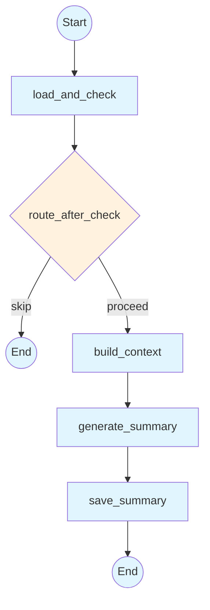
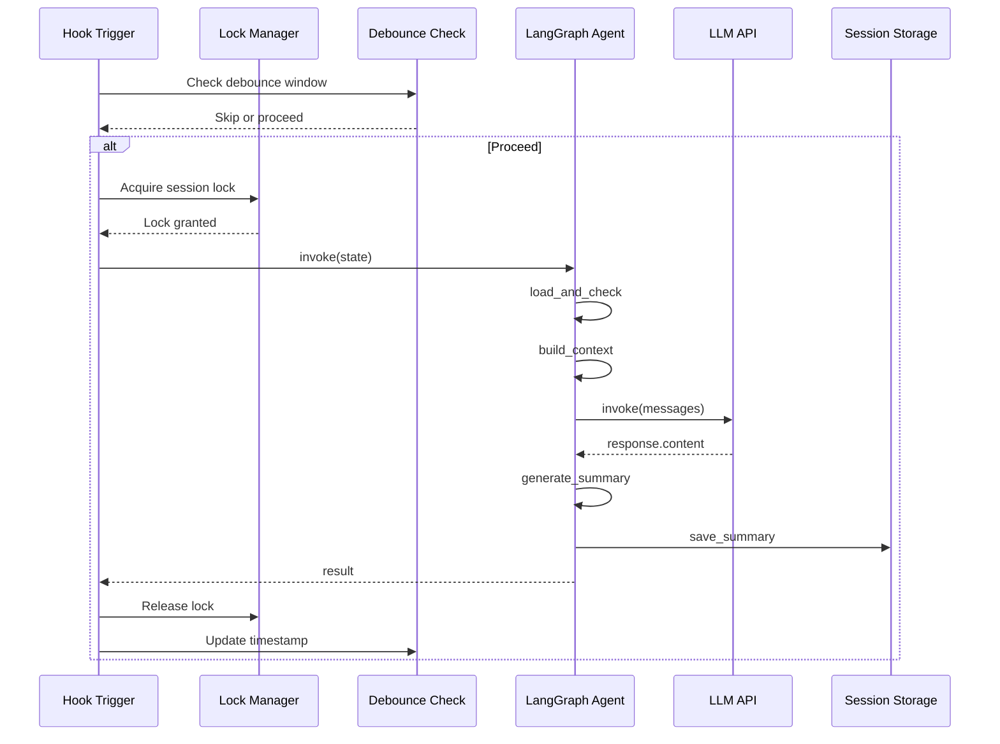

# SKILL.md: LLM Integration in Cursor Hooks

## Description

Guide development of LangGraph agents and LLM-powered hooks, covering StateGraph patterns, prompt engineering, token management, cost optimization, and building summarizer-style agents from scratch.

## When to Use

- Building an LLM-powered hook (summarization, code review, analysis)
- Creating LangGraph StateGraph agents for hook automation
- Optimizing LLM calls in hooks for cost and latency
- Implementing prompt engineering for hook-specific use cases
- Managing LLM configuration, fallbacks, and error handling
- Debouncing and locking concurrent LLM invocations

## Capabilities

- Design LangGraph StateGraph agents for hook workflows
- Define TypedDict state schemas for agent graphs
- Implement conditional routing and node patterns
- Engineer prompts for summarization, review, and analysis
- Manage context windows and token limits
- Handle LLM errors: empty responses, timeouts, retries
- Optimize costs: caching, cheaper models, selective invocation
- Configure LLMs via environment files
- Prevent concurrent LLM calls with debounce and locking

## Architecture Patterns

### LangGraph Agent Architecture



### Hook LLM Invocation Flow



## Core Patterns

### Pattern 1: LangGraph StateGraph Setup

The foundational pattern for building hook-based agents.

```python
#!/usr/bin/env python3
"""
Example: Code Review Agent for afterFileEdit hook.
"""
import json
import sys
import time
from datetime import datetime
from pathlib import Path
from typing import TypedDict

from dotenv import load_dotenv
from langchain_core.messages import HumanMessage, SystemMessage
from langchain_openai import ChatOpenAI
from langgraph.graph import END, START, StateGraph

# Load configuration
LLM_ENV_PATH = Path(__file__).parent.parent / "llm.env"
load_dotenv(str(LLM_ENV_PATH), override=True)


# ---------------------------------------------------------------------------
# State Definition
# ---------------------------------------------------------------------------

class ReviewState(TypedDict, total=False):
    file_path: str
    edits: list
    review_result: str
    strategy: str       # "review" | "skip"
    error: str
    force: bool


# ---------------------------------------------------------------------------
# LLM Setup
# ---------------------------------------------------------------------------

def get_llm():
    import os
    api_key = os.getenv("API_KEY", "")
    if not api_key:
        raise ValueError("API_KEY not set in llm.env")

    base_url = os.getenv("BASE_URL", "https://api.openai.com/v1")
    model = os.getenv("REVIEW_MODEL", "qwen3.6-plus")

    return ChatOpenAI(
        model=model,
        base_url=base_url,
        api_key=api_key,
        temperature=0.2,
        max_tokens=2048,
        timeout=30,
    )


# ---------------------------------------------------------------------------
# Graph Nodes
# ---------------------------------------------------------------------------

def should_review(state: ReviewState) -> ReviewState:
    """Decide whether to review based on file type and edit size."""
    file_path = state.get("file_path", "")
    force = state.get("force", False)

    if force:
        return {**state, "strategy": "review"}

    # Skip non-code files
    code_extensions = {".py", ".ts", ".tsx", ".js", ".jsx", ".go", ".rs"}
    if not any(file_path.endswith(ext) for ext in code_extensions):
        return {**state, "strategy": "skip"}

    return {**state, "strategy": "review"}


def route_after_check(state: ReviewState) -> str:
    if state.get("strategy") == "skip":
        return END
    return "generate_review"


def generate_review(state: ReviewState) -> ReviewState:
    """Call LLM to review the code changes."""
    edits = state.get("edits", [])
    file_path = state.get("file_path", "")

    # Format edits for context
    context = ""
    for i, edit in enumerate(edits, 1):
        context += f"Edit {i}:\n"
        context += f"Removed:\n{edit.get('old_string', '')}\n"
        context += f"Added:\n{edit.get('new_string', '')}\n\n"

    system_prompt = (
        f"You are reviewing code changes to {file_path}.\n\n"
        f"Changes:\n{context}\n\n"
        f"Provide feedback on:\n"
        f"1. Code quality and best practices\n"
        f"2. Potential bugs or edge cases\n"
        f"3. Performance implications\n"
        f"4. Security concerns\n\n"
        f"Be concise and actionable. Keep under 200 words."
    )

    try:
        llm = get_llm()
        response = llm.invoke([
            SystemMessage(content=system_prompt),
            HumanMessage(content="Review the changes above."),
        ])
        return {**state, "review_result": response.content}
    except Exception as e:
        return {**state, "error": str(e), "review_result": ""}


def save_review(state: ReviewState) -> ReviewState:
    """Persist review to a file."""
    file_path = state.get("file_path", "")
    review = state.get("review_result", "")

    if not review:
        return state

    # Write review alongside the file
    review_path = Path(file_path).with_suffix(".review.md")
    review_path.write_text(
        f"# Code Review: {Path(file_path).name}\n\n"
        f"Generated: {datetime.now().isoformat()}\n\n"
        f"{review}\n",
        encoding="utf-8",
    )

    return state


# ---------------------------------------------------------------------------
# Graph Definition
# ---------------------------------------------------------------------------

def build_graph():
    builder = StateGraph(ReviewState)
    builder.add_node("should_review", should_review)
    builder.add_node("generate_review", generate_review)
    builder.add_node("save_review", save_review)

    builder.add_edge(START, "should_review")
    builder.add_conditional_edges("should_review", route_after_check, {
        "generate_review": "generate_review",
        END: END,
    })
    builder.add_edge("generate_review", "save_review")
    builder.add_edge("save_review", END)

    return builder.compile()


graph = build_graph()
```

### Pattern 2: Debounce and Lock Management

Prevent concurrent or duplicate LLM calls.

```python
import time
import os
from pathlib import Path

DEBOUNCE_SECONDS = 60
LOCK_TIMEOUT_SECONDS = 120
STATE_DIR = Path("d:/test_misc/job_network/.cursor/hooks/state")


def acquire_lock(session_id: str) -> bool:
    """Acquire per-session lock. Returns False if already locked."""
    session_dir = STATE_DIR / "sessions" / session_id
    session_dir.mkdir(parents=True, exist_ok=True)
    lock_file = session_dir / ".llm_lock"

    if lock_file.exists():
        try:
            content = lock_file.read_text().strip()
            parts = content.split("|")
            pid = int(parts[0])
            timestamp = float(parts[1]) if len(parts) > 1 else 0
            elapsed = time.time() - timestamp

            if elapsed < LOCK_TIMEOUT_SECONDS and _is_process_alive(pid):
                return False
            lock_file.unlink(missing_ok=True)
        except (ValueError, OSError):
            lock_file.unlink(missing_ok=True)

    try:
        lock_file.write_text(f"{os.getpid()}|{time.time()}")
        return True
    except OSError:
        return False


def release_lock(session_id: str):
    lock_file = STATE_DIR / "sessions" / session_id / ".llm_lock"
    lock_file.unlink(missing_ok=True)


def check_debounce(session_id: str, debounce_key: str = "last_llm_timestamp") -> bool:
    """Check if within debounce window."""
    ts_file = STATE_DIR / "sessions" / session_id / f".{debounce_key}"
    if not ts_file.exists():
        return False
    try:
        last_ts = float(ts_file.read_text().strip())
        return (time.time() - last_ts) < DEBOUNCE_SECONDS
    except (ValueError, OSError):
        return False


def mark_invoked(session_id: str, debounce_key: str = "last_llm_timestamp"):
    """Update debounce timestamp."""
    ts_file = STATE_DIR / "sessions" / session_id / f".{debounce_key}"
    ts_file.write_text(str(time.time()))


def _is_process_alive(pid: int) -> bool:
    try:
        os.kill(pid, 0)
        return True
    except OSError:
        return False
```

### Pattern 3: Token Management and Truncation

Handle context window limits gracefully.

```python
# Constants for token management
MAX_EVENTS_FOR_CONTEXT = 100
HEAD_EVENTS = 20
TAIL_EVENTS = 80
MAX_EVENT_TEXT_CHARS = 2000
MAX_COMMAND_CHARS = 300
TRUNCATION_MARKER = "[...truncated]"


def _truncate(text: str, max_chars: int) -> str:
    """Truncate text with marker if too long."""
    if len(text) <= max_chars:
        return text
    return text[:max_chars - len(TRUNCATION_MARKER)] + TRUNCATION_MARKER


def _format_events_for_context(events: list) -> str:
    """Format events into LLM context with token capping."""
    # Keep first N + last M events
    if len(events) > MAX_EVENTS_FOR_CONTEXT:
        events = events[:HEAD_EVENTS] + events[-TAIL_EVENTS:]

    lines = []
    for i, ev in enumerate(events, 1):
        ev_type = ev.get("type", "unknown")

        if ev_type == "file_edit":
            file_path = ev.get("file_path", "")
            chars = ev.get("chars_added", 0)
            lines.append(f"### Step {i} - File Edit: {file_path} (+{chars} chars)")

        elif ev_type == "tool_use":
            tool = ev.get("tool_name", "")
            lines.append(f"### Step {i} - Tool: {tool}")

        # Add other event types as needed

    return "\n".join(lines)


def estimate_tokens(text: str) -> int:
    """Rough token estimation (English ~4 chars per token)."""
    return len(text) // 4
```

### Pattern 4: LLM Error Handling and Retry

Robust error handling for LLM calls.

```python
def call_llm_with_retry(system_prompt: str, user_prompt: str, max_retries: int = 2):
    """Call LLM with retry logic for empty responses and timeouts."""
    for attempt in range(max_retries + 1):
        try:
            llm = get_llm()
            response = llm.invoke([
                SystemMessage(content=system_prompt),
                HumanMessage(content=user_prompt),
            ])
            content = response.content

            # Retry on empty
            if not content or not content.strip():
                print(f"[llm] Empty response, retry {attempt + 1}/{max_retries}", file=sys.stderr)
                continue

            return content

        except Exception as e:
            print(f"[llm] Error on attempt {attempt + 1}: {e}", file=sys.stderr)
            if attempt == max_retries:
                return None
            time.sleep(2 ** attempt)  # Exponential backoff

    return None
```

### Pattern 5: Cost Optimization Strategies

Minimize LLM costs while maintaining functionality.

```python
def should_invoke_llm(session, min_new_events: int = 3) -> bool:
    """Decide whether LLM call is warranted based on activity."""
    events = session.get("events", [])
    last_count = session.get("summary", {}).get("last_summary_event_count", 0)
    new_events = len(events) - last_count

    # Don't invoke for minimal activity
    if new_events < min_new_events:
        return False

    # Don't invoke if no meaningful changes
    recent_edits = [
        ev for ev in events[-new_events:]
        if ev.get("type") in ("file_edit", "tool_use")
    ]
    if not recent_edits:
        return False

    return True


def use_cheaper_model_for_simple_tasks():
    """Select model based on task complexity."""
    import os

    # Simple tasks: formatting, extraction
    SIMPLE_MODELS = {"simple": os.getenv("SIMPLE_MODEL", "gpt-4o-mini")}
    # Complex tasks: analysis, reasoning
    COMPLEX_MODELS = {"complex": os.getenv("REASONING_MODEL", "qwen3.6-plus")}

    def get_model_for(task_complexity: str):
        return COMPLEX_MODELS.get(task_complexity, SIMPLE_MODELS["simple"])

    return get_model_for
```

### Pattern 6: Prompt Engineering for Hooks

Specialized prompt patterns for different hook use cases.

```python
# Session Summarization Prompt
SUMMARIZATION_PROMPT = """
You are summarizing a recorded AI coding assistant (Cursor) session.

{context}

Produce a concise narrative summary covering:
1. What the user was trying to accomplish
2. Key actions the agent took and why
3. Important decisions, trade-offs, or reasoning patterns
4. Files modified and what changed
5. Outcome and any remaining open questions

Write in a clear, professional tone. Keep it under 500 words.
Use markdown formatting.
"""

# Code Review Prompt
CODE_REVIEW_PROMPT = """
You are reviewing code changes to {file_path}.

Changes:
{changes}

Provide feedback on:
1. Code quality and best practices
2. Potential bugs or edge cases
3. Performance implications
4. Security concerns

Be concise and actionable. Keep under 200 words.
"""

# Security Analysis Prompt
SECURITY_ANALYSIS_PROMPT = """
You are analyzing a shell command for security risks.

Command: {command}
Working Directory: {cwd}

Assess:
1. Command injection risks
2. Data exfiltration potential
3. Destructive operation risk
4. Privilege escalation vectors

Return a risk score (low/medium/high) and brief explanation.
"""
```

## LLM Configuration

### llm.env Format

```env
API_KEY=your-api-key-here
BASE_URL=https://api.openai.com/v1
REASONING_MODEL=qwen3.6-plus
SIMPLE_MODEL=gpt-4o-mini
REVIEW_MODEL=qwen3.6-plus
```

### Loading Configuration

```python
from dotenv import load_dotenv
from pathlib import Path
import os

LLM_ENV_PATH = Path(__file__).parent.parent / "llm.env"
load_dotenv(str(LLM_ENV_PATH), override=True)

api_key = os.getenv("API_KEY", "")
base_url = os.getenv("BASE_URL", "https://api.openai.com/v1")
model = os.getenv("REASONING_MODEL", "qwen3.6-plus")
```

## Complete Example: Building a New Summarizer-Style Agent

### Step 1: Define State

```python
from typing import TypedDict

class MyAgentState(TypedDict, total=False):
    session_id: str
    input_data: str
    result: str
    strategy: str
    error: str
    force: bool
```

### Step 2: Define Nodes

```python
def load_and_validate(state) -> dict:
    # Load input, decide whether to proceed
    pass

def process(state) -> dict:
    # Call LLM, process input
    pass

def save_result(state) -> dict:
    # Persist result
    pass
```

### Step 3: Build Graph

```python
from langgraph.graph import END, START, StateGraph

def build_graph():
    builder = StateGraph(MyAgentState)
    builder.add_node("load_and_validate", load_and_validate)
    builder.add_node("process", process)
    builder.add_node("save_result", save_result)

    builder.add_edge(START, "load_and_validate")
    builder.add_conditional_edges("load_and_validate", route_fn, {
        "process": "process",
        END: END,
    })
    builder.add_edge("process", "save_result")
    builder.add_edge("save_result", END)

    return builder.compile()
```

### Step 4: Wire to Hook

```python
# In your hook script (e.g., afterAgentResponse.py)
result = graph.invoke({
    "session_id": conversation_id,
    "input_data": payload.get("text", ""),
    "force": False,
})
```

## Commands

`/llm-agent-create`: Create a new LangGraph agent for hooks
`/llm-prompt-design`: Design a prompt for a hook use case
`/llm-cost-optimize`: Optimize LLM costs for existing hooks
`/llm-debug`: Debug LLM integration issues

## Workflows

### Creating a New LLM-Powered Hook

1. **Define Purpose**: What problem does this hook solve?
2. **Design State**: What data flows through the agent?
3. **Write Nodes**: Implement load, process, save nodes
4. **Build Graph**: Connect nodes with conditional routing
5. **Add Debounce/Lock**: Prevent concurrent invocations
6. **Wire to Hook**: Invoke from appropriate hook event
7. **Test**: Run with sample input, verify output
8. **Configure**: Add model selection to llm.env

### Debugging LLM Issues

1. **Check API Key**: Verify API_KEY in llm.env
2. **Review Logs**: Check stderr for error messages
3. **Test LLM Directly**: Call LLM outside graph
4. **Check Input**: Ensure formatted context is correct
5. **Verify Output**: Handle empty or malformed responses
6. **Monitor Costs**: Track token usage and API calls

## Security Considerations

- Never log API keys or full LLM responses
- Sanitize user input before sending to LLM
- Implement timeouts to prevent hanging calls
- Use fail-open patterns for non-critical LLM hooks
- Rate limit LLM invocations to prevent abuse
- Consider data privacy: what session data is sent to LLM?

## Performance Considerations

- Set appropriate timeouts (30-60s for LLM calls)
- Use debounce to prevent redundant calls
- Cache common responses when applicable
- Choose cheaper models for simple tasks
- Truncate context to stay within token limits
- Monitor latency: LLM calls block hook execution

## References

- LangGraph docs: https://langchain-ai.github.io/langgraph/
- LangChain docs: https://python.langchain.com/
- Existing summarizer: `.cursor/hooks/summarizer_agent.py`
- LLM config: `.cursor/llm.env`

## Related Skills

- See `.cursor/skills/cursor-hooks-core/SKILL.md` for hook lifecycle fundamentals
- See `.cursor/skills/cursor-hooks-state-mgmt/SKILL.md` for session state patterns
- See `.cursor/skills/cursor-hooks-testing/SKILL.md` for testing LLM agents
- See `.cursor/skills/cursor-hooks-observability/SKILL.md` for performance monitoring
