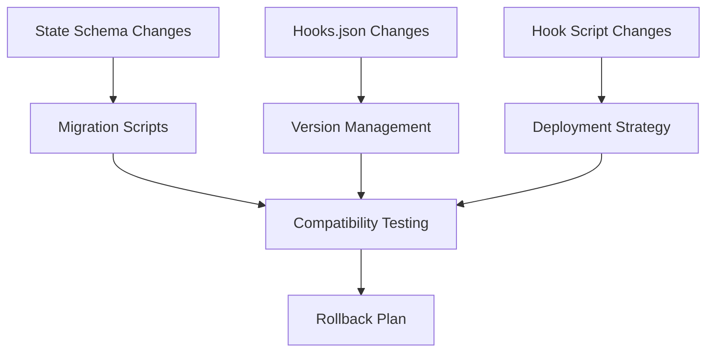

# SKILL.md: Cursor Hooks Migration & Versioning

## Description

Manage evolution of Cursor hooks over time, covering hooks.json version management, state schema migration, backward compatibility patterns, hook script versioning, and rollback strategies.

## When to Use

- Upgrading hooks to a new schema version
- Adding new fields to session.json
- Deprecating old hook scripts or events
- Managing hooks.json format changes
- Rolling back a failed hook update
- Migrating existing session data to new formats
- Coordinating hook changes across team members

## Capabilities

- Design backward-compatible schema changes
- Write migration scripts for session data
- Version hooks.json configurations
- Implement feature flags for gradual rollout
- Rollback failed hook deployments
- Test migration compatibility
- Document version history

## Architecture

### Migration Layers



## State Schema Migration

### Pattern 1: Additive Field Migration

Safest migration: only add new fields, never remove.

```python
#!/usr/bin/env python3
"""
Migration: v1 -> v2
Adds new metadata fields to existing sessions.
"""
from datetime import datetime
from pathlib import Path
import json

STATE_DIR = Path("d:/test_misc/job_network/.cursor/hooks/state")
SESSIONS_DIR = STATE_DIR / "sessions"


def migrate_session_v1_to_v2(session: dict) -> dict:
    """Add new metadata fields to existing sessions."""
    if "metadata" not in session:
        session["metadata"] = {}

    metadata = session["metadata"]

    # Add new fields if missing
    if "migrated_to_v2" not in metadata:
        metadata["migrated_to_v2"] = True
        metadata["migration_timestamp"] = datetime.now().isoformat()

    # Add schema_version field
    if "schema_version" not in metadata:
        metadata["schema_version"] = 2

    return session


def run_migration():
    """Apply migration to all sessions."""
    migrated_count = 0
    for session_file in SESSIONS_DIR.glob("*/session.json"):
        try:
            session = json.loads(session_file.read_text())

            # Skip already migrated sessions
            if session.get("metadata", {}).get("migrated_to_v2"):
                continue

            # Apply migration
            session = migrate_session_v1_to_v2(session)

            # Save back
            session_file.write_text(json.dumps(session, indent=2))
            migrated_count += 1
        except Exception as e:
            print(f"Error migrating {session_file}: {e}")

    print(f"Migrated {migrated_count} sessions to v2")


if __name__ == "__main__":
    run_migration()
```

### Pattern 2: Field Renaming with Backward Compatibility

Support both old and new field names during transition.

```python
def migrate_field_rename(session: dict, old_field: str, new_field: str) -> dict:
    """Rename a field while maintaining backward compatibility."""
    # If new field exists, it wins
    if new_field in session:
        # Remove old field if it exists (cleanup)
        session.pop(old_field, None)
        return session

    # If only old field exists, rename it
    if old_field in session:
        session[new_field] = session.pop(old_field)

    return session


# Example: Rename "file_edits" to "edits" in events
def migrate_file_edits_to_edits(session: dict) -> dict:
    """Rename file_edits array to edits."""
    if "file_edits" in session and "edits" not in session:
        session["edits"] = session.pop("file_edits")
        session.setdefault("metadata", {})["field_migration"] = "file_edits->edits"
    return session
```

### Pattern 3: Data Transformation Migration

Transform existing data to new format.

```python
def migrate_events_structure(session: dict) -> dict:
    """Transform events from old format to new format."""
    for event in session.get("events", []):
        # Old format: { "type": "thought", "content": "..." }
        # New format: { "type": "thought", "text": "..." }
        if event.get("type") == "thought" and "content" in event:
            event["text"] = event.pop("content")

        # Old format: { "type": "tool_use", "tool": "Read" }
        # New format: { "type": "tool_use", "tool_name": "Read" }
        if event.get("type") == "tool_use" and "tool" in event:
            event["tool_name"] = event.pop("tool")

    return session
```

### Pattern 4: Versioned Migration Runner

Orchestrate multiple migrations in order.

```python
#!/usr/bin/env python3
"""
Versioned Migration Runner
Applies migrations in order based on current schema version.
"""
from datetime import datetime
from pathlib import Path
import json

STATE_DIR = Path("d:/test_misc/job_network/.cursor/hooks/state")
SESSIONS_DIR = STATE_DIR / "sessions"
CURRENT_VERSION = 3


MIGRATIONS = {
    1: lambda s: s,  # Initial version (no migration needed)
    2: migrate_session_v1_to_v2,
    3: migrate_events_structure,
}


def get_current_version(session: dict) -> int:
    """Get the current schema version of a session."""
    return session.get("metadata", {}).get("schema_version", 1)


def migrate_session(session: dict, target_version: int = CURRENT_VERSION) -> dict:
    """Migrate a session to the target version."""
    current = get_current_version(session)

    if current >= target_version:
        return session  # Already up to date

    for version in range(current + 1, target_version + 1):
        if version in MIGRATIONS:
            session = MIGRATIONS[version](session)
            session.setdefault("metadata", {})["schema_version"] = version
            print(f"Applied migration to v{version}")
        else:
            raise ValueError(f"No migration defined for version {version}")

    return session


def run_all_migrations():
    """Apply all pending migrations to all sessions."""
    stats = {"migrated": 0, "skipped": 0, "errors": 0}

    for session_file in SESSIONS_DIR.glob("*/session.json"):
        try:
            session = json.loads(session_file.read_text())
            current = get_current_version(session)

            if current >= CURRENT_VERSION:
                stats["skipped"] += 1
                continue

            session = migrate_session(session)
            session_file.write_text(json.dumps(session, indent=2))
            stats["migrated"] += 1

        except Exception as e:
            print(f"Error migrating {session_file}: {e}")
            stats["errors"] += 1

    print(f"Migration complete: {stats}")
    return stats
```

## Hooks.json Version Management

### Pattern 5: Hooks.json Version Evolution

Track and manage hooks.json format changes.

```json
{
  "version": 1,
  "_migration_notes": "Upgraded from v0 to v1 on 2026-04-29",
  "hooks": {
    "sessionStart": [
      {
        "command": "...",
        "_comment": "Added debug hook"
      }
    ]
  }
}
```

### Pattern 6: Gradual Rollout with Feature Flags

Enable new hooks for a subset of sessions first.

```json
{
  "version": 1,
  "feature_flags": {
    "enable_new_summarizer": true,
    "enable_code_review_hook": false,
    "enable_security_scan_hook": true
  },
  "hooks": {
    "afterAgentResponse": [
      {
        "command": "...summarizer_trigger.py",
        "enabled": true
      },
      {
        "command": "...code_review.py",
        "enabled": false
      }
    ]
  }
}
```

### Pattern 7: Hooks.json Backup Before Changes

Always backup before modifying.

```python
#!/usr/bin/env python3
"""
Backup hooks.json before making changes.
"""
import shutil
from datetime import datetime
from pathlib import Path

HOOKS_JSON = Path("d:/test_misc/job_network/.cursor/hooks.json")
BACKUP_DIR = Path("d:/test_misc/job_network/.cursor/hooks.json.bak")


def backup_hooks_json():
    """Create timestamped backup of hooks.json."""
    BACKUP_DIR.mkdir(parents=True, exist_ok=True)
    timestamp = datetime.now().strftime("%Y%m%d_%H%M%S")
    backup_file = BACKUP_DIR / f"hooks_{timestamp}.json"

    if HOOKS_JSON.exists():
        shutil.copy2(HOOKS_JSON, backup_file)
        print(f"Backup created: {backup_file}")
        return backup_file
    else:
        print("No hooks.json to backup")
        return None


def restore_latest_backup():
    """Restore the most recent backup."""
    if not BACKUP_DIR.exists():
        print("No backup directory")
        return

    backups = sorted(BACKUP_DIR.glob("hooks_*.json"))
    if not backups:
        print("No backups found")
        return

    latest = backups[-1]
    shutil.copy2(latest, HOOKS_JSON)
    print(f"Restored from: {latest}")
```

## Hook Script Versioning

### Pattern 8: Coexistence of Old and New Versions

Run both versions during transition period.

```json
{
  "hooks": {
    "afterAgentResponse": [
      {
        "command": "...summarizer_trigger.py",
        "_comment": "v1 - old trigger logic",
        "enabled": false
      },
      {
        "command": "...summarizer_trigger_v2.py",
        "_comment": "v2 - new trigger logic",
        "enabled": true
      }
    ]
  }
}
```

### Pattern 9: Version Check in Hook Scripts

Hook scripts can check their own version and migrate state.

```python
#!/usr/bin/env python3
"""
Hook Script with Version Check.
"""
HOOK_VERSION = "2.0"
MIN_COMPATIBLE_VERSION = "1.5"

def main():
    payload = read_hook_input()

    # Check session state version
    session = recorder.load_session(conversation_id)
    session_version = session.get("metadata", {}).get("hook_version", "1.0")

    # Migrate session if needed
    if session_version < MIN_COMPATIBLE_VERSION:
        session = migrate_session(session)
        recorder.save_session(conversation_id, session)

    # ... rest of hook logic ...
```

## Rollback Strategies

### Pattern 10: Full Rollback Plan

Steps to rollback a failed hook deployment.

```
ROLLBACK PROCEDURE:

1. Identify the problem:
   - Which hook is failing?
   - What is the error?
   - Which sessions are affected?

2. Disable the hook:
   - Set "enabled": false in hooks.json
   - OR remove the hook entry entirely
   - Restart Cursor to reload hooks.json

3. Restore state:
   - Restore session.json from backup
   - OR run reverse migration script
   - OR manually fix corrupted sessions

4. Verify:
   - Test with a new conversation
   - Check Hooks output channel for errors
   - Verify session data is correct

5. Communicate:
   - Document the rollback reason
   - Update migration notes in hooks.json
   - Create issue for fixing the root cause
```

### Pattern 11: Automated Rollback

Script to detect failures and rollback automatically.

```python
#!/usr/bin/env python3
"""
Automated Rollback Detector.
Monitors hook health and triggers rollback on failure.
"""
import json
from pathlib import Path
from datetime import datetime

def check_and_rollback():
    """Check for recent failures and rollback if needed."""
    metrics_file = Path("d:/test_misc/job_network/.cursor/hooks/state/hooks-metrics.json")
    if not metrics_file.exists():
        return

    metrics = json.loads(metrics_file.read_text())

    for hook_name, m in metrics.items():
        if m["total_executions"] > 0:
            error_rate = m["error_count"] / m["total_executions"]
            if error_rate > 0.5:  # >50% error rate
                print(f"High error rate for {hook_name}: {error_rate:.1%}")
                disable_hook(hook_name)


def disable_hook(hook_name: str):
    """Disable a hook in hooks.json."""
    hooks_file = Path("d:/test_misc/job_network/.cursor/hooks.json")
    hooks_config = json.loads(hooks_file.read_text())

    for event, hooks in hooks_config.get("hooks", {}).items():
        for hook in hooks:
            command = hook.get("command", "")
            if hook_name in command:
                hook["enabled"] = False
                hook["_disabled_at"] = datetime.now().isoformat()
                hook["_disabled_reason"] = "High error rate - auto-disabled"

    hooks_file.write_text(json.dumps(hooks_config, indent=2))
    print(f"Disabled hook: {hook_name}")
```

## Migration Testing

### Pattern 12: Migration Compatibility Test

Test migrations before applying to production.

```python
#!/usr/bin/env python3
"""
Test migration on a copy of session data.
"""
import json
import shutil
from pathlib import Path
from conversation_recorder import ConversationRecorder

STATE_DIR = Path("d:/test_misc/job_network/.cursor/hooks/state")
TEST_DIR = STATE_DIR / "migration_test"


def test_migration():
    """Test migration on a copy of all sessions."""
    # Create test directory
    if TEST_DIR.exists():
        shutil.rmtree(TEST_DIR)
    shutil.copytree(STATE_DIR / "sessions", TEST_DIR / "sessions")

    # Run migration on test data
    recorder = ConversationRecorder()
    recorder.SESSIONS_DIR = TEST_DIR / "sessions"
    recorder.STATE_DIR = TEST_DIR

    stats = {"success": 0, "errors": 0}

    for session_file in (TEST_DIR / "sessions").glob("*/session.json"):
        try:
            session = json.loads(session_file.read_text())
            session = migrate_session(session)

            # Validate result
            assert "metadata" in session
            assert "schema_version" in session.get("metadata", {})

            stats["success"] += 1
        except Exception as e:
            print(f"Error: {session_file}: {e}")
            stats["errors"] += 1

    print(f"Test results: {stats}")
    return stats["errors"] == 0
```

## Commands

`/hooks-migrate`: Run schema migration on all sessions
`/hooks-rollback`: Rollback to previous hook configuration
`/hooks-version`: Check current schema version
`/hooks-migrate-test`: Test migration on copy of data
`/hooks-backup`: Backup hooks.json and state

## Workflows

### Adding a New Schema Field

1. **Document Change**: Note what field is being added and why
2. **Write Migration**: Create migration function in migration script
3. **Test Migration**: Run on copy of data first
4. **Backup State**: Copy all session.json files
5. **Run Migration**: Apply to all sessions
6. **Verify**: Check migrated sessions for correctness
7. **Update Code**: Update ConversationRecorder and hooks
8. **Commit**: Include migration script and changes

### Rolling Back a Bad Deployment

1. **Detect Failure**: Monitor error rates in metrics
2. **Disable Hook**: Set `"enabled": false` in hooks.json
3. **Restart Cursor**: Reload hooks configuration
4. **Restore State**: Run reverse migration if needed
5. **Verify**: Test with new conversation
6. **Document**: Record rollback reason and date

### Coordinating Team Changes

1. **Communicate Change**: Notify team of upcoming migration
2. **Test on Fork**: Test migration on a copy of the repository
3. **Merge and Migrate**: Apply changes and run migration
4. **Monitor**: Watch for errors after deployment
5. **Follow Up**: Ensure all team members have updated hooks

## Security Considerations

- Backup session data before migration (may contain sensitive info)
- Do not commit backups to version control
- Test migrations thoroughly before applying to production
- Maintain rollback capability for all migrations
- Log all migration activities for audit trail

## Performance Considerations

- Migration scripts should be efficient for large numbers of sessions
- Consider batching migrations for very large datasets
- Test migration performance before applying
- Plan for downtime if migration is slow
- Clean up migration scripts after successful completion

## References

- Current state: `.cursor/hooks/state/` directory
- Session recorder: `.cursor/hooks/conversation_recorder.py`
- Hooks configuration: `.cursor/hooks.json`

## Related Skills

- See `.cursor/skills/cursor-hooks-state-mgmt/SKILL.md` for session schema details
- See `.cursor/skills/cursor-hooks-core/SKILL.md` for hook configuration patterns
- See `.cursor/skills/cursor-hooks-testing/SKILL.md` for testing migrations
- See `.cursor/skills/cursor-hooks-observability/SKILL.md` for monitoring migration health
