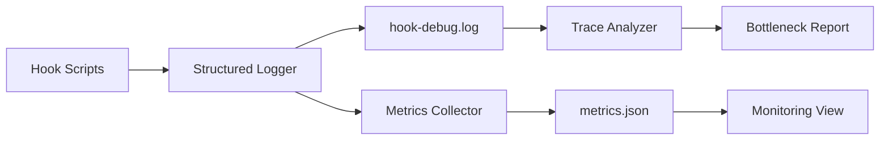

# SKILL.md: Cursor Hooks Observability & Monitoring

## Description

Comprehensive monitoring, debugging, and health checking for Cursor hooks infrastructure. Covers performance metrics, structured logging, trace analysis, dashboard patterns, and real-time monitoring workflows.

## When to Use

- Debugging hook execution failures or unexpected behavior
- Monitoring hook performance: latency, failure rates, timeouts
- Setting up structured logging for hook events
- Analyzing hook execution traces and bottlenecks
- Building dashboards for hook health
- Investigating LLM call latency and costs
- Setting up alerting thresholds for hook failures

## Capabilities

- Implement structured JSON logging for hooks
- Collect and analyze performance metrics
- Build real-time monitoring dashboards
- Trace hook execution across the lifecycle
- Identify bottlenecks and slow hooks
- Set up alerting for hook failures
- Monitor LLM call costs and latency
- Integrate with existing debug_hook.py and view.py

## Architecture

### Observability Pipeline



### Existing Debug Infrastructure

Your current hooks already have basic debugging:

- `debug_hook.py`: Logs hook triggers to `state/hook-debug.log`
- `view.py`: Provides a viewing interface for hook state
- `hook-debug.log`: Append-only log of hook activity

## Core Patterns

### Pattern 1: Structured JSON Logging

Replace simple text logging with structured JSON for analysis.

```python
#!/usr/bin/env python3
"""Structured logger for hook events."""
import json
import time
from datetime import datetime
from pathlib import Path

class HookLogger:
    """Structured JSON logger for hook events."""

    LOG_DIR = Path("d:/test_misc/job_network/.cursor/hooks/state")
    LOG_FILE = LOG_DIR / "hooks-structured.log"
    METRICS_FILE = LOG_DIR / "hooks-metrics.json"

    def __init__(self):
        self.LOG_DIR.mkdir(parents=True, exist_ok=True)

    def log_event(self, event_name: str, data: dict):
        """Log a structured event."""
        entry = {
            "timestamp": datetime.now().isoformat(),
            "epoch": time.time(),
            "event": event_name,
            **data,
        }
        with open(self.LOG_FILE, "a", encoding="utf-8") as f:
            f.write(json.dumps(entry) + "\n")

    def log_hook_execution(self, hook_name: str, duration_ms: float, status: str, details: dict = None):
        """Log a hook execution with metrics."""
        self.log_event("hook_execution", {
            "hook_name": hook_name,
            "duration_ms": duration_ms,
            "status": status,
            "details": details or {},
        })
        self._update_metrics(hook_name, duration_ms, status)

    def log_llm_call(self, model: str, tokens_in: int, tokens_out: int, duration_ms: float, cost: float = 0):
        """Log an LLM API call."""
        self.log_event("llm_call", {
            "model": model,
            "tokens_in": tokens_in,
            "tokens_out": tokens_out,
            "duration_ms": duration_ms,
            "cost_usd": cost,
        })

    def log_error(self, hook_name: str, error: str, traceback: str = ""):
        """Log an error event."""
        self.log_event("error", {
            "hook_name": hook_name,
            "error": error,
            "traceback": traceback[:2000],  # Limit size
        })

    def _update_metrics(self, hook_name: str, duration_ms: float, status: str):
        """Update aggregated metrics."""
        metrics = self._load_metrics()
        if hook_name not in metrics:
            metrics[hook_name] = {
                "total_executions": 0,
                "total_duration_ms": 0,
                "success_count": 0,
                "error_count": 0,
                "min_duration_ms": float("inf"),
                "max_duration_ms": 0,
            }

        m = metrics[hook_name]
        m["total_executions"] += 1
        m["total_duration_ms"] += duration_ms
        m["min_duration_ms"] = min(m["min_duration_ms"], duration_ms)
        m["max_duration_ms"] = max(m["max_duration_ms"], duration_ms)

        if status == "success":
            m["success_count"] += 1
        else:
            m["error_count"] += 1

        self._save_metrics(metrics)

    def _load_metrics(self) -> dict:
        if self.METRICS_FILE.exists():
            try:
                return json.loads(self.METRICS_FILE.read_text())
            except json.JSONDecodeError:
                return {}
        return {}

    def _save_metrics(self, metrics: dict):
        self.METRICS_FILE.write_text(json.dumps(metrics, indent=2))

    def get_metrics(self) -> dict:
        """Return current aggregated metrics."""
        return self._load_metrics()
```

### Pattern 2: Performance Timing Decorator

Instrument hooks to automatically measure execution time.

```python
import time
import functools
from pathlib import Path

logger = HookLogger()

def time_hook(hook_name: str):
    """Decorator to time hook execution and log metrics."""
    def decorator(func):
        @functools.wraps(func)
        def wrapper(*args, **kwargs):
            start = time.time()
            status = "success"
            try:
                result = func(*args, **kwargs)
                return result
            except Exception as e:
                status = "error"
                logger.log_error(hook_name, str(e))
                raise
            finally:
                duration_ms = (time.time() - start) * 1000
                logger.log_hook_execution(hook_name, duration_ms, status)
        return wrapper
    return decorator


# Usage in hook scripts
@time_hook("before_shell_execution")
def main():
    payload = read_hook_input()
    # ... hook logic ...
    return {"permission": "allow"}
```

### Pattern 3: Hook Execution Tracing

Trace the full lifecycle of a session's hook executions.

```python
class HookTracer:
    """Trace hook execution across a session lifecycle."""

    TRACE_FILE = Path("d:/test_misc/job_network/.cursor/hooks/state/hooks-trace.json")

    def record_hook_trigger(self, session_id: str, hook_event: str, hook_name: str):
        """Record when a hook is triggered."""
        trace = self._load_trace()
        if session_id not in trace:
            trace[session_id] = {"hooks": [], "start_time": time.time()}

        trace[session_id]["hooks"].append({
            "event": hook_event,
            "hook": hook_name,
            "timestamp": time.time(),
        })
        self._save_trace(trace)

    def record_hook_complete(self, session_id: str, hook_event: str, hook_name: str, duration_ms: float, status: str):
        """Record hook completion with duration."""
        trace = self._load_trace()
        if session_id in trace:
            for h in reversed(trace[session_id]["hooks"]):
                if h["event"] == hook_event and h["hook"] == hook_name and "duration_ms" not in h:
                    h["duration_ms"] = duration_ms
                    h["status"] = status
                    break
        self._save_trace(trace)

    def analyze_session_hooks(self, session_id: str) -> dict:
        """Analyze hook execution for a session."""
        trace = self._load_trace().get(session_id, {})
        hooks = trace.get("hooks", [])

        if not hooks:
            return {"error": "No trace data for session"}

        durations = [h.get("duration_ms", 0) for h in hooks if "duration_ms" in h]
        errors = [h for h in hooks if h.get("status") == "error"]

        return {
            "total_hooks": len(hooks),
            "total_duration_ms": sum(durations),
            "avg_duration_ms": sum(durations) / len(durations) if durations else 0,
            "max_duration_ms": max(durations) if durations else 0,
            "error_count": len(errors),
            "slowest_hook": max(hooks, key=lambda h: h.get("duration_ms", 0)) if hooks else None,
        }

    def _load_trace(self) -> dict:
        if self.TRACE_FILE.exists():
            try:
                return json.loads(self.TRACE_FILE.read_text())
            except json.JSONDecodeError:
                return {}
        return {}

    def _save_trace(self, trace: dict):
        self.TRACE_FILE.write_text(json.dumps(trace, indent=2))
```

### Pattern 4: Monitoring Dashboard (view.py Enhancement)

Build a real-time monitoring view for hooks.

```python
#!/usr/bin/env python3
"""
Hook Monitoring Dashboard - view.py enhancement.
Displays current hook health, metrics, and recent activity.
"""
import json
from datetime import datetime
from pathlib import Path

STATE_DIR = Path("d:/test_misc/job_network/.cursor/hooks/state")
METRICS_FILE = STATE_DIR / "hooks-metrics.json"
LOG_FILE = STATE_DIR / "hooks-structured.log"
INDEX_FILE = STATE_DIR / "sessions_index.json"


def generate_dashboard():
    """Generate a markdown dashboard."""
    lines = ["# Hooks Monitoring Dashboard\n"]
    lines.append(f"Generated: {datetime.now().isoformat()}\n")

    # Hook Performance Summary
    lines.append("## Hook Performance\n")
    if METRICS_FILE.exists():
        metrics = json.loads(METRICS_FILE.read_text())
        lines.append("| Hook | Executions | Avg Duration | Success Rate |")
        lines.append("|------|-----------|--------------|--------------|")

        for hook_name, m in metrics.items():
            avg_dur = m["total_duration_ms"] / m["total_executions"] if m["total_executions"] > 0 else 0
            success_rate = m["success_count"] / m["total_executions"] * 100 if m["total_executions"] > 0 else 0
            lines.append(f"| {hook_name} | {m['total_executions']} | {avg_dur:.0f}ms | {success_rate:.1f}% |")

    # Session Overview
    lines.append("\n## Session Overview\n")
    if INDEX_FILE.exists():
        index = json.loads(INDEX_FILE.read_text())
        total_sessions = len(index)
        total_events = sum(s.get("event_count", 0) for s in index.values())
        lines.append(f"- Total Sessions: {total_sessions}")
        lines.append(f"- Total Events: {total_events}")

    # Recent Activity
    lines.append("\n## Recent Activity\n")
    if LOG_FILE.exists():
        log_lines = LOG_FILE.read_text().splitlines()
        recent = log_lines[-10:]  # Last 10 entries
        for line in recent:
            try:
                entry = json.loads(line)
                lines.append(f"- [{entry.get('timestamp', '')}] {entry.get('event', '')}: {json.dumps(entry.get('details', {}))[:100]}")
            except json.JSONDecodeError:
                lines.append(f"- {line}")

    return "\n".join(lines)


if __name__ == "__main__":
    print(generate_dashboard())
```

### Pattern 5: Log Analysis and Queries

Query structured logs for insights.

```python
class LogAnalyzer:
    """Analyze structured hook logs."""

    LOG_FILE = Path("d:/test_misc/job_network/.cursor/hooks/state/hooks-structured.log")

    def __init__(self):
        self.entries = []
        if self.LOG_FILE.exists():
            for line in self.LOG_FILE.read_text().splitlines():
                try:
                    self.entries.append(json.loads(line))
                except json.JSONDecodeError:
                    pass

    def query_by_event(self, event_name: str) -> list:
        """Filter entries by event type."""
        return [e for e in self.entries if e.get("event") == event_name]

    def query_by_hook(self, hook_name: str) -> list:
        """Filter entries by hook name."""
        return [e for e in self.entries if e.get("hook_name") == hook_name]

    def query_errors(self) -> list:
        """Get all error entries."""
        return [e for e in self.entries if e.get("event") == "error"]

    def query_slow_hooks(self, threshold_ms: float = 1000) -> list:
        """Find hooks slower than threshold."""
        return [
            e for e in self.entries
            if e.get("event") == "hook_execution" and e.get("duration_ms", 0) > threshold_ms
        ]

    def get_hourly_volume(self) -> dict:
        """Count hook executions by hour."""
        hourly = {}
        for e in self.entries:
            if e.get("event") == "hook_execution":
                hour = e.get("timestamp", "")[:13]  # YYYY-MM-DDTHH
                hourly[hour] = hourly.get(hour, 0) + 1
        return hourly

    def generate_report(self) -> str:
        """Generate a summary report."""
        total_executions = len(self.query_by_event("hook_execution"))
        total_errors = len(self.query_errors())
        slow_hooks = self.query_slow_hooks()

        report = [
            "# Hook Activity Report\n",
            f"Total Hook Executions: {total_executions}",
            f"Total Errors: {total_errors}",
            f"Slow Hooks (>{1000}ms): {len(slow_hooks)}",
            "",
            "Hourly Volume:",
        ]

        for hour, count in sorted(self.get_hourly_volume().items()):
            report.append(f"  {hour}: {count} executions")

        return "\n".join(report)
```

### Pattern 6: Alert Thresholds

Set up alerting for hook failures or anomalies.

```python
class HookAlerts:
    """Monitor hooks and trigger alerts."""

    ALERTS_FILE = Path("d:/test_misc/job_network/.cursor/hooks/state/hooks-alerts.json")

    def check_health(self):
        """Check all hooks and generate alerts."""
        alerts = []
        metrics = HookLogger().get_metrics()

        for hook_name, m in metrics.items():
            # High error rate
            if m["total_executions"] > 10:
                error_rate = m["error_count"] / m["total_executions"]
                if error_rate > 0.1:  # >10% error rate
                    alerts.append({
                        "type": "high_error_rate",
                        "hook": hook_name,
                        "rate": error_rate,
                        "severity": "warning",
                    })

            # Slow execution
            if m["max_duration_ms"] > 5000:  # >5s
                alerts.append({
                    "type": "slow_execution",
                    "hook": hook_name,
                    "max_duration_ms": m["max_duration_ms"],
                    "severity": "info",
                })

        self._save_alerts(alerts)
        return alerts

    def _save_alerts(self, alerts: list):
        self.ALERTS_FILE.write_text(json.dumps(alerts, indent=2))
```

## Metrics Schema

### Individual Hook Metric

```json
{
  "hook_name": "before_shell_execution",
  "total_executions": 150,
  "total_duration_ms": 45000,
  "success_count": 148,
  "error_count": 2,
  "min_duration_ms": 12,
  "max_duration_ms": 890
}
```

### Structured Log Entry

```json
{
  "timestamp": "2026-04-29T15:30:00.000000",
  "epoch": 1714392600.123456,
  "event": "hook_execution",
  "hook_name": "before_shell_execution",
  "duration_ms": 45,
  "status": "success",
  "details": {
    "command": "npm test",
    "permission": "allow"
  }
}
```

## Commands

`/hooks-monitor`: Show real-time hook monitoring dashboard
`/hooks-logs`: Analyze recent hook execution logs
`/hooks-metrics`: Show aggregated performance metrics
`/hooks-alerts`: Check for hook health alerts
`/hooks-trace`: Trace hook execution for current session

## Workflows

### Setting Up Observability

1. **Add Logger**: Import HookLogger into hook scripts
2. **Add Timing**: Wrap hook functions with time_hook decorator
3. **Enable Tracing**: Record hook triggers and completions
4. **View Dashboard**: Run view.py to see current state
5. **Set Alerts**: Configure alert thresholds for failures

### Debugging a Hook Issue

1. **Check Dashboard**: Run view.py for overview
2. **Query Logs**: Use LogAnalyzer to find errors
3. **Trace Session**: Analyze specific session with HookTracer
4. **Identify Bottleneck**: Find slow hooks with query_slow_hooks
5. **Fix and Monitor**: Apply fix, watch metrics improve

### Monitoring LLM Costs

1. **Log Each Call**: Use log_llm_call for every LLM invocation
2. **Track Daily**: Aggregate costs by date
3. **Set Budget**: Alert when approaching cost limits
4. **Optimize**: Identify expensive calls to optimize

## Security Considerations

- Do not log sensitive data in structured logs
- Redact API keys, credentials, and PII from log entries
- Restrict access to log files
- Rotate logs periodically to prevent unbounded growth
- Use structured logging to enable automated scanning for leaked secrets

## Performance Considerations

- Structured logging adds ~1-5ms per hook invocation
- Write logs asynchronously if possible
- Rotate log files to prevent disk space issues
- Aggregate metrics in memory, flush periodically
- Use sampling for high-volume hooks

## References

- Existing debug infrastructure: `.cursor/hooks/debug_hook.py`, `.cursor/hooks/view.py`
- Log file: `.cursor/hooks/state/hook-debug.log`
- Python logging module: https://docs.python.org/3/library/logging.html

## Related Skills

- See `.cursor/skills/cursor-hooks-core/SKILL.md` for hook lifecycle fundamentals
- See `.cursor/skills/cursor-hooks-testing/SKILL.md` for testing hooks
- See `.cursor/skills/cursor-hooks-llm-integration/SKILL.md` for LLM call monitoring
