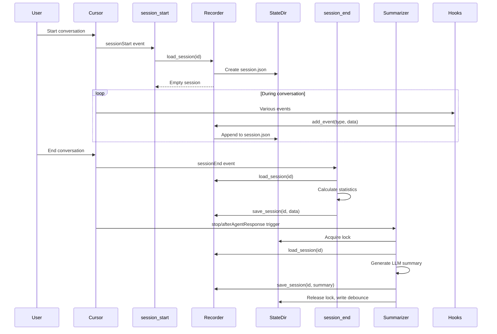

# SKILL.md: Session State Management for Cursor Hooks

## Description

Comprehensive expertise in the ConversationRecorder system, session lifecycle, state persistence, and data management patterns for Cursor hooks. Covers session schemas, state directory conventions, concurrent access patterns, and lifecycle management.

## When to Use

- Developing a new hook that reads or writes session state
- Understanding the session.json structure and event formats
- Debugging session state issues or missing data
- Implementing session cleanup, archival, or migration
- Building tools that query or analyze recorded sessions
- Managing concurrent access to session files

## Capabilities

- Understand and extend the session.json schema
- Navigate the state directory structure
- Implement thread-safe session access patterns
- Manage session lifecycle: create, update, summarize, archive
- Query sessions via index and search functionality
- Handle race conditions with file locking
- Implement retention policies and cleanup

## Architecture Overview

### State Directory Structure

```
.cursor/hooks/state/
  sessions_index.json            # Quick lookup for all sessions
  hook-debug.log                 # Debug log for hook execution
  sessions/
    {session_id}/
      session.json               # Full conversation data
      summary.md                 # Statistics summary
      summary_narrative.md       # LLM-generated narrative
      .last_summarized_timestamp # Debounce timestamp (float)
      .summarizer_lock           # Concurrency lock (pid|timestamp)
```

### Component Relationships

```mermaid
graph LR
    Hooks[Hook Scripts] --> Recorder[ConversationRecorder]
    Recorder --> StateDir[state/sessions/]
    SessionStart[session_start.py] --> SessionFile[session.json]
    AfterResponse[after_agent_response.py] --> Events[events array]
    AfterThought[after_agent_thought.py] --> Events
    AfterEdit[after_file_edit.py] --> FileEdits[file_edits array]
    BeforeShell[before_shell_execution.py] --> ShellCmds[shell_commands array]
    PreTool[pre_tool_use.py] --> ToolUses[tool_uses array]
    SessionEnd[session_end.py] --> Stats[summary statistics]
    Summarizer[summarizer_agent.py] --> Narrative[summary_narrative.md]
    Summarizer --> SessionFile
    Index[ sessions_index.json] <-- Recorder
```

## Session Schema

### Core session.json Structure

```json
{
  "session_id": "f747cdbc-3bd9-47d0-9f4d-d7f32df54f71",
  "created_at": "2026-04-29T15:00:00.000000",
  "last_updated": "2026-04-29T15:30:00.000000",
  "metadata": {
    "is_background_agent": false,
    "composer_mode": "agent",
    "hook_version": "1.0",
    "python_version": "3.13"
  },
  "events": [
    {
      "timestamp": "2026-04-29T15:00:01.000000",
      "type": "thought",
      "text": "Analyzing user request...",
      "duration_seconds": 5.2
    }
  ],
  "file_edits": [],
  "thoughts": [],
  "responses": [],
  "shell_commands": [],
  "tool_uses": [],
  "summary": {
    "narrative": "",
    "generated_at": "",
    "strategy": "",
    "event_count_at_summary": 0,
    "last_summary_event_count": 0,
    "total_events": 0,
    "total_responses": 0,
    "total_thoughts": 0,
    "total_thinking_time_ms": 0,
    "total_thinking_time_seconds": 0,
    "total_file_edits": 0,
    "unique_files_edited": [],
    "total_shell_commands": 0,
    "total_tool_uses": 0,
    "tool_usage_breakdown": {},
    "net_code_change": 0,
    "total_chars_added": 0,
    "total_chars_removed": 0,
    "finalized_at": "",
    "end_reason": "",
    "session_duration_ms": 0,
    "session_duration_seconds": 0,
    "final_status": ""
  }
}
```

### Event Types Reference

Each event in the `events` array has a `type` field that determines its structure:

| Type | Recorded By | Key Fields |
|------|-------------|------------|
| `thought` | afterAgentThought | text, duration_seconds |
| `response` | afterAgentResponse | full_text |
| `file_edit` | afterFileEdit | file_path, chars_added, chars_removed, edits |
| `shell_command` | beforeShellExecution | command, cwd, sandbox |
| `tool_use` | preToolUse | tool_name, tool_input, agent_message |

### Index Schema (sessions_index.json)

```json
{
  "f747cdbc-3bd9-47d0-9f4d-d7f32df54f71": {
    "created_at": "2026-04-29T15:00:00.000000",
    "last_updated": "2026-04-29T15:30:00.000000",
    "event_count": 45,
    "file_edits": 12,
    "thoughts": 15,
    "responses": 8
  }
}
```

## Core Patterns

### Pattern 1: Using ConversationRecorder

The standard pattern for accessing session state in any hook.

```python
#!/usr/bin/env python3
import sys
from pathlib import Path

sys.path.insert(0, str(Path(__file__).parent))
from conversation_recorder import ConversationRecorder, read_hook_input, get_conversation_id

def main():
    payload = read_hook_input()
    conversation_id = get_conversation_id(payload)

    recorder = ConversationRecorder()

    # Load existing session (creates if missing)
    session = recorder.load_session(conversation_id)

    # Add an event
    recorder.add_event(
        conversation_id,
        "tool_use",
        {
            "tool_name": "Shell",
            "tool_input": payload.get("tool_input", {}),
            "agent_message": "Running command",
        }
    )

    # Direct session modification
    session["metadata"]["custom_field"] = "value"
    recorder.save_session(conversation_id, session)

if __name__ == "__main__":
    main()
```

### Pattern 2: Session Lifecycle Management

Understanding the full lifecycle from creation to archival.



### Pattern 3: Concurrent Access Prevention

File locking for multi-hook or multi-process access.

```python
import time
import os
from pathlib import Path

LOCK_TIMEOUT_SECONDS = 120

def acquire_lock(session_id, state_dir):
    """Acquire per-session lock. Returns False if already locked."""
    session_dir = state_dir / "sessions" / session_id
    session_dir.mkdir(parents=True, exist_ok=True)
    lock_file = session_dir / ".summarizer_lock"

    if lock_file.exists():
        try:
            content = lock_file.read_text().strip()
            parts = content.split("|")
            pid = int(parts[0])
            timestamp = float(parts[1]) if len(parts[1:]) else 0
            elapsed = time.time() - timestamp

            if elapsed < LOCK_TIMEOUT_SECONDS and _is_process_alive(pid):
                return False
            # Stale lock - remove it
            lock_file.unlink(missing_ok=True)
        except (ValueError, OSError):
            lock_file.unlink(missing_ok=True)

    try:
        lock_file.write_text(f"{os.getpid()}|{time.time()}")
        return True
    except OSError:
        return False


def release_lock(session_id, state_dir):
    """Release per-session lock."""
    lock_file = state_dir / "sessions" / session_id / ".summarizer_lock"
    lock_file.unlink(missing_ok=True)


def _is_process_alive(pid):
    """Check if process is still running (cross-platform)."""
    try:
        os.kill(pid, 0)
        return True
    except OSError:
        return False
```

### Pattern 4: Session Querying and Search

Search across sessions for specific events or patterns.

```python
from conversation_recorder import ConversationRecorder

recorder = ConversationRecorder()

# Search for sessions containing a pattern
results = recorder.search_sessions("npm install")
for result in results:
    print(f"Session {result['session']}: {result['event']}")

# Query index for quick stats
import json
index_file = Path(".cursor/hooks/state/sessions_index.json")
index = json.loads(index_file.read_text())

# Find sessions with many file edits
active_sessions = [
    (sid, data) for sid, data in index.items()
    if data.get("file_edits", 0) > 10
]

# Get session count
print(f"Total sessions: {len(index)}")
```

### Pattern 5: Session Statistics Aggregation

Compute statistics from session data (used by session_end.py).

```python
def compute_session_statistics(session):
    """Calculate comprehensive session statistics."""
    events = session.get("events", [])

    # Count by type
    type_counts = {}
    for event in events:
        event_type = event.get("type", "unknown")
        type_counts[event_type] = type_counts.get(event_type, 0) + 1

    # Calculate thinking time
    total_thinking_ms = sum(
        event.get("duration_seconds", 0) * 1000
        for event in events
        if event.get("type") == "thought"
    )

    # Unique files edited
    unique_files = list(set(
        event.get("file_path", "")
        for event in session.get("file_edits", [])
        if event.get("file_path")
    ))

    # Tool usage breakdown
    tool_breakdown = {}
    for event in session.get("tool_uses", []):
        tool_name = event.get("tool_name", "unknown")
        tool_breakdown[tool_name] = tool_breakdown.get(tool_name, 0) + 1

    # Net code change
    total_added = sum(
        event.get("chars_added", 0)
        for event in session.get("file_edits", [])
    )
    total_removed = sum(
        event.get("chars_removed", 0)
        for event in session.get("file_edits", [])
    )

    return {
        "total_events": len(events),
        "total_responses": type_counts.get("response", 0),
        "total_thoughts": type_counts.get("thought", 0),
        "total_thinking_time_ms": total_thinking_ms,
        "total_thinking_time_seconds": total_thinking_ms / 1000,
        "total_file_edits": len(session.get("file_edits", [])),
        "unique_files_edited": unique_files,
        "total_shell_commands": len(session.get("shell_commands", [])),
        "total_tool_uses": len(session.get("tool_uses", [])),
        "tool_usage_breakdown": tool_breakdown,
        "net_code_change": total_added - total_removed,
        "total_chars_added": total_added,
        "total_chars_removed": total_removed,
    }
```

### Pattern 6: Session Cleanup and Retention

Implement retention policies to manage disk usage.

```python
import json
import os
import shutil
from datetime import datetime, timedelta
from pathlib import Path

STATE_DIR = Path("d:/test_misc/job_network/.cursor/hooks/state")
SESSIONS_DIR = STATE_DIR / "sessions"
INDEX_FILE = STATE_DIR / "sessions_index.json"


def cleanup_old_sessions(max_age_days=30):
    """Remove sessions older than max_age_days."""
    cutoff = datetime.now() - timedelta(days=max_age_days)
    index = json.loads(INDEX_FILE.read_text()) if INDEX_FILE.exists() else {}

    removed = 0
    for session_id, metadata in list(index.items()):
        created_at = datetime.fromisoformat(metadata["created_at"])
        if created_at < cutoff:
            session_dir = SESSIONS_DIR / session_id
            if session_dir.exists():
                shutil.rmtree(session_dir)
            del index[session_id]
            removed += 1

    INDEX_FILE.write_text(json.dumps(index, indent=2))
    print(f"Cleaned up {removed} sessions older than {max_age_days} days")


def cleanup_empty_sessions():
    """Remove sessions with no events."""
    index = json.loads(INDEX_FILE.read_text()) if INDEX_FILE.exists() else {}

    removed = 0
    for session_id, metadata in list(index.items()):
        if metadata.get("event_count", 0) == 0:
            session_dir = SESSIONS_DIR / session_id
            if session_dir.exists():
                shutil.rmtree(session_dir)
            del index[session_id]
            removed += 1

    INDEX_FILE.write_text(json.dumps(index, indent=2))
    print(f"Cleaned up {removed} empty sessions")


def get_storage_usage():
    """Calculate total storage used by sessions."""
    total_size = 0
    for session_dir in SESSIONS_DIR.iterdir():
        if session_dir.is_dir():
            for f in session_dir.rglob("*"):
                if f.is_file():
                    total_size += f.stat().st_size
    return total_size / (1024 * 1024)  # Return in MB
```

## Debounce and Timestamp Management

### Debounce Timestamp File

```
# .cursor/hooks/state/sessions/{id}/.last_summarized_timestamp
1714392000.123456
```

A single float value representing Unix timestamp of last summarization. Used to prevent duplicate summaries within the debounce window (60 seconds by default).

### Reading Debounce State

```python
from pathlib import Path

def check_debounce(session_id, state_dir, debounce_seconds=60):
    """Returns True if within debounce window (should skip)."""
    ts_file = state_dir / "sessions" / session_id / ".last_summarized_timestamp"
    if not ts_file.exists():
        return False
    try:
        last_ts = float(ts_file.read_text().strip())
        return (time.time() - last_ts) < debounce_seconds
    except (ValueError, OSError):
        return False


def mark_summarized(session_id, state_dir):
    """Update debounce timestamp."""
    ts_file = state_dir / "sessions" / session_id / ".last_summarized_timestamp"
    ts_file.write_text(str(time.time()))
```

## File Lock File Format

```
# .cursor/hooks/state/sessions/{id}/.summarizer_lock
12345|1714392000.123456
```

Format: `{pid}|{timestamp}` where pid is the process ID and timestamp is Unix time when lock was acquired.

## Troubleshooting

### Common State Issues

**Session.json grows too large**:

- Check for duplicate event recording (dual-CWD hooks may double-fire)
- Implement event deduplication: `summarizer_agent._dedup_events()`
- Consider archiving old sessions

**Lock file stuck**:

- Check if process is still running: `_is_process_alive(pid)`
- Remove stale lock: `session_dir / ".summarizer_lock".unlink(missing_ok=True)`
- Increase LOCK_TIMEOUT_SECONDS if legitimate long-running processes

**Index out of sync**:

- Index is updated on every save_session call
- If corrupted, regenerate from session files:
  ```python
  for session_file in SESSIONS_DIR.glob("*/session.json"):
      session = json.loads(session_file.read_text())
      # Rebuild index entry
  ```

**Missing events in session**:

- Verify all hooks call `recorder.add_event()` correctly
- Check that hooks run from correct working directory
- Review hook execution logs in `hook-debug.log`

### Debugging State Issues

```python
# Quick diagnostic script
from conversation_recorder import ConversationRecorder
from pathlib import Path
import json

recorder = ConversationRecorder()

# List all sessions
for session_file in recorder.SESSIONS_DIR.glob("*/session.json"):
    session = json.loads(session_file.read_text())
    print(f"Session: {session['session_id']}")
    print(f"  Events: {len(session.get('events', []))}")
    print(f"  File Edits: {len(session.get('file_edits', []))}")
    print(f"  Summary: {session.get('summary', {}).get('narrative', '')[:100]}...")
    print()
```

## Commands

`/state-inspect`: Show session details and statistics
`/state-cleanup`: Run session cleanup and archival
`/state-search`: Search across all sessions for patterns
`/state-diagnose`: Diagnose session state issues

## Workflows

### Adding a New Event Type

1. **Define Schema**: Document the event type structure
2. **Update add_event**: Add handler in ConversationRecorder.add_event()
3. **Update Hook**: Call recorder.add_event() from the appropriate hook
4. **Update Tests**: Add test fixture and test case
5. **Update Index**: Add count to sessions_index.json if needed

### Migrating Session Schema

1. **Identify Changes**: What fields need to be added/removed/renamed?
2. **Create Migration Script**: Write migration function
3. **Apply to Existing Sessions**: Run migration on all sessions
4. **Update Code**: Update ConversationRecorder and hooks
5. **Verify**: Check migrated sessions for correctness

### Archiving Old Sessions

1. **Define Retention Policy**: How long to keep sessions?
2. **Create Archive Directory**: `.cursor/hooks/state/archive/`
3. **Move Sessions**: Move old sessions to archive
4. **Update Index**: Remove archived sessions from active index
5. **Schedule**: Run cleanup periodically

## Security Considerations

- Session files may contain sensitive command outputs or file contents
- Do not commit session files to version control
- Consider encrypting session data if it contains credentials
- Implement access controls for session directories
- Clean up sessions with sensitive data after use

## Performance Considerations

- Session.json grows with conversation length - monitor disk usage
- File I/O on every event can be slow - consider batching
- Index file provides quick lookup without loading full sessions
- Use search sparingly - it loads all sessions into memory
- Implement session size limits to prevent unbounded growth

## References

- ConversationRecorder source: `.cursor/hooks/conversation_recorder.py`
- Summarizer agent: `.cursor/hooks/summarizer_agent.py`
- Session start hook: `.cursor/hooks/session_start.py`
- Session end hook: `.cursor/hooks/session_end.py`

## Related Skills

- See `.cursor/skills/cursor-hooks-core/SKILL.md` for hook lifecycle fundamentals
- See `.cursor/skills/cursor-hooks-testing/SKILL.md` for testing session state
- See `.cursor/skills/cursor-hooks-llm-integration/SKILL.md` for summarizer patterns
- See `.cursor/skills/cursor-hooks-migration/SKILL.md` for schema evolution
- See `.cursor/skills/cursor-hooks-observability/SKILL.md` for I/O optimization
