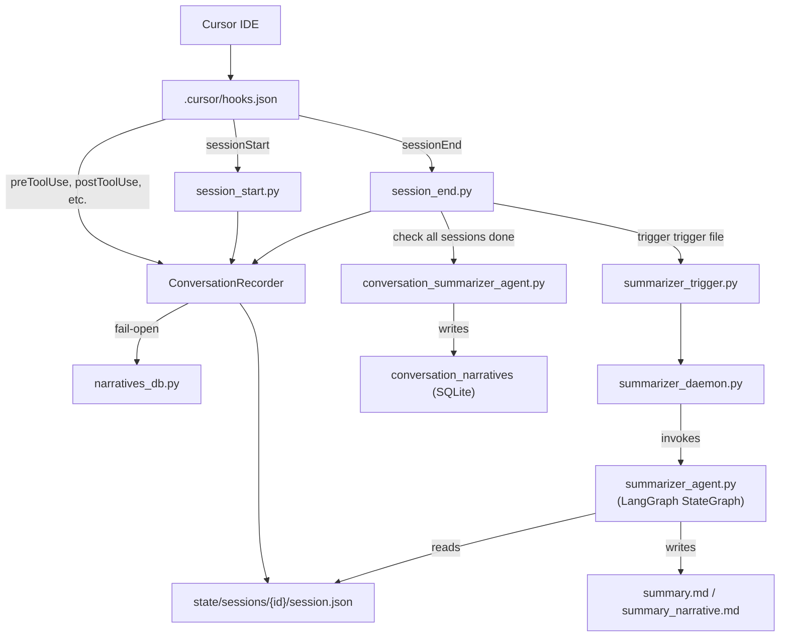

# Cursor Hooks & LangGraph Session Summarizer -- AI Agent Development Guide

## 1. Project Overview

An automated session recording and AI-powered summarization system built on top of Cursor's hooks framework. It records every interaction between a user and the AI coding assistant, then uses LangGraph agents to generate narrative summaries of each session.

### What It Does

- Records the full lifecycle of Cursor AI coding sessions: initial thought, tool calls, shell commands, file edits, and final output
- Automatically produces concise, human-readable narrative summaries via an LLM
- Stores session data in both JSON files (primary) and SQLite (secondary query layer)
- Aggregates session summaries into conversation-level narratives across multiple sessions

### Key Design Principles

- **Fail-open**: Hooks always output `{"permission": "allow"}` on error; the agent workflow is never blocked
- **Dual-write**: Events written to `session.json` (JSON file system, primary) and `narratives.db` (SQLite, secondary). SQLite writes are fail-open
- **Debounce-based summarization**: 60-second minimum interval between summaries to avoid excessive LLM calls
- **Zero-dependency SQLite layer**: `narratives_db.py` uses only Python stdlib `sqlite3`

### High-Level Architecture




---

## 2. Directory Structure

```
d:\test_agent\cursor-learning-harness\
├── AGENTS.md                          # Agent behavior rules
├── DOCS.md                            # This file -- comprehensive documentation
├── README.md                          # GitHub landing page
├── LICENSE                            # MIT License
├── run_sentiment_arc.py               # Entry point for sentiment arc analysis
├── verify_gpu.py                      # GPU availability check
├── .cursor/
│   ├── hooks.json                     # Hook event routing (20 event types, version 1)
│   ├── llm.env.example                # LLM API configuration template
│   ├── hooks/                         # Core system (~39 Python files)
│   │   ├── conversation_recorder.py   # Shared utility: session CRUD, event recording, ConversationLinker
│   │   ├── narratives_db.py           # SQLite storage layer: 8 schema migrations, 11 tables
│   │   ├── learning_analyzer.py       # Learning signal extraction: generates .mdc rules from telemetry
│   │   ├── learning_rules_agent.py    # LangGraph learning rules agent
│   │   ├── learning_rules_langgraph.py# LangGraph state graph for learning rules
│   │   ├── summarizer_agent.py        # LangGraph StateGraph: session-level summarizer
│   │   ├── conversation_summarizer_agent.py  # LangGraph: conversation-level summarizer
│   │   ├── summarizer_daemon.py       # Background polling daemon (5s interval)
│   │   ├── summarizer_daemon_launcher.py     # Windows DETACHED_PROCESS launcher
│   │   ├── summarizer_trigger.py      # Trigger file writer for daemon
│   │   ├── summarize_sessions.py      # CLI: manual batch summarization
│   │   ├── session_start.py           # Session initialization hook
│   │   ├── session_end.py             # Session finalization + conversation summary trigger + learning quick-scan
│   │   ├── pre_tool_use.py            # Records tool invocations
│   │   ├── post_tool_use.py           # Records tool results
│   │   ├── post_tool_use_failure.py   # Records tool failures
│   │   ├── before_shell_execution.py  # Records shell commands (pre-execution)
│   │   ├── after_shell_execution.py   # Records shell command results
│   │   ├── before_mcp_execution.py    # Records MCP calls (pre-execution)
│   │   ├── after_mcp_execution.py     # Records MCP results
│   │   ├── after_file_edit.py         # Records code changes
│   │   ├── after_agent_response.py    # Records agent responses
│   │   ├── after_agent_thought.py     # Records agent reasoning
│   │   ├── before_read_file.py        # Records file reads
│   │   ├── before_tab_file_read.py    # Records tab file reads
│   │   ├── after_tab_file_edit.py     # Records tab file edits
│   │   ├── before_submit_prompt.py    # Records user prompts
│   │   ├── pre_compact.py             # Records context compactions
│   │   ├── subagent_start.py          # Records subagent launches
│   │   ├── subagent_stop.py           # Records subagent termination
│   │   ├── stop.py                    # Records agent loop termination
│   │   ├── sentiment_arc_trigger.py   # Sentiment arc trigger hook
│   │   ├── check_sentiment.py         # Sentiment check utility
│   │   ├── view.py                    # CLI viewer for sessions
│   │   ├── check_status.py            # System status utility
│   │   ├── cleanup_sessions.py        # Session cleanup utility
│   │   ├── debug_hook.py              # Universal debug logger
│   │   ├── conftest.py                # Pytest configuration
│   │   ├── test_narrative_system.py   # Narrative system tests
│   │   ├── dashboard/                 # Streamlit analytics dashboard
│   │   │   ├── dashboard.py           # Streamlit app entry point
│   │   │   ├── db_queries.py          # SQLite query functions
│   │   │   ├── write_config.py        # Dashboard config writer
│   │   │   └── requirements.txt       # Dashboard dependencies
│   │   ├── sentiment_arc/             # Sentiment arc analysis module
│   │   │   ├── arc_analyzer.py        # Arc classification engine
│   │   │   ├── arc_db.py              # Arc features database layer
│   │   │   ├── batch_runner.py        # Batch analysis runner
│   │   │   ├── config.py              # Sentiment arc configuration
│   │   │   ├── dedup.py               # Deduplication utilities
│   │   │   ├── embedder.py            # Embedding model wrapper
│   │   │   ├── parser.py              # Session JSON parser
│   │   │   ├── score_text.py          # Sentiment scoring
│   │   │   ├── task_completion.py     # Task completion detection
│   │   │   └── tests/                 # Test suite (10 test files)
│   │   └── requirements.txt           # Python dependencies
│   ├── skills/                        # 25 specialized skill files
│   │   ├── cursor-hooks-core/         # Hook lifecycle, protocol, events, troubleshooting
│   │   ├── cursor-hooks-python/       # Python hooks, libraries, Kubernetes, secret detection
│   │   ├── cursor-hooks-bash/         # Shell script hooks, jq, JSON parsing, command validation
│   │   ├── cursor-hooks-testing/      # Pytest test suites, fixtures, subprocess testing
│   │   ├── cursor-hooks-testing-practical/  # Practical testing patterns
│   │   ├── cursor-hooks-error-handling/  # Fail-open, timeout handling, crash recovery
│   │   ├── cursor-hooks-formatting/   # Auto-formatting, linter integration
│   │   ├── cursor-hooks-governance/   # Enterprise audit, policy enforcement
│   │   ├── cursor-hooks-llm-integration/  # LangGraph, TypedDict, debounce, token management
│   │   ├── cursor-hooks-matcher/      # Tool-based matchers, regex, subagent types
│   │   ├── cursor-hooks-state-mgmt/   # ConversationRecorder, session.json, retention
│   │   ├── cursor-hooks-subagent/     # subagentStart/Stop, loop control, git isolation
│   │   ├── cursor-hooks-migration/    # hooks.json versioning, schema migrations
│   │   ├── cursor-hooks-observability/  # Structured logging, HookLogger, HookTracer
│   │   ├── cursor-hooks-security/     # Secret detection, PII, MCP governance
│   │   ├── cursor-hooks-windows-dev/  # PowerShell, Windows paths, file locking, venv
│   │   ├── session-analytics/         # SQLite analysis, query patterns, backfill
│   │   ├── python-hook-debugging/     # Python hook debugging strategies
│   │   ├── sqlite-patterns/           # SQLite patterns, migrations, WAL mode, fail-open CRUD
│   │   ├── context7-integration/      # Context7 MCP for library docs
│   │   ├── context7-parallel-research/  # Parallel Context7 execution
│   │   ├── browser-use-testing/       # Frontend testing via cursor-ide-browser MCP
│   │   ├── web-fetch-docs/            # Documentation retrieval via WebFetch
│   │   ├── web-search-research/       # Real-time info gathering via WebSearch
│   │   └── agent-skill-finder/        # Skill discovery and installation
│   ├── plans/                         # Completed implementation plans (6 files)
│   └── rules/
│       ├── mcp-usage.mdc              # MCP usage best practices
│       └── learning-critical.mdc      # Auto-generated critical learning rules
```

### Runtime State (`.cursor/hooks/state/`)

```
.cursor/hooks/state/
├── narratives.db                      # SQLite database (schema v8, 11 tables)
├── sessions_index.json                # Quick-lookup index of all sessions
├── conversation_links.json            # Session-to-conversation mapping
├── conversation_fingerprint.json      # Workspace fingerprint tracking
├── session_conversation_map.json      # Conversation mapping backup
├── rule_usage.json                    # Tracks which learning rules are referenced in sessions
├── extracted_signals.json             # Raw learning signals output from learning_analyzer.py
├── hook-debug.log / hooks-debug.log   # Debug logs from hook executions
├── summarizer_daemon.log              # Daemon process log
├── summarizer_daemon.pid              # Daemon PID file
├── sessions/                          # Per-session data directories
│   └── {session_id}/
│       ├── session.json               # Full conversation data with events (schema v4)
│       ├── summary.md                 # Combined statistics + narrative
│       ├── summary_narrative.md       # LLM-generated narrative only
│       ├── summary_structured.json    # Structured JSON (objectives, files, decisions)
│       ├── .last_summarized_timestamp # Debounce timestamp
│       └── .summarizer_lock           # Per-session lock (PID|timestamp)
└── summarizer_triggers/               # Daemon trigger files (auto-deleted after processing)
```

---

## 3. Hooks System Architecture

### How Cursor Hooks Work

1. Cursor fires events defined in `[.cursor/hooks.json](.cursor/hooks.json)`
2. Each event invokes Python scripts via `subprocess` with JSON over stdin
3. Hooks return JSON on stdout with `permission: "allow"/"deny"/"ask"`
4. Diagnostics go to stderr (does not interfere with protocol)
5. Exit codes: `0` = success, `2` = block, other = failure (hooks fail open by default)

### Communication Protocol

```
Cursor --> stdin:  JSON payload
                  {
                    "conversation_id": "...",
                    "session_id": "...",
                    "hook_event_name": "afterAgentResponse",
                    "model": "qwen3.6-plus",
                    "cursor_version": "...",
                    "agentResponse": "...",     # event-specific field
                    "abort": false,
                    "toolName": "Shell",        # varies by event type
                    ...
                  }

Hook  --> stdout:  JSON response
                  {"permission": "allow"}
                  # Optionally: user_message, agent_message, updated_input, updated_command

Hook  --> stderr:  Diagnostic logging (does not interfere with stdout protocol)
```

### Configured Event Types (from `.cursor/hooks.json`)


| Event                  | When It Fires                       | Hooks Attached                                     |
| ---------------------- | ----------------------------------- | -------------------------------------------------- |
| `sessionStart`         | A new Cursor session begins         | `session_start.py`, `summarizer_daemon.py --start` |
| `sessionEnd`           | A Cursor session ends               | `session_end.py` (30s timeout), `sentiment_arc_trigger.py` |
| `preToolUse`           | Before a tool is invoked            | `pre_tool_use.py`                                  |
| `postToolUse`          | After a tool completes              | `post_tool_use.py`                                 |
| `postToolUseFailure`   | After a tool fails                  | `post_tool_use_failure.py`                         |
| `beforeShellExecution` | Before a shell command runs         | `before_shell_execution.py`                        |
| `afterShellExecution`  | After a shell command completes     | `after_shell_execution.py`                         |
| `beforeMCPExecution`   | Before an MCP tool call             | `before_mcp_execution.py`                          |
| `afterMCPExecution`    | After an MCP tool completes         | `after_mcp_execution.py`                           |
| `subagentStart`        | A subagent session starts           | `subagent_start.py`                                |
| `subagentStop`         | A subagent session stops            | `subagent_stop.py`                                 |
| `beforeReadFile`       | Before the agent reads a file       | `before_read_file.py`                              |
| `afterFileEdit`        | After a file edit completes         | `after_file_edit.py`                               |
| `beforeSubmitPrompt`   | Before the user submits a prompt    | `before_submit_prompt.py`                          |
| `preCompact`           | Before context window compaction    | `pre_compact.py`                                   |
| `afterAgentResponse`   | After the agent produces a response | `after_agent_response.py`, `summarizer_trigger.py` |
| `afterAgentThought`    | After the agent produces reasoning  | `after_agent_thought.py`                           |
| `stop`                 | When the agent loop terminates      | `stop.py`                                          |
| `beforeTabFileRead`    | Before a tab file read              | `before_tab_file_read.py`                          |
| `afterTabFileEdit`     | After a tab file edit               | `after_tab_file_edit.py`                           |


### Python Path

All hooks use the workspace virtual environment: `${workspaceFolder}/.venv/Scripts/python.exe`

This path is configured in `[.cursor/hooks.json](.cursor/hooks.json)`. Update there if your environment differs.

### Fail-Open Design

Every hook wraps its logic in try/except and outputs `{"permission": "allow"}` on any error. This ensures the Cursor agent workflow is never blocked by hook failures. Diagnostic output goes exclusively to stderr.

---

## 4. Core Components

### 4.1 ConversationRecorder

File: `[.cursor/hooks/conversation_recorder.py](.cursor/hooks/conversation_recorder.py)` (~679 lines)

The central utility class used by all recording hooks.

**Key responsibilities:**

- **Session CRUD**: Create, read, update, delete session directories and `session.json` files
- **Event recording**: Appends events to chronological `events[]` array and categorized arrays
- **Index management**: Updates `sessions_index.json` with per-session stats
- **File locking**: Uses `msvcrt` on Windows for concurrent access safety
- **10MB soft cap**: Stops recording events when `session.json` exceeds 10MB
- **BOM stripping**: Strips double-encoded UTF-8 BOM from stdin input
- **Full data capture**: All events store complete text without truncation; no `*_preview` fields are written to session.json

**Session JSON schema (v4):**

```json
{
  "session_id": "uuid-v4",
  "created_at": "ISO-8601",
  "last_updated": "ISO-8601",
  "events": [],
  "file_edits": [],
  "thoughts": [],
  "responses": [],
  "shell_commands": [],
  "tool_uses": [],
  "tool_results": [],
  "tool_failures": [],
  "shell_results": [],
  "file_reads": [],
  "mcp_calls": [],
  "mcp_results": [],
  "subagent_starts": [],
  "subagent_stops": [],
  "user_prompts": [],
  "compactions": [],
  "tab_file_reads": [],
  "tab_file_edits": [],
  "metadata": {
    "is_background_agent": false,
    "composer_mode": "agent",
    "hook_version": 1,
    "python_version": "3.13",
    "git_branch": "main",
    "git_commit": "abc123",
    "workspace_roots": ["d:\\test_agent\\cursor-learning-harness"]
  },
  "summary": {}
}
```

**ConversationLinker:**
Manages stable conversation IDs across sessions using:

1. Existing session-to-conversation mapping
2. Subagent `parent_conversation_id` from payload
3. Recent compaction detection (within 60s, scans last 10 sessions)
4. Workspace fingerprint matching (workspace_roots + git_branch + composer_mode)
5. UUID v4 generation as fallback

**Event field names (session.json):**

All hooks store full data without `*_preview` fields. The canonical field names are:

| Event Type | Field | Description |
|---|---|---|
| `user_prompt` | `prompt_text` | Full user prompt text |
| `response` | `text` | Full agent response text |
| `thought` | `text` | Full agent thought text |
| `tool_use` | `tool_input` | Full tool input (JSON string) |
| `tool_result` | `tool_input`, `tool_output` | Full input and output |
| `tool_failure` | `tool_input` | Full tool input at failure time |
| `shell_result` | `command`, `output` | Full command and output |
| `file_read` | `content` | Full file content |
| `file_edit` | `full_old_string`, `full_new_string` | Full before/after content |
| `mcp_call` | `tool_input` | Full MCP tool input |
| `mcp_result` | `tool_input`, `result` | Full input and result JSON |
| `subagent_stop` | `summary` | Full subagent summary |
| `tab_file_read` | `content` | Full tab file content |
| `tab_file_edit` | `full_old_string`, `full_new_string` | Full before/after content |

Note: The summarizer (`summarizer_agent.py`) applies local truncation when building LLM context (e.g., `MAX_EVENT_TEXT_CHARS = 2000`), but this does **not** modify stored data -- it only limits what gets sent to the LLM during summary generation.

**Key functions:**

- `read_hook_input()` -- Reads JSON from stdin with BOM stripping
- `safe_output(permission, ...)` -- Writes fail-open JSON to stdout
- `record_event()` -- Writes event to session.json and SQLite (fail-open)
- `get_conversation_id()` -- Resolves conversation ID via ConversationLinker

### 4.2 NarrativesDB

File: `[.cursor/hooks/narratives_db.py](.cursor/hooks/narratives_db.py)` (~2,210 lines)

SQLite-backed storage layer for session data. **Zero external dependencies** -- uses only Python stdlib `sqlite3`.

**Schema version: 8** with 11 tables:


| Table                               | Purpose                                                                                                                                                                              |
| ----------------------------------- | ------------------------------------------------------------------------------------------------------------------------------------------------------------------------------------ |
| `sessions`                          | One row per session (session_id, created_at, completed_at, status, duration_ms, composer_mode, model, git_branch, git_commit, workspace_roots, is_background_agent, conversation_id) |
| `narratives`                        | Session narrative summaries (session_id, narrative, generated_at, strategy, word_count)                                                                                              |
| `session_stats`                     | Per-session statistics (total_events, responses, thoughts, thinking_time, file_edits, shell_commands, tool_uses, code_changes)                                                       |
| `session_tool_stats`                | Tool performance metrics (calls, successes, failures, errors, avg durations, breakdowns)                                                                                             |
| `hook_events`                       | All raw hook events (session_id, sequence, timestamp, event_type, model, detail_json) with indexes                                                                                   |
| `conversations`                     | Conversation-level metadata (conversation_id, created_at, completed_at, status, git context, composer_mode)                                                                          |
| `conversation_narratives`           | Conversation-level narratives (conversation_id, narrative, session_count, word_count)                                                                                                |
| `structured_summaries`              | Session-level structured JSON (objectives, files_modified/created/deleted, decisions, errors, session_type)                                                                          |
| `conversation_structured_summaries` | Conversation-level merged structured summaries                                                                                                                                       |
| `schema_versions`                   | Migration tracking (version, applied_at, description)                                                                                                                                |


**Configuration:**

- WAL mode enabled for concurrent reads
- Busy timeout set for write contention
- Foreign keys enforced
- Corrupt database recovery (auto-delete and recreate)
- Constants: `NARRATIVE_SOFT_CAP_CHARS = 100,000`, `UNIQUE_FILES_CAP = 500`

**CLI usage:**

```bash
python narratives_db.py --backfill                # Populate DB from existing JSON sessions
python narratives_db.py --backfill-events         # Backfill per-event data into hook_events table
python narratives_db.py --backfill-conversations  # Create conversation rows for sessions without conversation_id
python narratives_db.py --list                    # List all sessions in DB
python narratives_db.py --list-conversations      # List all conversations in DB
python narratives_db.py --get <session_id>        # Get narrative for a session
python narratives_db.py --get-conversation <conv_id>  # Get conversation and its sessions
python narratives_db.py --search <query>          # Search narratives
python narratives_db.py --stats                   # Show DB-level aggregate stats
python narratives_db.py --aggregate-stats <conv_id>   # Show aggregate stats for a conversation
python narratives_db.py --summarize-conversation <conv_id>  # Generate conversation-level summary
python narratives_db.py --get-conversation-narrative <conv_id>  # Get conversation narrative summary
python narratives_db.py --get-conversation-structured <conv_id> # Get conversation structured summary
```

### 4.3 LangGraph Session Summarizer

File: `[.cursor/hooks/summarizer_agent.py](.cursor/hooks/summarizer_agent.py)` (~1259 lines)

A LangGraph StateGraph-based agent that generates narrative summaries from recorded session events.

**State schema (TypedDict):**

```python
class SummarizerState(TypedDict, total=False):
    session_id: str
    events: list
    new_event_count: int
    previous_summary: str
    narrative_summary: str
    strategy: str          # "full_regenerate" | "delta_update" | "skip"
    error: str
    force: bool
    regenerate: bool
    formatted_context: str
```

**Graph structure:**

```
START --> load_and_check --> build_context --> generate_summary --> save_summary --> END
                                ^
                                |
                        (strategy == skip) --> END
```

**Node details:**


| Node               | Purpose                                                                                                  |
| ------------------ | -------------------------------------------------------------------------------------------------------- |
| `load_and_check`   | Loads `session.json`, checks 60s debounce, compares event counts, determines strategy                    |
| `build_context`    | Formats events into LLM timeline: dedup, token cap (20 head + 80 tail), 2000-char truncation             |
| `generate_summary` | ChatOpenAI call with narrative prompt, empty-response retry logic                                        |
| `save_summary`     | Persists to `session.json`, writes `summary_narrative.md`, updates `summary.md`, sets debounce timestamp |


**Strategy determination:**

- `full_regenerate`: new events >= 3 OR no previous summary OR `--force`/`--regenerate` flag
- `delta_update`: fewer than 3 new events since last summary
- `skip`: debounce active (within 60s) OR no new events

**Key constants:**


| Constant                 | Value | Purpose                                 |
| ------------------------ | ----- | --------------------------------------- |
| `DEBOUNCE_SECONDS`       | 60    | Minimum time between summaries          |
| `LOCK_TIMEOUT_SECONDS`   | 120   | Stale lock detection timeout            |
| `REGENERATE_THRESHOLD`   | 3     | New events needed for full regenerate   |
| `MAX_EVENTS_FOR_CONTEXT` | 100   | Maximum events sent to LLM              |
| `HEAD_EVENTS`            | 20    | Events kept from the start when capping |
| `TAIL_EVENTS`            | 80    | Events kept from the end when capping   |
| `MAX_EVENT_TEXT_CHARS`   | 2000  | Max characters per event text           |
| `MAX_COMMAND_CHARS`      | 300   | Max characters for shell commands       |


**Concurrency control:**

- Per-session lock files (`.summarizer_lock`): content is `PID|timestamp`
- Stale locks (older than 120s or from dead processes) are removed
- Debounce: `.last_summarized_timestamp` written after each summary

**LLM configuration** (from `.cursor/llm.env`):

- `ChatOpenAI`, `temperature=0.3`, `max_tokens=4096`, `timeout=60`
- `API_KEY`, `BASE_URL` (default: `https://api.openai.com/v1`), `REASONING_MODEL` (default: `qwen3.6-plus`)

**CLI usage:**

```bash
python summarizer_agent.py <session_id>              # Normal summarization
python summarizer_agent.py <session_id> --force      # Bypass debounce and threshold
python summarizer_agent.py <session_id> --regenerate # Full regenerate
```

### 4.4 Conversation Summarizer

File: `[.cursor/hooks/conversation_summarizer_agent.py](.cursor/hooks/conversation_summarizer_agent.py)` (~685 lines)

Aggregates session-level summaries into conversation-level narratives. Uses existing session summaries as building blocks (does not reprocess raw events).

- `max_tokens=8192`, `timeout=90`
- Launched from `session_end.py` as a detached subprocess (120s timeout)
- Writes to `conversation_narratives` and `conversation_structured_summaries` tables in SQLite

### 4.5 Daemon System


| File                                                                                         | Purpose                                                                                                                                                                                    |
| -------------------------------------------------------------------------------------------- | ------------------------------------------------------------------------------------------------------------------------------------------------------------------------------------------ |
| `[.cursor/hooks/summarizer_daemon.py](.cursor/hooks/summarizer_daemon.py)`                   | Background daemon: polls `summarizer_triggers/` every 5s, deduplicates by session_id, invokes `summarizer_agent.py`, manages PID file, handles SIGTERM/SIGINT, stale trigger cleanup (24h) |
| `[.cursor/hooks/summarizer_daemon_launcher.py](.cursor/hooks/summarizer_daemon_launcher.py)` | Detached process launcher: uses `subprocess.Popen` with `CREATE_NEW_CONSOLE` and `DETACHED_PROCESS` flags on Windows                                                                       |
| `[.cursor/hooks/summarizer_trigger.py](.cursor/hooks/summarizer_trigger.py)`                 | Trigger file writer: called by `afterAgentResponse` and `stop --force` hooks, writes timestamped trigger files to `state/summarizer_triggers/`                                             |


**Daemon lifecycle:**

```
sessionStart --> summarizer_daemon.py --start --> detached process
    --> polls every 5s for trigger files
    --> deduplicates by session_id (skips if already processing)
    --> invokes summarizer_agent.py <session_id>
    --> removes processed trigger file
    --> cleans stale triggers (>24h)
```

---

## 5. Two-Level Summarization Architecture

### Path A: Session-Level (Daemon-Based)

```
afterAgentResponse or stop hook
    --> summarizer_trigger.py writes trigger file
        --> state/summarizer_triggers/<timestamp>_<session_id>.trigger
            --> summarizer_daemon.py picks up (5s poll)
                --> deduplicates by session_id
                    --> summarizer_agent.py <session_id>
                        --> reads session.json
                        --> generates narrative
                        --> writes summary_narrative.md + summary.md
                        --> updates session.json summary field
```

### Path B: Conversation-Level (Session_End-Based)

```
sessionEnd --> session_end.py
    --> finalizes session with comprehensive statistics
    --> checks: all sessions in conversation completed AND all have narratives
        --> launches conversation_summarizer_agent.py (detached subprocess, 120s timeout)
            --> aggregates session summaries
            --> generates conversation narrative
            --> writes conversation_narratives (SQLite)
            --> writes conversation_structured_summaries (SQLite)
```

---

## 6. State Storage Layout

### Per-Session Directory

Each session gets its own directory under `.cursor/hooks/state/sessions/{session_id}/`:

```
{session_id}/
├── session.json                 # Full conversation data (schema v4)
├── summary.md                   # Combined: statistics block + narrative block
├── summary_narrative.md         # Narrative text only
├── summary_structured.json      # Structured: objectives, files, decisions, errors
├── .last_summarized_timestamp   # Debounce: ISO-8601 timestamp of last summary
└── .summarizer_lock             # Lock: PID|timestamp format
```

### Index Files


| File                            | Purpose                                                                                                                              |
| ------------------------------- | ------------------------------------------------------------------------------------------------------------------------------------ |
| `sessions_index.json`           | Quick-lookup: session_id -> {created_at, last_updated, event_count, file_edits, thoughts, responses, shell_commands, tool_uses, ...} |
| `conversation_links.json`       | Maps session_id -> conversation_id with metadata                                                                                     |
| `conversation_fingerprint.json` | Workspace fingerprint for conversation linking (workspace_roots + git_branch + composer_mode)                                        |
| `session_conversation_map.json` | Backup mapping of session-to-conversation relationships                                                                              |


## 6.5 Data Storage Layers Diagram

The system uses four data storage layers, each written at a different point in the session lifecycle:

```
LAYER 0: CURSOR HOOKS (Entry Point)
stdin JSON payloads from Cursor agent lifecycle events
Triggers: sessionStart -> beforeSubmitPrompt -> afterAgentThought
          -> afterAgentResponse -> pre/postToolUse -> afterFileEdit
          -> before/afterShell -> before/afterMCP -> subagentStart/Stop
          -> preCompact -> stop/sessionEnd
        |
        v  Each hook fires -> ConversationRecorder.add_event()
LAYER 1: JSON File System (Primary Store, Always Active)
.cursor/hooks/state/
  Index Files (written every event):
  - sessions_index.json          fast lookup by session_id
  - conversation_links.json      session_id -> conversation_id
  - conversation_fingerprint.json workspace fingerprints
  - rule_usage.json              learning rule reference tracking
  - extracted_signals.json       raw learning signals from analyzer

  Per-Session (written incrementally during session):
  sessions/{session_id}/
  - session.json                 ALL events + metadata + summary
  - .summarizer_lock             lock file (PID|timestamp)
  - .last_summarized_timestamp   debounce (epoch float)
  - summary_narrative.md         LLM narrative text
  - summary_structured.json      LLM structured JSON
  - summary.md                   combined narrative + structured

  Per-Conversation (written after session summaries):
  conversations/{conversation_id}/
  - conversation_summary.md
  - conversation_structured.json
  - .summarizer_lock
  - .last_summarized_timestamp
        |
        v  Dual-write on every operation
LAYER 2: SQLite Database (Queryable Mirror, Fails Open)
.cursor/hooks/state/narratives.db (schema v8, 11 tables)
  Tables:
  - conversations                    conversation metadata
  - conversation_narratives          conversation-level text
  - conversation_structured_summaries conversation-level JSON (includes sentiment)
  - sessions                         session metadata
  - narratives                       session-level narrative text
  - structured_summaries             session-level structured JSON (includes sentiment)
  - session_stats                    aggregated session stats
  - session_tool_stats               per-tool breakdowns
  - hook_events                      every single event (JSON detail)
  - session_arc_features             sentiment arc analysis results
  - arc_analysis_stats               batch run history
        |
        v  Summarizer reads events, writes summaries
LAYER 3: Summarizer Agents (LLM-Generated)
Triggered by: daemon process or CLI (summarize_sessions.py)
  Session-Level (summarizer_agent.py):
  - Reads: raw events from session.json / hook_events
  - Writes: narrative + structured summary
  - Output: summary_narrative.md, summary_structured.json

  Conversation-Level (conversation_summarizer_agent.py):
  - Reads: existing SESSION summaries (not raw events)
  - Writes: aggregated conversation narrative + structured JSON
  - Output: conversation_summary.md, conversation_structured.json

LAYER 4: Learning Analyzer (Rule Generation)
Triggered by: session_end.py (quick-scan) or CLI --bootstrap/--update
  learning_analyzer.py:
  - Reads: hook_events, structured_summaries, session_arc_features
  - Extracts: 10 signal categories (failures, hotspots, sentiment, etc.)
  - Writes: extracted_signals.json, learning.mdc, learning-critical.mdc
```
```

**When data is written:**


| Phase                            | What Gets Written                                                                                                                   |
| -------------------------------- | ----------------------------------------------------------------------------------------------------------------------------------- |
| Session starts                   | `session.json` created, `conversations` + `sessions` rows inserted, `conversation_links.json` updated                               |
| During session (each hook fires) | Event appended to `session.json["events"]`, `sessions_index.json` updated, `hook_events` row inserted                               |
| Session ends (`stop.py`)         | Stats computed -> `session.json["summary"]` populated, `session_stats` + `session_tool_stats` updated                               |
| Summarizer runs (daemon/CLI)     | LLM generates narrative + structured -> `.md`/`.json` files written, `narratives` + `structured_summaries` rows upserted            |
| Conversation summarizer          | Aggregates session summaries -> `conversation_summary.md`, `conversation_narratives` + `conversation_structured_summaries` upserted |


**Key relationships:**

- **1 conversation -> N sessions** (sessions can span across conversation boundaries)
- **JSON is primary**, SQLite is a queryable mirror - dual-write on every operation
- **18 event types** tracked (thought, response, tool_use, file_edit, shell_command, mcp_call, subagent_start/stop, etc.)
- **Summaries exist at two levels**: session-level (from raw events) and conversation-level (from session summaries)
- **Conversation summarizer reads session summaries**, never raw events - it is a summary-of-summaries layer

---

## 7. Database Schema Details

### Table Definitions

**sessions:**

```sql
session_id TEXT PRIMARY KEY,
created_at TEXT NOT NULL,
completed_at TEXT,
status TEXT DEFAULT 'unknown',
duration_ms INTEGER DEFAULT 0,
end_reason TEXT,
composer_mode TEXT,
model TEXT,
git_branch TEXT,
git_commit TEXT,
workspace_roots TEXT DEFAULT '[]',
is_background_agent INTEGER DEFAULT 0,
conversation_id TEXT DEFAULT '',
last_updated TEXT DEFAULT CURRENT_TIMESTAMP
```

**narratives:**

```sql
session_id TEXT PRIMARY KEY,
narrative TEXT NOT NULL,
generated_at TEXT NOT NULL,
strategy TEXT DEFAULT '',
word_count INTEGER DEFAULT 0,
event_count_at_summary INTEGER DEFAULT 0,
FOREIGN KEY (session_id) REFERENCES sessions(session_id) ON DELETE CASCADE
```

**hook_events:**

```sql
id INTEGER PRIMARY KEY AUTOINCREMENT,
session_id TEXT NOT NULL,
sequence INTEGER NOT NULL,
timestamp TEXT NOT NULL,
event_type TEXT NOT NULL,
model TEXT,
detail_json TEXT,
FOREIGN KEY (session_id) REFERENCES sessions(session_id) ON DELETE CASCADE
```

Indexes: `(session_id, sequence)`, `(session_id, event_type)`, `(event_type)`

**session_stats:**

```sql
session_id TEXT PRIMARY KEY,
total_events INTEGER DEFAULT 0,
total_responses INTEGER DEFAULT 0,
total_thoughts INTEGER DEFAULT 0,
total_thinking_time_ms INTEGER DEFAULT 0,
total_file_edits INTEGER DEFAULT 0,
unique_files_edited TEXT DEFAULT '[]',
total_shell_commands INTEGER DEFAULT 0,
total_tool_uses INTEGER DEFAULT 0,
tool_usage_breakdown TEXT DEFAULT '{}',
net_code_change INTEGER DEFAULT 0,
total_chars_added INTEGER DEFAULT 0,
total_chars_removed INTEGER DEFAULT 0,
FOREIGN KEY (session_id) REFERENCES sessions(session_id) ON DELETE CASCADE
```

### Migration Strategy

Migrations are defined in the `MIGRATIONS` dict in `narratives_db.py`, keyed by version number. Each version contains a list of SQL statements executed in order.

```python
MIGRATIONS = {
    1: [...],   # Initial schema
    2: [...],   # Added columns
    ...
    7: [...],   # Current
}
```

To add a migration:

1. Add new version key to `MIGRATIONS` dict with list of `ALTER TABLE` / `CREATE TABLE` statements
2. Increment `CURRENT_SQLITE_SCHEMA_VERSION`
3. Run `python narratives_db.py --backfill` to apply

---

## 8. Skills System

The project includes 20+ specialized skill files in `.cursor/skills/`, `.agents/skills/`, and `.cursor/skills-cursor/`. Each skill is a `SKILL.md` file that provides agents with domain expertise.

### Skill Discovery

Agents discover skills via the `agent-skill-finder` skill. To use a skill, read its `SKILL.md` file and follow the instructions within.

### Workspace Skills (`.cursor/skills/`)


| Skill File                       | Coverage                                                                                                                                                                  |
| -------------------------------- | ------------------------------------------------------------------------------------------------------------------------------------------------------------------------- |
| `cursor-hooks-core`              | Hook lifecycle, configuration hierarchy (Enterprise > Team > Project > User), all 20 event types, stdio JSON protocol, exit codes, environment variables, troubleshooting |
| `cursor-hooks-python`            | Python hooks with rich libraries (YAML, JSON Schema, regex), Kubernetes manifest validation, secret detection, PII detection, HTTP integration                            |
| `cursor-hooks-bash`              | Shell script hooks with jq, JSON parsing, command validation, regex patterns, audit logging, destructive command prevention                                               |
| `cursor-hooks-testing`           | Pytest-based test suites, fixture management, subprocess integration testing, JSON schema validation, summarizer agent mocking                                            |
| `cursor-hooks-testing-practical` | Practical testing patterns and real-world test scenarios                                                                                                                  |
| `cursor-hooks-error-handling`    | Fail-open vs fail-closed, timeout handling, crash recovery, invalid JSON handling, debugging strategies                                                                   |
| `cursor-hooks-formatting`        | Auto-formatting (Prettier, Black, gofmt), linter integration (ESLint, Ruff), formatter chains                                                                             |
| `cursor-hooks-llm-integration`   | LangGraph StateGraph agents, TypedDict schemas, debounce/lock management, token management, prompt engineering, llm.env configuration                                     |
| `cursor-hooks-state-mgmt`        | ConversationRecorder system, session.json schema, concurrent access patterns, retention policies                                                                          |
| `cursor-hooks-subagent`          | subagentStart/Stop lifecycle, loop control (default limit 5), git branch isolation, cost tracking                                                                         |
| `cursor-hooks-windows-dev`       | PowerShell/batch hooks, Windows paths, CRLF handling, file locking on Windows, virtual environments                                                                       |
| `cursor-hooks-security`          | Secret detection (AWS, API keys, GitHub tokens), PII detection, MCP governance, command injection prevention                                                              |
| `cursor-hooks-observability`     | Structured JSON logging, HookLogger, performance timing, HookTracer, alert thresholds                                                                                     |
| `session-analytics`              | SQLite schema documentation, query patterns, backfill operations, data quality checks                                                                                     |
| `python-hook-debugging`          | Python hook debugging strategies and common failure modes                                                                                                                 |
| `sqlite-patterns`                | Raw SQLite patterns: schema migrations (v1-v8), WAL mode, dual-write JSON+SQLite consistency, corrupt DB recovery, fail-open CRUD patterns                               |

### Installed External Skills (`.agents/skills/`)

| Skill File                 | Source                                                                                          | Coverage                                                                                                                                                         |
| -------------------------- | ----------------------------------------------------------------------------------------------- | ---------------------------------------------------------------------------------------------------------------------------------------------------------------- |
| `mastering-langgraph`      | `SpillwaveSolutions/mastering-langgraph-agent-skill`                                            | StateGraph patterns, tool-using agents, branching workflows, checkpointers/persistence, HITL with `interrupt()`, multi-agent systems, debugging with LangSmith     |
| `pytest`                   | `1Mangesh1/dev-skills-collection`                                                               | pytest fixtures, parametrization, markers, mocking/monkeypatch, conftest patterns, coverage configuration, CI integration                                        |
| `ruff-recursive-fix`       | `github/awesome-copilot`                                                                        | Iterative Ruff linting workflow: safe autofix, unsafe autofix, format, re-check loop; requires `ruff` in venv                                                    |
| `python-type-safety`       | `wshobson/agents`                                                                               | Type annotations, generics with TypeVars, structural protocols, type narrowing, mypy/pyright strict mode, Python 3.13 modern syntax                              |

### Skill Installation Commands

To install new skills from skills.sh or GitHub:

```bash
# Install from GitHub repository
npx skills add <owner>/<repo> --skill <skill-name> --yes

# Install all skills from a repository (interactive)
npx skills add <owner>/<repo> --yes

# Example: install LangGraph skill
npx skills add https://github.com/SpillwaveSolutions/mastering-langgraph-agent-skill --yes
```


---

## 9. MCP Integration

The workspace has 11 configured MCP servers. MCP tool descriptors are stored in `C:\Users\kanis\.cursor\projects\d-test-agent-learning-agent\mcps\`.


| MCP Server                  | Purpose                                                      |
| --------------------------- | ------------------------------------------------------------ |
| `cursor-ide-browser`        | Web browsing, UI testing, form filling, screenshots          |
| `user-context7`             | Library/framework/SDK documentation (prefer over web search) |
| `user-playwright`           | Programmatic browser testing and automation                  |
| `user-playwright-no-vision` | Playwright without visual verification                       |
| `user-github`               | PR creation, issue management, repository operations         |
| `user-chrome-devtools`      | Performance profiling, debugging, network inspection         |
| `user-ESLint`               | Code quality analysis and lint rule checks                   |
| `user-neo4j`                | Graph database queries                                       |
| `user-mcp-deepwiki`         | Deep documentation research                                  |
| `user-shadcn`               | shadcn component documentation                               |
| `user-sequential-thinking`  | Complex multi-step reasoning                                 |


### Tool Routing Rules (from `.cursor/rules/mcp-usage.mdc`)

- **Library/API questions**: use `user-context7` first, fall back to web search only if context7 has no result
- **Web page interaction**: use `cursor-ide-browser` for manual-style navigation, `user-playwright` for scripted flows
- **Performance issues**: use `user-chrome-devtools` for profiling
- **Code quality**: use `user-ESLint` before claiming code is clean
- **Never call multiple MCP servers for the same question** -- pick the most relevant one

---

## 10. Development Guidelines for AI Agents

### Adding a New Hook Event

1. Add the event to `[.cursor/hooks.json](.cursor/hooks.json)` with the Python command path
2. Create a new Python script in `.cursor/hooks/` that:
  - Calls `read_hook_input()` from `conversation_recorder.py`
  - Processes the event data
  - Calls `recorder.record_event(...)` to write to session.json
  - Outputs `safe_output("allow")` to stdout
  - Wraps everything in try/except (fail-open)
3. If the event needs a new category array in session.json:
  - Add the array to `ConversationRecorder.create_session()` in `conversation_recorder.py`
  - Add the array to `ConversationRecorder.record_event()` categorization logic

### Adding a New Event Category to session.json

1. In `conversation_recorder.py`, add a new empty list to `SESSION_SCHEMA_V4` in `create_session()`
2. In `record_event()`, add the mapping from event type to the new array
3. In `session_end.py`, add the category to the statistics computation
4. Run a test session to verify the array is populated

### Adding a Database Migration

1. In `narratives_db.py`, add a new key to `MIGRATIONS` dict:
  ```python
   8: [
       "ALTER TABLE sessions ADD COLUMN new_column TEXT DEFAULT ''",
   ]
  ```
2. Increment `CURRENT_SQLITE_SCHEMA_VERSION = 8`
3. Run `python narratives_db.py --backfill`

### Testing

- Use `cursor-hooks-testing` and `cursor-hooks-testing-practical` skills for testing patterns
- Use `pytest` skill in `.agents/skills/pytest/` for comprehensive pytest guidance (fixtures, parametrization, mocking)
- Tests should be pytest-based
- Mock subprocess calls when testing hooks that invoke the summarizer
- Validate JSON output with schema assertions
- Test fail-open behavior by injecting errors
- Current test coverage: sentiment_arc module only (10 test files); core modules (narratives_db.py, summarizer_agent.py, conversation_recorder.py) need tests

### Error Handling Rules

1. **Always fail-open**: output `{"permission": "allow"}` on any error
2. **Log to stderr**: all diagnostics go to stderr, never stdout
3. **Never block Cursor**: hooks must not hang indefinitely; use timeouts
4. **Catch all exceptions**: wrap hook logic in broad try/except blocks
5. **Graceful degradation**: if SQLite write fails, continue with JSON-only recording

### Code Conventions

- Python 3.13 target
- UTF-8 encoding for all file I/O
- ISO 8601 timestamps
- JSON serialization with `json.dumps(data, indent=2, ensure_ascii=False)`
- Path resolution: `HOOKS_DIR = Path(__file__).parent.resolve()`, `STATE_DIR = HOOKS_DIR / "state"`
- Type annotations: use `ruff-recursive-fix` and `python-type-safety` skills for guidance; prefer modern syntax (`T | None` over `Optional[T]`, PEP 695 type aliases)
- Linting: use `ruff check --fix .` and `ruff format .` (ruff installed in venv at version 0.15.12); for iterative fixes, read `.agents/skills/ruff-recursive-fix/SKILL.md`

### Dependencies

From `[.cursor/hooks/requirements.txt](.cursor/hooks/requirements.txt)`:

```
langchain>=1.0.0
langgraph>=1.0.0
langchain-openai>=1.0.0
python-dotenv>=1.0.0
```

Install: `pip install -r .cursor/hooks/requirements.txt`

Additional dependencies installed via `.venv` (not in requirements.txt):
- `sentence-transformers>=3.0.0`, `torch>=2.0.0`, `scikit-learn>=1.4.0`, `numpy>=1.26.0`, `tqdm>=4.66.0` — sentiment arc analysis
- `ruff>=0.15.0` — dev dependency for linting/formatting
- `streamlit>=1.40.0`, `plotly>=5.24.0` — dashboard
- `pytest>=9.0.0` — testing

---

## 11. CLI Tools

### Session Viewer

```bash
python .cursor/hooks/view.py
```

Interactive CLI for:

- Listing sessions with stats
- Viewing session details
- Searching across sessions
- Showing aggregate statistics
- Displaying recent sessions

### Batch Summarization

```bash
python .cursor/hooks/summarize_sessions.py --status              # Show status of all sessions
python .cursor/hooks/summarize_sessions.py --all                 # Summarize all unsummarized sessions
python .cursor/hooks/summarize_sessions.py --regenerate          # Regenerate all summaries
python .cursor/hooks/summarize_sessions.py --structured          # Generate structured summaries
python .cursor/hooks/summarize_sessions.py --validate-structured # Validate structured JSON
python .cursor/hooks/summarize_sessions.py --summarize-conversation   # Summarize a conversation
python .cursor/hooks/summarize_sessions.py --summarize-all-conversations
python .cursor/hooks/summarize_sessions.py --list-conversations-with-stats
```

### Single Session Summarization

```bash
python .cursor/hooks/summarizer_agent.py <session_id>              # Normal
python .cursor/hooks/summarizer_agent.py <session_id> --force      # Bypass debounce
python .cursor/hooks/summarizer_agent.py <session_id> --regenerate # Full regenerate
```

### Database Operations

```bash
python .cursor/hooks/narratives_db.py --backfill          # Populate DB from JSON
python .cursor/hooks/narratives_db.py --list              # List sessions in DB
python .cursor/hooks/narratives_db.py --get <session_id>  # Get narrative
python .cursor/hooks/narratives_db.py --search <query>    # Search narratives
```

### System Status

```bash
python .cursor/hooks/check_status.py
```

### Dashboard (Streamlit)

```bash
cd .cursor/hooks/dashboard
pip install -r requirements.txt
streamlit run dashboard.py
```

Opens at `http://localhost:8501`.

The dashboard provides 5 pages:


| Page                 | Description                                                                                              |
| -------------------- | -------------------------------------------------------------------------------------------------------- |
| **Overview**         | KPI cards, time-series charts, tool usage breakdown, session status pie chart, recent sessions table     |
| **Session Explorer** | Search/filter sessions by ID, status, model, date range with paginated results and detail view           |
| **Narrative Viewer** | Browse and read LLM-generated session narratives with metadata sidebar and prev/next navigation          |
| **Tool Analytics**   | Tool frequency tables, success rates, usage trends over time, per-tool performance metrics               |
| **File Activity**    | Most-edited files, code changes per session, chars added/removed scatter plot, net code change bar chart |


Dashboard files:

- `.cursor/hooks/dashboard/dashboard.py` — Streamlit app entry point
- `.cursor/hooks/dashboard/db_queries.py` — SQLite query functions
- `.cursor/hooks/dashboard/requirements.txt` — Dependencies (streamlit, plotly)

Edge cases handled:

- DB locked/unavailable: shows error message with backfill instructions
- Empty database: shows placeholder with `--backfill` guidance
- Large narratives (>50K chars): truncates with opt-in to show full text
- Corrupt database: displays recovery message
- NULL values: handled gracefully in all charts and tables

### Daemon Management

```bash
python .cursor/hooks/summarizer_daemon.py --start   # Start in background
```

The daemon auto-starts on `sessionStart` via `hooks.json`. It manages its own PID file and handles clean shutdown on SIGTERM/SIGINT.

---

## 12. Common Patterns and Conventions

### Path Resolution

Every hook script resolves paths relative to its own location:

```python
HOOKS_DIR = Path(__file__).parent.resolve()
STATE_DIR = HOOKS_DIR / "state"
SESSIONS_DIR = STATE_DIR / "sessions"
```

### Debug Logging

```python
from conversation_recorder import HOOKS_DIR, STATE_DIR

DEBUG_LOG = STATE_DIR / "hook-debug.log"

def debug_log(message: str) -> None:
    STATE_DIR.mkdir(parents=True, exist_ok=True)
    timestamp = datetime.now().isoformat()
    with open(DEBUG_LOG, "a", encoding="utf-8") as f:
        f.write(f"[{timestamp}] [hook-name] {message}\n")
```

### Fail-Open stdout Output

```python
from conversation_recorder import safe_output

def main():
    try:
        # ... hook logic ...
        safe_output("allow")
    except Exception as e:
        print(f"ERROR: {e}", file=sys.stderr)
        safe_output("allow")
```

### Reading Hook Input

```python
from conversation_recorder import read_hook_input

payload = read_hook_input()
session_id = payload.get("session_id")
event_type = payload.get("hook_event_name")
```

### Recording Events

```python
from conversation_recorder import ConversationRecorder

recorder = ConversationRecorder()
recorder.record_event(
    session_id=session_id,
    event_type="toolUse",
    event_data={"toolName": "Shell", "command": "ls"},
)
```

### Session Metadata Gathering

Session start hooks collect:

```python
git_branch = subprocess.run(["git", "branch", "--show-current"], capture_output=True, text=True).stdout.strip()
git_commit = subprocess.run(["git", "rev-parse", "HEAD"], capture_output=True, text=True).stdout.strip()
workspace_roots = payload.get("workspaceRoots", [])
composer_mode = payload.get("composerMode", "unknown")
is_background = payload.get("isBackgroundAgent", False)
```

### Text Truncation

Text truncation is used **only in consumer code** (summarizer, view CLI) when building LLM prompts or terminal output. No preview fields are stored in session.json -- all events capture full data.

**Summarizer local truncation** (for LLM context building, not storage):

```python
from conversation_recorder import truncate

truncated = truncate(long_text, max_chars=2000)  # appends "[...truncated]" if needed
```

Summarizer constants (apply only to LLM context, not stored data):

| Constant                 | Value | Purpose                                 |
| ------------------------ | ----- | --------------------------------------- |
| `MAX_EVENTS_FOR_CONTEXT` | 100   | Maximum events sent to LLM              |
| `HEAD_EVENTS`            | 20    | Events kept from the start when capping |
| `TAIL_EVENTS`            | 80    | Events kept from the end when capping   |
| `MAX_EVENT_TEXT_CHARS`   | 2000  | Max characters per event text in prompt |
| `MAX_COMMAND_CHARS`      | 300   | Max characters for shell commands       |
| `MAX_STRUCTURED_JSON_BYTES` | 10 KB | Max structured summary payload       |

### Process Detection (Windows-compatible)

```python
from conversation_recorder import is_process_alive

if is_process_alive(pid):
    # process still running
```

Uses `psutil` if available, falls back to `tasklist` on Windows, `os.kill(pid, 0)` on Unix.

---

## 13. Troubleshooting

### Daemon Not Starting

1. Check Python path in `hooks.json` matches your installation
2. Check for stale PID file: `state/summarizer_daemon.pid`
3. Verify `psutil` is installed (optional but recommended): `pip install psutil`
4. Check daemon log: `state/summarizer_daemon.log`
5. Manually test: `python .cursor/hooks/summarizer_daemon.py --start`

### Summaries Not Generated

1. Check trigger directory for pending triggers: `state/summarizer_triggers/`
2. Check debounce timestamp: `state/sessions/{id}/.last_summarized_timestamp`
3. Check lock file: `state/sessions/{id}/.summarizer_lock` (remove if stale)
4. Run manual summarization: `python .cursor/hooks/summarizer_agent.py <session_id> --force`
5. Check LLM configuration in `.cursor/llm.env`

### SQLite Issues

1. Check database exists: `state/narratives.db`
2. If corrupt, delete and recreate: delete `narratives.db`, then `python narratives_db.py --backfill`
3. Check WAL mode files: `narratives.db-wal`, `narratives.db-shm` (auto-managed by SQLite)
4. Backfill from JSON: `python narratives_db.py --backfill`
5. List sessions: `python narratives_db.py --list`

### Hook Failures

1. Check debug log: `state/hooks-debug.log` or `state/hook-debug.log`
2. Check exit codes: non-zero means failure (but hooks fail open, so Cursor continues)
3. Test hook manually: `echo '{"session_id":"test","hook_event_name":"sessionStart"}' | python .cursor/hooks/session_start.py`
4. Verify Python path in `hooks.json`

### File Locking (Windows)

- Uses `msvcrt.locking()` for exclusive locks
- Timeout: `_SESSION_LOCK_TIMEOUT = 10` seconds
- If `msvcrt` unavailable, falls back to no locking (race condition risk)
- Ensure hooks don't run simultaneously on the same session.json

### LLM API Issues

1. Verify `.cursor/llm.env` has valid `API_KEY`
2. Check `BASE_URL` is correct for your provider
3. Verify `REASONING_MODEL` is available on your provider
4. Summarizer has 60s timeout; increase if your provider is slow
5. Check `summarizer_daemon.log` for LLM error traces

---

## Quick Reference


| What                | Where                                                              |
| ------------------- | ------------------------------------------------------------------ |
| Hook configuration  | `[.cursor/hooks.json](.cursor/hooks.json)`                         |
| LLM configuration   | `[.cursor/llm.env](.cursor/llm.env)`                               |
| Python dependencies | `[.cursor/hooks/requirements.txt](.cursor/hooks/requirements.txt)` |
| Session data        | `.cursor/hooks/state/sessions/{id}/session.json`                   |
| SQLite database     | `.cursor/hooks/state/narratives.db`                                |
| Debug logs          | `.cursor/hooks/state/hooks-debug.log`                              |
| Daemon log          | `.cursor/hooks/state/summarizer_daemon.log`                        |
| Agent rules         | `[AGENTS.md](AGENTS.md)`                                           |
| MCP rules           | `[.cursor/rules/mcp-usage.mdc](.cursor/rules/mcp-usage.mdc)`       |
| Skills              | `.cursor/skills/`                                                  |
| Sentiment arc module| `.cursor/hooks/sentiment_arc/`                                     |
| Learning analyzer   | `[.cursor/hooks/learning_analyzer.py](.cursor/hooks/learning_analyzer.py)` |
| Learning rules      | `.cursor/rules/learning.mdc` and `.cursor/rules/learning-critical.mdc` |
| Extracted signals   | `.cursor/hooks/state/extracted_signals.json`                       |
| Rule usage tracking | `.cursor/hooks/state/rule_usage.json`                              |
| Agent transcripts   | `.cursor/hooks/state/sessions/<uuid>/session.json`             |


## Sentiment Arc Analysis

The Sentiment Arc module processes Cursor session data from `state/sessions/<uuid>/session.json` to detect linguistic patterns across multi-turn conversations. It classifies each session into an **archetype** based on the emotional trajectory — helping distinguish smooth, productive sessions from frustrating, unproductive ones.

### What It Does

1. **Parses** session.json files from `.cursor/hooks/state/sessions/<uuid>/` (events array format)
2. **Scores sentiment** per turn using `cardiffnlp/twitter-roberta-base-sentiment-latest` — a dedicated 3-class (positive/neutral/negative) sentiment classifier
3. **Computes embeddings** for geometric features (user self-distance, model relevance trend) using `sentence-transformers/all-MiniLM-L6-v2`
4. **Computes arc features** — slope, volatility, recovery events, user self-distance, model relevance trend
5. **Classifies archetypes** — smooth convergence, escalating frustration, looping, etc.
6. **Stores results** in `narratives.db` for dashboard visualization

### How to Run

```bash
# Using the entry point script (recommended)
.venv/Scripts/python.exe run_sentiment_arc.py

# Analyze first 5 sessions (for testing)
.venv/Scripts/python.exe run_sentiment_arc.py --limit 5

# Analyze a single session
.venv/Scripts/python.exe run_sentiment_arc.py --session-id <uuid>

# Re-analyze all sessions (force)
.venv/Scripts/python.exe run_sentiment_arc.py --force

# Dry run: discover sessions without analyzing
.venv/Scripts/python.exe run_sentiment_arc.py --dry-run

# Include subagent transcripts
.venv/Scripts/python.exe run_sentiment_arc.py --include-subagents

# Use a different sentiment model
.venv/Scripts/python.exe run_sentiment_arc.py --model SamLowe/roberta-base-go_emotions
```

### Configuration (Environment Variables)

| Variable | Default | Description |
|---|---|---|
| `SENTIMENT_ARC_TRANSCRIPT_ROOT` | `.cursor/hooks/state/sessions` | Path to session directory |
| `SENTIMENT_ARC_MODEL` | `cardiffnlp/twitter-roberta-base-sentiment-latest` | Sentiment classification model |
| `SENTIMENT_ARC_EMBED_MODEL` | `sentence-transformers/all-MiniLM-L6-v2` | Embedding model for geometric features |

### Database Schema

Two new tables added to `narratives.db`:

**`session_arc_features`** — Per-session analysis results
| Column | Type | Description |
|---|---|---|
| `session_id` | TEXT | Primary key, transcript directory name |
| `analyzed_at` | TEXT | ISO timestamp of analysis |
| `archetype` | TEXT | Classification result |
| `turn_count` | INTEGER | Number of turns |
| `arc_slope` | REAL | Sentiment trajectory slope |
| `arc_intercept` | REAL | Starting sentiment |
| `late_volatility` | REAL | Variance in last 25% of turns |
| `user_self_distance` | REAL | How repetitive user prompts are |
| `model_relevance_trend` | REAL | Whether agent responses track user intent |
| `recovery_events` | INTEGER | Count of sentiment dips + rebounds |
| `avg_sentiment` | REAL | Mean sentiment score |
| `sentiment_range` | REAL | Max - min sentiment |
| `arc_etv` | REAL | Emotional trajectory volatility |
| `arc_ecp` | REAL | Emotional centroid position |
| `mismatched_effort_signal` | INTEGER | 1 if user is clear but agent degrades |
| `smoothed_arc_json` | TEXT | JSON array of smoothed scores |
| `per_turn_sentiments_json` | TEXT | JSON array of raw scores |
| `model_used` | TEXT | Which model generated this analysis |
| `error_message` | TEXT | Parse/analysis error if any |

**`arc_analysis_stats`** — Append-only history of batch runs

### Archetype Definitions

| Archetype | Meaning |
|---|---|
| `smooth_convergence` | Positive slope, low volatility, high end sentiment — session resolved cleanly |
| `rapid_resolution` | Sharp dip then fast recovery — initial confusion but quick fix |
| `steady_friction` | Flat, mildly negative, low volatility — slow grind without breakthrough |
| `escalating_frustration` | Negative slope with increasing volatility — things get worse over time |
| `mismatched_effort` | User is clear/consistent but agent relevance degrades — primary frustration pattern |
| `looping` | High oscillation with multiple recovery events — agent repeats failed approaches |
| `abandoned` | Sharp drop in last 25%, no recovery — user gave up |
| `inconclusive` | No clear pattern detected |
| `too_short` | Fewer than 4 text-bearing turns |
| `error` | Parsing or embedding failed |

### Dashboard Integration

A new **"Sentiment Arcs"** page in the Streamlit dashboard shows:
- KPI row (sessions analyzed, smooth %, frustrating %, avg slope, top archetype, mismatched effort)
- Archetype distribution bar chart (color-coded: green = smooth, red = frustration, gray = errors)
- Stacked area timeline of daily archetype distribution
- Paginated session explorer with archetype filter, search, and click-to-expand detail
- Individual arc charts (raw scores + smoothed arc over turns)
- Top frustrating sessions table
- Analysis errors table

### Phase 1: Sentiment Context Injection into Summarizer

The summarizer agent now reads sentiment arc data from `session_arc_features` and injects it into the LLM system prompt during summary generation. This allows the narrative summary to reference the session's emotional trajectory and interaction pattern.

**Integration points:**

- `summarizer_agent.py` adds `get_sentiment_context(session_id: str) -> str` (lines 980-1037) — reads arc features from SQLite, formats a markdown block with archetype, confidence, sentiment trend, recovery events, and effort-to-outcome mismatch. Returns empty string for `too_short`, `inconclusive`, or `error` archetypes (fail-open).
- `summarizer_agent.py` `generate_summary()` calls `get_sentiment_context()` and injects the block between the event timeline and the event type legend in the system prompt.
- `summarizer_daemon.py` `process_batch()` runs sentiment arc analysis via `sentiment_arc.batch_runner.main()` **before** invoking the summarizer graph, ensuring arc data is available for injection.

**Sentiment block format (when archetype is meaningful):**

```
## Session Interaction Pattern
- Archetype: <archetype>
- Confidence: <0.00-1.00>
- Sentiment trend: <improving/declining/stable> (slope=<value>)
- Overall tone: <positive/neutral/negative>
- Recovery events: <N> (user bounced back after setbacks)
- Note: <additional observations>
```

**Current limitation:** All existing sessions (33 total) produce only `too_short` (26) or `inconclusive` (7) archetypes because they contain very few user_prompt/response turns (max 8 turns). The sentiment context block is therefore empty for all current sessions, which is correct fail-open behavior. More interactive sessions with 10+ turns are needed to produce meaningful archetypes like `smooth_convergence`, `escalating_frustration`, or `looping`.

### Sentiment Model

Default: **cardiffnlp/twitter-roberta-base-sentiment-latest** (Apache 2.0, ~125M params)

- Direct 3-class sentiment classification (negative, neutral, positive) → maps to [-1, +1]
- ~500MB download on first run, cached by transformers
- Trained on Twitter data, handles contemporary language and short-form text well
- Runs on CPU (~20ms per turn on modern hardware)
- Override via `SENTIMENT_ARC_MODEL` env var or `--model` CLI flag
- Alternatives: `SamLowe/roberta-base-go_emotions` (28 emotion categories), `distilbert-base-uncased-finetuned-sst-2-english`

### Embedding Model

Default: **sentence-transformers/all-MiniLM-L6-v2** (Apache 2.0, 23M params)

- Used for geometric features: user self-distance, model relevance trend
- ~80MB, runs on CPU (~10ms per turn)
- Override via `SENTIMENT_ARC_EMBED_MODEL` env var
- Alternatives: `BAAI/bge-small-en-v1.5` (better STS scores, MIT license)

### Known Limitations

- Sentiment scoring uses a Twitter-trained RoBERTa model; may not capture all nuances of technical conversations
- Code-heavy turns with minimal natural language produce neutral scores
- Subagent transcripts are excluded by default (parent transcript captures user-facing conversation)
- Requires `sentence-transformers`, `torch`, and `transformers` packages — ~2GB additional disk space
- Both sentiment and embedding models are loaded into memory simultaneously (~700MB total)

## Sentiment Arc Phase 2: Structured Summary Integration

### Overview
Sentiment arc data is now captured in structured summaries at both session and conversation level. Phase 1 injected sentiment as LLM prompt context; Phase 2 persists the data end-to-end.

### Data Flow
1. `batch_runner.py` analyzes session transcripts -> stores results in `session_arc_features`
2. `summarizer_agent.py` reads arc data via `inject_sentiment_into_structured()` -> enriches structured summary dict
3. `upsert_structured_summary()` writes sentiment columns to `structured_summaries` table
4. `conversation_summarizer_agent.py` aggregates per-session arc data via `load_conversation_sentiment()` -> enriches conversation structured summary
5. `upsert_conversation_structured()` writes conversation sentiment columns to `conversation_structured_summaries` table

### New Structured Summary Fields (Session Level)

Stored in `structured_summaries` table (migration v8):

| Column | Type | Description |
|--------|------|-------------|
| `sentiment_archetype` | TEXT | e.g., "smooth_convergence", "looping", "escalating_frustration" |
| `sentiment_confidence` | REAL | Classification confidence 0.0-1.0 |
| `arc_slope` | REAL | Sentiment trend slope (positive = improving) |
| `avg_sentiment` | REAL | Mean sentiment score across turns |
| `recovery_events` | INTEGER | Number of sentiment recovery events |
| `mismatched_effort_score` | REAL | Effort-to-outcome mismatch indicator (0.0-1.0) |
| `sentiment_gap` | REAL | Difference between assistant and user sentiment |
| `user_sentiment_trend` | REAL | User-only sentiment slope |
| `assistant_sentiment_trend` | REAL | Assistant-only sentiment slope |

### New Conversation Structured Summary Fields

Stored in `conversation_structured_summaries` table (migration v8):

| Column | Type | Description |
|--------|------|-------------|
| `dominant_archetype` | TEXT | Most common archetype across sessions |
| `archetype_distribution` | TEXT (JSON) | Count per archetype: `{"smooth_convergence": 2, "looping": 1}` |
| `avg_arc_slope` | REAL | Average slope across sessions |
| `avg_sentiment` | REAL | Average sentiment across sessions |
| `frustration_count` | INTEGER | Number of frustrating sessions in conversation |
| `sentiment_trajectory` | TEXT (JSON) | Per-session arc data: `[{"session_id": "...", "archetype": "...", ...}]` |

### Database
Migration v8 adds 9 columns to `structured_summaries`, 6 columns to `conversation_structured_summaries`, plus 2 indexes. Uses ALTER TABLE ADD COLUMN with fail-open for idempotency.

### Dashboard Queries (Phase 2)
New functions in `db_queries.py`:
- `get_conversation_sentiment_summary(conversation_id)` - Full sentiment detail for one conversation
- `get_conversation_sentiment_list(sort_col, limit)` - Paginated list of conversations with sentiment
- `get_conversation_sentiment_time_series(days)` - Daily average sentiment metrics across conversations

### Tests
New test file: `.cursor/hooks/sentiment_arc/tests/test_structured_summary_sentiment.py`
- `TestMakeEmptyStructuredSummary` - Verifies all sentiment default fields
- `TestInjectSentimentIntoStructured` - Tests enrichment, no-arc, and fail-open cases
- `TestUpsertStructuredSummarySentimentColumns` - Round-trip test for DB write/read
- `TestMergeStructuredSummariesSentimentAggregation` - Tests conversation-level aggregation
- `TestConversationSentimentAggregation` - Tests load_conversation_sentiment node

## Sentiment Arc Phase 3: Narrative Quality + Dashboard Integration

### Overview
Phase 3 closes two gaps left by Phases 1 and 2: (1) LLM prompts now explicitly instruct the model to reason about sentiment and weave interaction patterns into narratives, and (2) conversation sentiment is fully wired into the Streamlit dashboard UI.

### Changes

#### 1. Explicit Sentiment Reasoning in LLM Prompts

**Session summarizer** (`.cursor/hooks/summarizer_agent.py`):
- `generate_summary()` now appends an "Interaction Pattern" instruction to the narrative prompt when sentiment data is available.
- The LLM is told to reference sentiment naturally — frustration spikes, recovery moments, smooth progress — rather than just passively seeing the data.
- Sentiment block retrieval is moved before system prompt construction to avoid redundant calls.

**Conversation summarizer** (`.cursor/hooks/conversation_summarizer_agent.py`):
- `generate_narrative()` now appends an "Interaction Pattern Analysis" section to the system prompt when `conversation_sentiment` has a dominant archetype.
- Provides archetype-specific guidance: looping → describe retry patterns, escalating_frustration → highlight failure cascade, etc.
- Skips sentiment section entirely if sentiment data is sparse or absent.

#### 2. Dashboard UI Integration

**Conversation Summaries page** (`.cursor/hooks/dashboard/dashboard.py`):
- New "Sentiment Overview" section with KPIs (conversations analyzed, avg sentiment, top pattern) and archetype distribution bar chart.
- Appears between the main KPI row and the tab switcher.

**Conversation Narratives tab**:
- Sentiment Arc section below the main summary stats: dominant pattern, avg sentiment, avg slope metrics.
- Warning banner when frustrating sessions are detected.
- Session-by-session sentiment trajectory sparkline chart (Plotly).

**Conversation Explorer table**:
- New columns: Sentiment (archetype), Avg Sent, Frustrating count.
- New filter dropdown: filter conversations by sentiment archetype.
- Valid sort columns extended to include `dominant_archetype`, `avg_sentiment`, `avg_arc_slope`, `frustration_count`.

**New query function** (`.cursor/hooks/dashboard/db_queries.py`):
- `get_conversation_sentiment_kpi_stats()` - Aggregates conversation-level sentiment: total with sentiment, archetype distribution, avg sentiment.

#### 3. Explorer Query Enhancement

**`get_conversations_explorer()`** (`.cursor/hooks/dashboard/db_queries.py`):
- Added `archetype_filter` parameter for filtering by sentiment archetype.
- SELECT clause now includes `css.dominant_archetype`, `css.avg_arc_slope`, `css.avg_sentiment`, `css.frustration_count`.
- Count query updated to also JOIN `conversation_structured_summaries` for accurate filtering.

---

## 14. Learning Analyzer -- Auto-Generated Rules

### Overview

File: `[.cursor/hooks/learning_analyzer.py](.cursor/hooks/learning_analyzer.py)` (~1,711 lines)

The Learning Analyzer extracts **actionable learning signals** from session telemetry and generates Cursor rule files (`.mdc` format) that instruct the agent on what to do and what to avoid. It is the core of the self-improving learning loop.

### How It Works

```
session_end.py (after each session)
    --> calls learning_analyzer.py --quick-scan
            --> extracts signals from the completed session
                    --> writes extracted_signals.json

Manual or periodic:
    learning_analyzer.py --bootstrap
            --> extracts signals from ALL sessions
            --> merges with existing rules (accumulate evidence)
            --> prunes low-signal rules (single-occurrence noise, unreferenced)
            --> caps at MAX_ACTIVE_RULES (25)
            --> assigns category-prefixed IDs (TF-001, SC-002, etc.)
            --> computes effectiveness by correlating with sentiment outcomes
            --> writes extracted_signals.json
            --> writes learning.mdc (full rule set, alwaysApply: true)
            --> writes learning-critical.mdc (top 10 rules, alwaysApply: true)
```

### Signal Extractors (10 Categories)

| Category | File | What It Detects |
|---|---|---|
| **Tool Failures** | `extract_tool_failures()` | Tools that fail repeatedly; clusters file-not-found errors by directory root cause |
| **Shell Commands** | `extract_shell_failures()` | Shell commands with non-zero exit codes |
| **Sentiment Patterns** | `extract_sentiment_patterns()` | Lessons from each sentiment archetype (escalating_frustration, looping, smooth_convergence, etc.) |
| **File Hotspots** | `extract_file_hotspots()` | Files edited in >15% of sessions (threshold: `MIN_HOTSPOT_PCT`) |
| **Compaction Patterns** | `extract_compaction_patterns()` | Context compaction frequency and usage levels |
| **Decision Quality** | `extract_decision_quality()` | Decisions from structured summaries and their outcomes |
| **Subagent Patterns** | `extract_subagent_patterns()` | Which subagent types succeed/fail per task category (Explore, Test, Debug, etc.) |
| **Successful Patterns** | `extract_success_patterns()` | Tool usage and decision patterns from sessions with positive sentiment outcomes |
| **Procedural Patterns** | `extract_procedural_patterns()` | Recurring tool call sequences (e.g., Grep -> Read -> StrReplace -> Shell) that work 3+ times |
| **Correction Rules** | `extract_correction_rules()` | User correction patterns via regex ("No, that's wrong", "You should have...", "don't do...") |

### Rule Lifecycle

1. **Extraction**: Each extractor queries the SQLite database and returns a list of rule dicts with `category`, `pattern`, `lesson`, `evidence_sessions`, `count`.
2. **Effectiveness Scoring**: Rules are correlated with session sentiment outcomes (`_get_session_sentiment_map`). A rule appearing in sessions with `smooth_convergence` gets `positive`; sessions with `escalating_frustration` get `negative`.
3. **Deduplication & Merging**: New rules are merged with existing rules parsed from `learning.mdc`. Evidence sessions and counts accumulate across runs.
4. **Pruning**:
   - Single-occurrence file-not-found rules are deleted as noise
   - Unreferenced rules after 10+ sessions with count < 2 are deleted
   - Rules capped at `MAX_ACTIVE_RULES` (25), sorted by effectiveness priority (negative > positive > neutral > insufficient_data)
5. **ID Assignment**: Category-prefixed IDs: `TF-` (Tool Failures), `SC-` (Shell Commands), `SP-` (Sentiment Patterns), `FH-` (File Hotspots), `CP-` (Compaction), `DQ-` (Decision Quality), `SA-` (Subagent), `OK-` (Successful Patterns), `PP-` (Procedural Patterns), `CR-` (Correction Rules)
6. **Output**: Three outputs are written:
   - `extracted_signals.json` -- raw signals with all metadata
   - `learning.mdc` -- full rule set with effectiveness scores and recommendations
   - `learning-critical.mdc` -- top 10 rules (Hermes-style progressive disclosure)

### Rule Usage Tracking

Rules referenced by their ID in session transcripts are tracked in `state/rule_usage.json`:

```json
{
  "rule_hash": {
    "referenced_sessions": ["session-uuid-1", "session-uuid-2"],
    "total_refs": 3
  }
}
```

This feeds back into pruning -- rules never referenced after many sessions get deleted.

### Effectiveness Computation

```python
# For each rule, check its evidence_sessions against sentiment outcomes
negative_count = sessions with negative archetypes (escalating_frustration, looping, abandoned, etc.)
positive_count = sessions with positive archetypes (smooth_convergence, rapid_resolution)

if positive_count / total >= 0.6:  effectiveness = "positive"
elif negative_count / total >= 0.6:  effectiveness = "negative"
elif total < 2: effectiveness = "insufficient_data"
else: effectiveness = "neutral"
```

Recommendations mapped from effectiveness:
| Effectiveness | Recommendation |
|---|---|
| `negative` | DO NOT |
| `positive` | CONTINUE |
| `neutral` | MONITOR |
| `insufficient_data` | INSUFFICIENT DATA |

### Key Constants

| Constant | Value | Purpose |
|---|---|---|
| `MAX_ACTIVE_RULES` | 25 | Max rules in learning.mdc |
| `MAX_CRITICAL_RULES` | 10 | Max rules in learning-critical.mdc |
| `MIN_ACTIVE_COUNT` | 2 | Min evidence count for a rule to survive pruning |
| `MIN_HOTSPOT_PCT` | 15.0 | Min % of sessions a file must appear in to be a hotspot |
| `PROCEDURAL_THRESHOLD` | 3 | Min successful completions before promoting a procedure |
| `FILE_NOT_FOUND_NOISE_THRESHOLD` | 1 | Single-occurrence file-not-found rules are noise |
| `STALE_SESSIONS_THRESHOLD` | 20 | Rules last seen >20 sessions ago are marked historical |

### CLI Usage

```bash
python .cursor/hooks/learning_analyzer.py --bootstrap      # Generate from all sessions
python .cursor/hooks/learning_analyzer.py --update <sid>   # Update from a single session
python .cursor/hooks/learning_analyzer.py --status         # Show current rules and effectiveness
```

### Integration with session_end.py

When a session ends, `session_end.py` runs a quick-scan learning update:

```python
def _try_quick_scan_learning(session_id: str) -> None:
    """Run learning analyzer quick-scan after session completion."""
    # Calls learning_analyzer.update_from_session(session_id)
    # Writes extracted_signals.json for the single session
```

This ensures the learning system gets incremental updates after every session, while `--bootstrap` regenerates the full rule set from all historical data.

### User Correction Detection

The analyzer scans session transcripts for **12 regex patterns** that detect explicit user corrections:

```python
CORRECTION_PATTERNS = [
    r"(?:no,\s*(?:that'?s\s+)?(?:wrong|incorrect|not\s+right|not\s+correct))",
    r"you\s+should\s+(?:have\s+)?(?:look|check|read|use|try)",
    r"why\s+did\s+(?:i\s+have\s+to|you\s+not)",
    r"that'?s\s+not\s+(?:what|correct|right)",
    r"(?:i\s+already\s+(?:told|said|asked))",
    r"(?:please\s+(?:investigate|do)\s+(?:this\s+)?(?:yourself|by\s+yourself))",
    r"(?:stop\s+(?:doing|trying))",
    r"(?:don'?t\s+(?:do|use|try|call))",
    r"(?:you\s+need\s+to\s+(?:look|check|read))",
    r"(?:look\s+at\s+(?:the\s+)?(?.+?)\s+first)",
    r"(?:you\s+missed)",
    r"(?:that\s+is\s+not\s+what\s+i\s+asked)",
]
```

Each detected correction generates a rule with `effectiveness_score: "negative"` and `is_correction: True`, making it high-priority for inclusion in the critical rules file.

