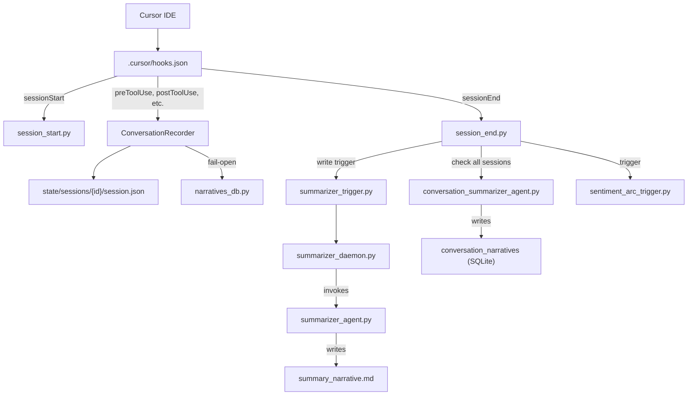

<p align="center">
  
</p>

<h1 align="center">Cursor Learning Harness</h1>

<p align="center">
  Records Cursor AI coding sessions, generates narrative summaries, and self-improves agent behavior through a closed learning loop.
</p>

<p align="center">
  <a href="https://www.python.org/downloads/"></a>
  <a href="https://github.com/langchain-ai/langgraph"></a>
  <a href="LICENSE"></a>
  <a href="https://docs.pytest.org/"></a>
</p>

> [!NOTE]
> Screenshot of the Streamlit dashboard coming soon.

---

## Why This Project

- **AI sessions are invisible** -- every Cursor session is lost after the chat clears; this records everything
- **No pattern tracking** -- repeated failures, looping, and frustration go unnoticed; sentiment analysis catches them
- **Agents don't learn** -- extracted patterns become Cursor rules that improve future behavior automatically

## Quick Start

### Prerequisites

- Python 3.13+
- [Cursor IDE](https://cursor.sh/)

### Setup

```bash
# 1. Create and activate virtual environment
python -m venv .venv
.venv\Scripts\activate

# 2. Install dependencies
pip install -r .cursor/hooks/requirements.txt
pip install streamlit plotly

# 3. (Optional) Backfill SQLite from existing JSON sessions
python .cursor/hooks/narratives_db.py --backfill

# 4. Launch the dashboard
streamlit run .cursor/hooks/dashboard/dashboard.py
```

The summarizer daemon auto-starts on every `sessionStart` via `.cursor/hooks.json` -- no manual step needed.

## Features

- **Session Recording**: Captures the full lifecycle of Cursor AI coding sessions -- initial thoughts, tool calls, shell commands, file edits, and MCP calls
- **AI-Powered Summarization**: Uses LangGraph agents to generate human-readable narrative summaries of each session
- **Two-Level Summarization**: Session-level narratives (from raw events) and conversation-level narratives (aggregated from session summaries)
- **Sentiment Arc Analysis**: Classifies sessions into archetypes (smooth convergence, escalating frustration, looping, etc.) based on emotional trajectory
- **Self-Improving Learning Loop**: Extracts actionable patterns from session telemetry and generates Cursor rules (`.mdc`) to improve agent behavior
- **Dual Storage**: Session data written to both JSON files (primary) and SQLite (queryable mirror) with fail-open SQLite writes
- **Streamlit Dashboard**: Interactive UI for exploring sessions, narratives, tool analytics, and file activity
- **Fail-Open Design**: Hooks never block the Cursor agent workflow on error

## Architecture



## Configuration

### LLM API Key

The summarizer requires an LLM API key. Create a `.cursor/llm.env` file (see `.cursor/llm.env.example` for the template):

```bash
OPENAI_API_KEY=sk-...
OPENAI_MODEL=gpt-4o
```

### Sentiment Analysis

Sentiment arc analysis runs locally using:
- `cardiffnlp/twitter-roberta-base-sentiment-latest` for per-turn sentiment scoring
- `sentence-transformers/all-MiniLM-L6-v2` for embedding-based geometric features

No API key is needed for sentiment analysis -- models are downloaded automatically on first run.

## Project Structure

```
.
├── .cursor/
│   ├── hooks.json                    # Event routing (20 event types)
│   ├── llm.env.example               # LLM API config template
│   ├── hooks/                        # Hook scripts (~63 Python files)
│   │   ├── conversation_recorder.py  # Shared: session CRUD, event recording
│   │   ├── narratives_db.py          # SQLite: 8 schema migrations, 11 tables
│   │   ├── learning_analyzer.py      # Pattern extraction -> .mdc rules
│   │   ├── learning_rules_agent.py   # LangGraph learning rules agent
│   │   ├── summarizer_agent.py       # LangGraph: session-level summarizer
│   │   ├── conversation_summarizer_agent.py  # LangGraph: conversation summarizer
│   │   ├── summarizer_daemon.py      # Background polling daemon
│   │   ├── summarizer_daemon_launcher.py     # Windows DETACHED_PROCESS launcher
│   │   ├── summarizer_trigger.py     # Trigger file writer for daemon
│   │   ├── summarize_sessions.py     # CLI: manual batch summarization
│   │   ├── session_start.py          # Session initialization
│   │   ├── session_end.py            # Session finalization + triggers
│   │   ├── pre_tool_use.py           # Records tool invocations
│   │   ├── post_tool_use.py          # Records tool results
│   │   ├── post_tool_use_failure.py  # Records tool failures
│   │   ├── before_shell_execution.py # Records shell commands
│   │   ├── after_shell_execution.py  # Records shell results
│   │   ├── before_mcp_execution.py   # Records MCP calls
│   │   ├── after_mcp_execution.py    # Records MCP results
│   │   ├── after_file_edit.py        # Records code changes
│   │   ├── after_agent_response.py   # Records agent responses
│   │   ├── after_agent_thought.py    # Records agent reasoning
│   │   ├── subagent_start.py         # Subagent lifecycle tracking
│   │   ├── subagent_stop.py          # Subagent lifecycle tracking
│   │   ├── sentiment_arc/            # Sentiment analysis module
│   │   │   ├── arc_analyzer.py       # Core analysis logic
│   │   │   ├── arc_db.py             # Sentiment storage
│   │   │   ├── config.py             # Analysis configuration
│   │   │   ├── dedup.py              # Duplicate session detection
│   │   │   ├── embedder.py           # Sentence embeddings
│   │   │   ├── parser.py             # Session event parsing
│   │   │   ├── score_text.py         # Text-based sentiment scoring
│   │   │   ├── task_completion.py    # Task completion detection
│   │   │   └── tests/                # Unit tests for sentiment module
│   │   ├── dashboard/                # Streamlit dashboard
│   │   │   ├── dashboard.py          # Main UI
│   │   │   └── db_queries.py         # Database query layer
│   │   └── view.py                   # CLI session viewer
│   ├── rules/                        # Auto-generated learning rules (.mdc)
│   └── skills/                       # Agent skill definitions
├── .cursor/hooks/state/              # Runtime state (sessions, logs, SQLite)
│   ├── sessions/                     # Individual session JSON files
│   ├── sessions_index.json           # Session index
│   ├── conversation_links.json       # Cross-session conversation links
│   ├── narratives.db                 # SQLite database
│   └── summarizer_daemon.log         # Daemon logs
├── assets/                           # Repository graphics
├── DOCS.md                           # Comprehensive documentation
├── CONTRIBUTING.md                   # Contribution guidelines
└── README.md                         # This file
```

## CLI Tools

```bash
# View sessions via CLI
python .cursor/hooks/view.py

# Launch the Streamlit dashboard
streamlit run .cursor/hooks/dashboard/dashboard.py

# Populate SQLite from existing JSON sessions
python .cursor/hooks/narratives_db.py --backfill

# Manage the summarizer daemon
python .cursor/hooks/summarizer_daemon.py --start
python .cursor/hooks/summarizer_daemon.py --stop

# Run sentiment arc analysis
python .cursor/hooks/sentiment_arc/batch_runner.py

# Run the learning analyzer (generate .mdc rules)
python .cursor/hooks/learning_analyzer.py --bootstrap
```

## Sentiment Arc Analysis

Classifies sessions into archetypes based on emotional trajectory:

| Archetype | Description |
| --- | --- |
| Smooth convergence | Session resolved cleanly |
| Escalating frustration | Things get worse over time |
| Looping | Agent repeats failed approaches |
| Mismatched effort | User is clear but agent relevance degrades |
| Rapid resolution / Steady friction / Abandoned / Inconclusive | Other patterns |

See [DOCS.md](DOCS.md) for details on the analysis pipeline.

## Learning Loop

The learning analyzer extracts patterns from session telemetry and generates Cursor rules (`.mdc` format) to improve agent behavior over time:

1. **Extract** -- tool failures, file hotspots, sentiment patterns, subagent patterns, user corrections
2. **Score** -- correlate rules with sentiment outcomes (positive/negative effectiveness)
3. **Prune** -- remove noise, cap at 25 active rules
4. **Apply** -- rules auto-apply via `.cursor/rules/learning-critical.mdc`

## Contributing

See [CONTRIBUTING.md](CONTRIBUTING.md) for development setup, test instructions, and code style guidelines. All hooks must be fail-open and output `{"permission": "allow"}` on success.

## Troubleshooting

| Issue | Solution |
| --- | --- |
| Summarizer daemon not starting | Check `.cursor/hooks/state/summarizer_daemon.log` |
| LLM errors during summarization | Ensure `OPENAI_API_KEY` is set in `.cursor/llm.env` |
| SQLite backfill fails | Verify `state/sessions/` directory contains session files |
| Hook errors or unexpected behavior | Check `.cursor/hooks/state/hook-debug.log` |
| Session files not created | Verify `.cursor/hooks.json` has correct hook paths |

## Roadmap

- [x] Session recording with 20+ event types
- [x] Two-level AI summarization (session + conversation)
- [x] Sentiment arc analysis with local models
- [x] Self-improving learning loop (extract, score, prune, apply)
- [x] Streamlit dashboard
- [x] Subagent lifecycle tracking
- [ ] Cloud-synced session analytics
- [ ] Multi-project support

## License

MIT
