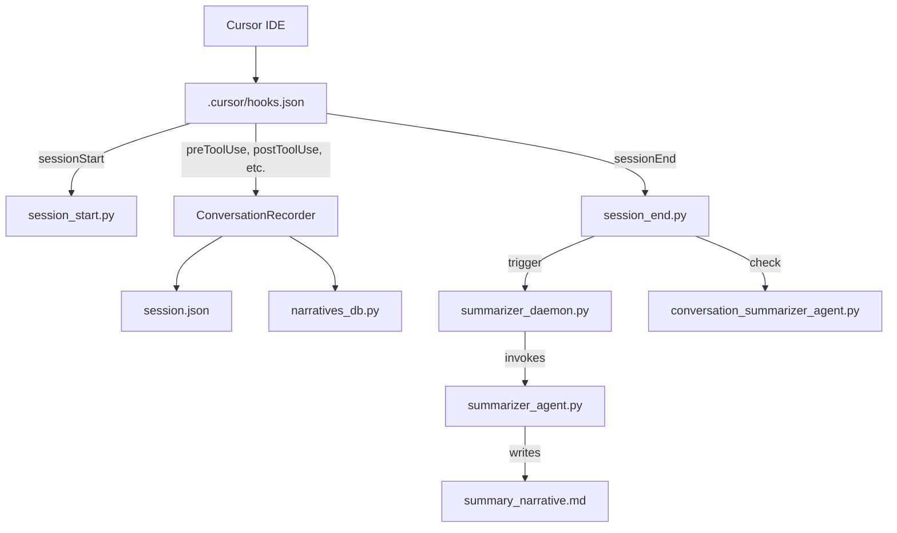

# Cursor Learning Agent

Automated learning system for Cursor IDE. Records every AI coding session, generates summaries, tracks sentiment changes, and continuously improves agent behavior over time.

## Features

- **Session Recording**: Captures the full lifecycle of Cursor AI coding sessions — initial thoughts, tool calls, shell commands, file edits, and final output
- **AI-Powered Summarization**: Uses LangGraph agents to generate human-readable narrative summaries of each session
- **Two-Level Summarization**: Session-level narratives (from raw events) and conversation-level narratives (aggregated from session summaries)
- **Sentiment Arc Analysis**: Classifies sessions into archetypes (smooth convergence, escalating frustration, looping, etc.) based on emotional trajectory
- **Self-Improving Learning Loop**: Extracts actionable patterns from session telemetry and generates Cursor rules to improve agent behavior
- **Dual Storage**: Session data written to both JSON files (primary) and SQLite (queryable mirror)
- **Streamlit Dashboard**: Interactive UI for exploring sessions, narratives, tool analytics, and file activity
- **Fail-Open Design**: Hooks never block the Cursor agent workflow on error

## Quick Start

### Prerequisites

- Python 3.13+
- [Cursor IDE](https://cursor.sh/)

### Setup

```bash
# Create and activate virtual environment
python -m venv .venv
.venv/Scripts\python.exe -m pip install -r .cursor/hooks/requirements.txt

# Install additional dependencies
.venv/Scripts\python.exe -m pip install \
  sentence-transformers torch scikit-learn numpy tqdm \
  streamlit plotly pytest

# Populate SQLite database from existing JSON sessions
.venv/Scripts\python.exe .cursor/hooks/narratives_db.py --backfill
```

### Usage

```bash
# Start the summarizer daemon (auto-starts on sessionStart via hooks.json)
.venv/Scripts\python.exe .cursor/hooks/summarizer_daemon.py --start

# Run sentiment arc analysis
.venv/Scripts\python.exe run_sentiment_arc.py

# Launch the dashboard
cd .cursor/hooks/dashboard
streamlit run dashboard.py

# View sessions via CLI
.venv/Scripts\python.exe .cursor/hooks/view.py
```

## Architecture



See [DOCS.md](DOCS.md) for full documentation including hooks system architecture, database schema details, skills system, MCP integration, CLI tools, and troubleshooting.

## License

MIT
