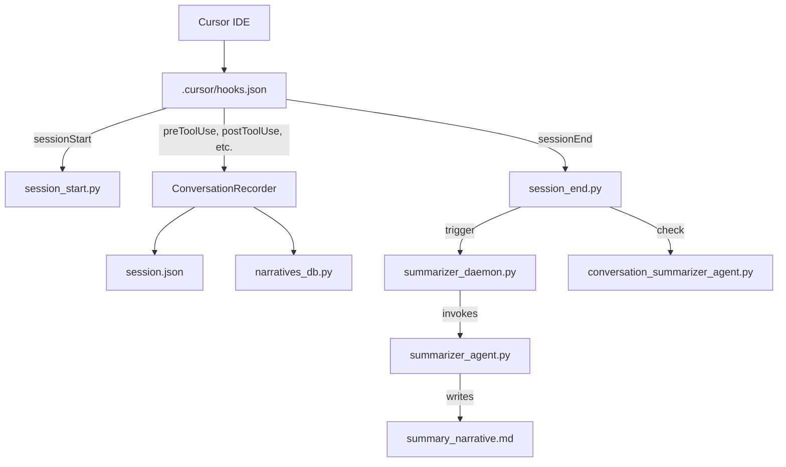

<p align="center">
  
</p>

<h1 align="center">Cursor Learning Harness</h1>

<p align="center">
  <strong>Self-Improving AI Coding Assistant with LangGraph & LangChain</strong>
</p>

<p align="center">
  
  
  
  
  
</p>

<p align="center">
  <em>Records every AI coding session, generates narrative summaries, tracks sentiment arcs, and continuously improves agent behavior over time.</em>
</p>

---

## Tech Stack

<p align="center">
  
  
  
  
  
  
  
</p>

## Features

- **Session Recording**: Captures the full lifecycle of Cursor AI coding sessions — initial thoughts, tool calls, shell commands, file edits, and final output
- **AI-Powered Summarization**: Uses LangGraph agents to generate human-readable narrative summaries of each session
- **Two-Level Summarization**: Session-level narratives (from raw events) and conversation-level narratives (aggregated from session summaries)
- **Sentiment Arc Analysis**: Classifies sessions into archetypes (smooth convergence, escalating frustration, looping, etc.) based on emotional trajectory
- **Self-Improving Learning Loop**: Extracts actionable patterns from session telemetry and generates Cursor rules to improve agent behavior
- **Dual Storage**: Session data written to both JSON files (primary) and SQLite (queryable mirror)
- **Streamlit Dashboard**: Interactive UI for exploring sessions, narratives, tool analytics, and file activity
- **Fail-Open Design**: Hooks never block the Cursor agent workflow on error

## Quick Start

### Prerequisites

- Python 3.13+
- [Cursor IDE](https://cursor.sh/)

### Setup

```bash
# Create and activate virtual environment
python -m venv .venv
.venv/Scripts\python.exe -m pip install -r .cursor/hooks/requirements.txt

# Install additional dependencies
.venv/Scripts\python.exe -m pip install \
  sentence-transformers torch scikit-learn numpy tqdm \
  streamlit plotly pytest

# Populate SQLite database from existing JSON sessions
.venv/Scripts\python.exe .cursor/hooks/narratives_db.py --backfill
```

### Usage

```bash
# Start the summarizer daemon (auto-starts on sessionStart via hooks.json)
.venv/Scripts\python.exe .cursor/hooks/summarizer_daemon.py --start

# Run sentiment arc analysis
.venv/Scripts\python.exe run_sentiment_arc.py

# Launch the dashboard
cd .cursor/hooks/dashboard
streamlit run dashboard.py

# View sessions via CLI
.venv/Scripts\python.exe .cursor/hooks/view.py
```

## Architecture



## How It Works

```
┌─────────────────────────────────────────────────────────────────┐
│                      Cursor IDE Events                          │
│  sessionStart · toolUse · shellCommand · fileEdit · MCP calls   │
└────────────────────────────┬────────────────────────────────────┘
                             │
                    ┌────────▼────────┐
                    │   Hooks Router   │
                    │  (hooks.json)    │
                    └────────┬────────┘
                             │
              ┌──────────────┼──────────────┐
              │              │              │
     ┌────────▼──────┐ ┌────▼─────┐ ┌──────▼──────┐
     │  Session JSON │ │  SQLite   │ │  Summarizer │
     │  (Primary)    │ │  (Mirror) │ │   Daemon    │
     └───────────────┘ └──────────┘ └──────┬──────┘
                                           │
                              ┌────────────▼────────────┐
                              │    LangGraph Agent       │
                              │  (StateGraph Pipeline)   │
                              └────────────┬────────────┘
                                           │
                    ┌──────────────────────┼──────────────────────┐
                    │                      │                      │
           ┌────────▼────────┐   ┌────────▼────────┐   ┌────────▼────────┐
           │  Narrative      │   │  Sentiment      │   │  Learning       │
           │  Summaries      │   │  Arc Analysis   │   │  Analyzer       │
           └─────────────────┘   └─────────────────┘   └────────┬────────┘
                                                                │
                                                       ┌────────▼────────┐
                                                       │  Cursor Rules   │
                                                       │  (.mdc files)   │
                                                       └─────────────────┘
```

## Project Structure

```
cursor-learning-harness/
├── .cursor/
│   ├── hooks/                  # Hook scripts (Python)
│   │   ├── session_start.py    # Session initialization
│   │   ├── session_end.py      # Session finalization
│   │   ├── summarizer_agent.py # LangGraph summarization
│   │   ├── narratives_db.py    # SQLite database ops
│   │   ├── learning_analyzer.py# Pattern extraction
│   │   └── dashboard/          # Streamlit dashboard
│   ├── rules/                  # Auto-generated learning rules
│   ├── skills/                 # Agent skill definitions
│   └── hooks.json              # Event routing configuration
├── assets/                     # Repository graphics
├── DOCS.md                     # Full documentation (1600+ lines)
├── README.md                   # This file
└── .venv/                      # Python virtual environment
```

## Sentiment Arc Analysis

Classifies sessions into archetypes based on emotional trajectory:

- **Smooth convergence** -- session resolved cleanly
- **Escalating frustration** -- things get worse over time
- **Looping** -- agent repeats failed approaches
- **Mismatched effort** -- user is clear but agent relevance degrades
- **Rapid resolution, steady friction, abandoned, inconclusive**

Uses `cardiffnlp/twitter-roberta-base-sentiment-latest` for per-turn sentiment scoring and `sentence-transformers/all-MiniLM-L6-v2` for geometric features (user self-distance, model relevance trend).

```bash
.venv/Scripts\python.exe run_sentiment_arc.py
```

## Learning Loop

The learning analyzer extracts patterns from session telemetry and generates Cursor rules (`.mdc` format) to improve agent behavior over time:

1. **Extract** -- tool failures, file hotspots, sentiment patterns, subagent patterns, user corrections, and more
2. **Score** -- correlate rules with sentiment outcomes (positive/negative effectiveness)
3. **Prune** -- remove noise, cap at 25 active rules
4. **Apply** -- rules auto-apply via `.cursor/rules/learning-critical.mdc`

```bash
.venv/Scripts\python.exe .cursor/hooks/learning_analyzer.py --bootstrap
```

See [DOCS.md](DOCS.md) for full documentation including hooks system architecture, database schema details, skills system, MCP integration, CLI tools, and troubleshooting.

## Setup Social Preview

To enable the social preview image for this repository:

1. Go to **Settings** > **Social Preview** in your GitHub repository
2. Click **Edit** and upload `assets/social-preview.png` (1280x640)
3. This image will appear when sharing the repo on Twitter, Discord, etc.

---

<p align="center">
  Built with
  
  
  
  
</p>

<p align="center">
  <a href="#cursor-learning-harness">Back to top</a>
</p>

## License

MIT
